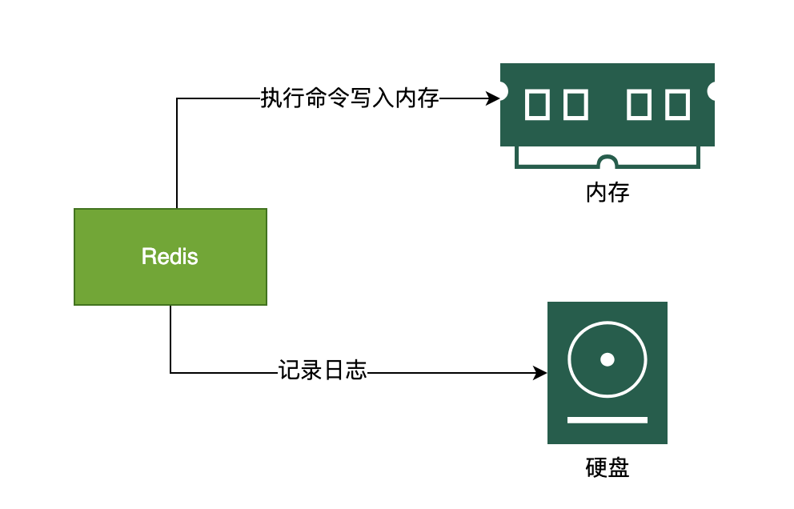
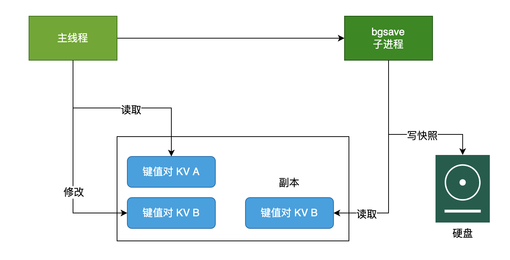
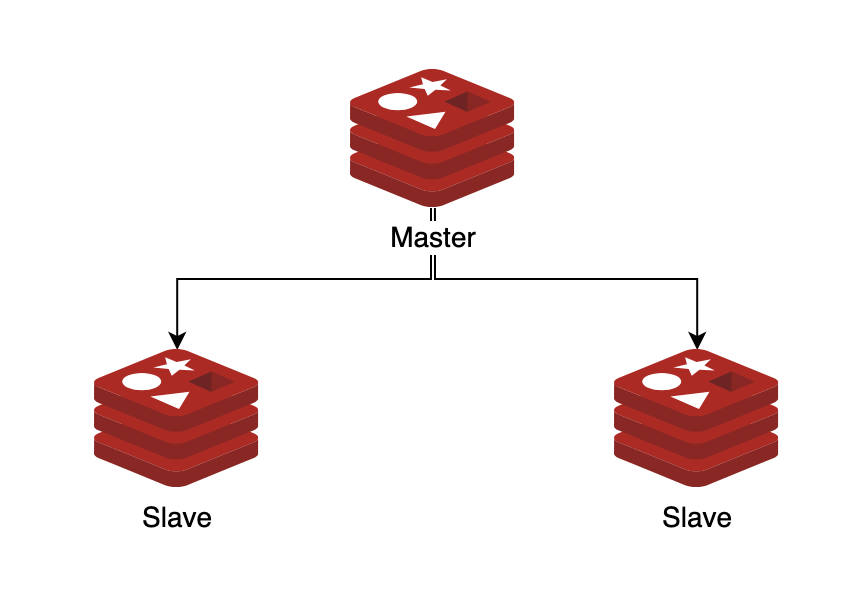
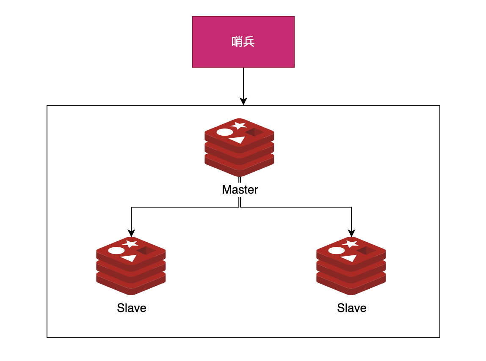
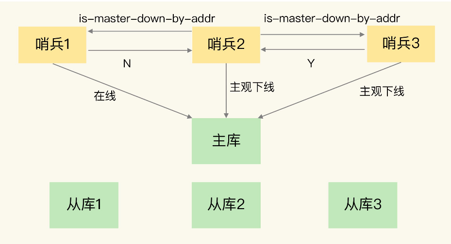
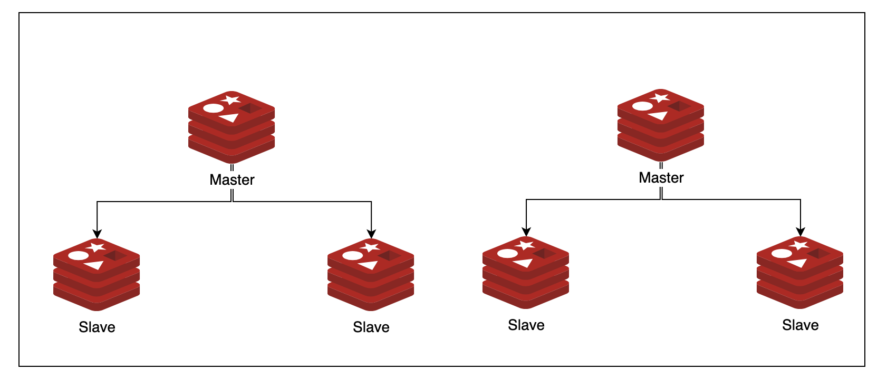

# Redis FAQ

1. Redis是单线程还是多线程？
2. 那为什么 Redis 在 4.0 之前会选择使用单线程？而且使用单线程还那么快？
3. Redis 是如何确保数据不丢失（持久化）的呢？
4. 讲讲Redis持久化的实现原理？
   1. Redis 为什么要先执行命令，再把数据写入日志呢？
   2. 那后写日志又有什么风险呢？
   3. RDB 做快照时会阻塞线程吗？
   4. RDB 做快照的时候数据能修改吗？
   5. Redis 是怎么解决在 bgsave 做快照的时候允许数据修改呢？
5. Redis 如何实现高可用？
6. Redis为什么需要使用集群模式呢？
7. Redis Cluster 在存储的时候如何确定选择哪个节点呢？

## Redis是单线程还是多线程？

在数据操作上是单线程

而在bgsave、网络IO等操作上是多线程的

## 那为什么 Redis 在 4.0 之前会选择使用单线程？而且使用单线程还那么快？

- 无锁，没有共享内存的冲突
- 减少了线程上下文切换的时间
- 纯内存操作，快
- 使用了epoll

## Redis 是如何确保数据不丢失的呢？

有两种备份方式

- AOF（Append Only File）
  - 每执行一次命令添加一行log，可以压缩
  - pros：更新频率高；时效性强
  - cons：文件大；恢复速度慢
- RDS（Redis Database）
  - 二进制文件，即某个时刻Redis的内存拷贝。定期备份
  - pros：更新频率低；时效性差
  - cons：文件小；恢复速度快



## Redis AOF为什么要先执行命令，再把数据写入日志呢？

在MySQL中采用的事写前日志，是因为MySQL在写前有做语法检查，所以可以先记录。

而在Redis中，由于没有语法检查，所以只记录执行成功的命令，可以避免记录错误命令的情况。

## 那后写日志又有什么风险呢？

- 如果Redis在后写命令时宕机，那么已经执行的命令会丢失
- 可能阻塞其他操作，AOF日志是在主线程中执行的，所以Redis把日志文件写入磁盘时，会阻塞后续的操作无法执行

## RDB 做快照时会阻塞线程吗？

- save命令会阻塞主线程，会导致阻塞。
- 默认使用bgsave命令，则会启动另一个子进程来，用于写入RDB文件，避免主线程阻塞。

## RDB 做快照的时候数据能修改吗？

可以，save是同步的会阻塞用户命令，而bgsave的时候是可以修改的。

## Redis 怎么解决在 bgsave 做快照的时候允许数据修改呢？

在启动bgsave后，

- 如果主线程读操作，对bgsave是没有影响的
- 如果主线程执行写操作，其会把更新同步到一个副本队列中，供bgsave子进程来读取最新的命令。

Redis4.0后，增加了RDB+AOF混合的形式：把数据以RDB的方式写入文件，再将后续的操作命令以AOF的格式存入文件，既保证了Redis重启速度，也降低了数据丢失的风险。



## Redis 如何实现高可用？

三种模式

- 主从复制（Primary Backup）
- 主从复制+哨兵（Sentinel）
- 集群模式

### 1）主从复制（Primary Backup）

也就是Primary-Backup模式，也是现实生活中MySQL的常见模式

- 写操作在Primary执行，并同步到Backup中
- 读操作可以Primary或Backup中执行



### 2）主从复制+哨兵（Sentinel）

在主从复制中，由于Primary单点错误的可能，如何容灾呢？

- 一种方式是引入Viewserver或者说哨兵来监控Primary-Backup，在Primary宕机是选举新的Primary，这也是Redis所支持的模式。
- 另外，哨兵也是有宕机的风险的。
  - 这里采用共识算法（Paxos、Raft），让Primary和Backup这些实例自行决定当前谁是Primary。而Redis就是采用Raft来集群化部署哨兵





### 3）Redis Cluster（集群）

集群模式是Redis3.0引入的一种模式，其有以下优点

- 分布式去中心化
- 存储分区，降低了系统对单节点的依赖，提高了Redis服务的读写性能。



## Redis为什么需要使用集群模式呢？

在主从复制模式下，我们可以通过增加Slave的模式来增加读QPS。

如果要增加写操作的性能，主从就无法做到了，所以要使用集群模式。

其实业务也可以按ID来Sharding在调用Redis前就决定使用哪个实例，MySQL也是如此，此乃横向扩展。

## Redis Cluster 在存储的时候如何确定选择哪个节点呢？

Redis Cluster采用类一致性哈希算法来实现节点选择。

Redis Cluster 将自己分成了 16384 个 Slot（槽位），也就是`[0, 16383]`哈希槽类似于数据分区，每个键值对都会根据它的 key，被映射到一个哈希槽中。每个 Redis 节点负责处理一部分槽位。

假如有三个instance（节点），其分配可能如下所示

| 节点 | Slot        |
| ---- | ----------- |
| 1    | 0~5000      |
| 2    | 5001~10000  |
| 3    | 10001~16383 |

在处理请求时，根据以下的操作确定要请求的节点值

- 根据键值对的 key，按照 CRC16 算法计算一个 16 bit 的值。
- 再用 16bit 值对 16384 取模，得到 0~16383 范围内的模数，每个模数代表一个相应编号的哈希槽。

## 为什么要采用一致性哈希来选择节点呢？

一致性哈希主要是用来解决哈希不均的问题。

在增加节点、减少节点时，Redis Cluster需要执行再平衡（rebalance），而一致性哈希能够确保数据复制转移操作最少。

还是以有三个instance（节点）为例

| 节点 | Slot        |
| ---- | ----------- |
| 1    | 0~5000      |
| 2    | 5001~10000  |
| 3    | 10001~16383 |

在增加一个新节点4后，假设其Hash在3后，我们只需要把节点3的一半数据复制到其上即可

| 节点 | Slot        |
| ---- | ----------- |
| 1    | 0~5000      |
| 2    | 5001~10000  |
| 3    | 10001~13500 |
| 4    | 13500~16383 |

如果我们不采用一致性哈希，而采用传统的sharding策略，那么在增加节点时，由于sharding的base变了，从3变成4。那么3个节点几乎都有数据复制、转移操作，增加了操作的复杂性。

## 什么是缓存雪崩、击穿、穿透？

| 问题类型                          | 触发条件                            | 危害特点                                | 解决方案汇总                                                 |
| --------------------------------- | ----------------------------------- | --------------------------------------- | ------------------------------------------------------------ |
| **缓存雪崩（Cache Avalanche）**   | 大量缓存同一时间过期，或 Redis 故障 | 瞬时大量请求打到数据库，系统崩溃风险    | 1. 缓存过期时间随机化（TTL 加偏移）<br>2. 热点缓存永不过期 + 后台刷新<br/>3. 多级缓存（本地+Redis）<br/>4. 请求限流+服务降级<br/>5. Redis 高可用部署（主从、集群、哨兵） |
| **缓存击穿（Cache Breakdown）**   | 某个热点 key 突然失效（高并发访问） | 请求集中打到数据库，瞬时压力骤增        | 1. 使用分布式锁更新缓存（Double Check）<br/>2. 永不过期 + 后台异步刷新<br/>3. 预加载或延迟双删策略 |
| **缓存穿透（Cache Penetration）** | 请求的是数据库中没有的数据          | 每次请求都穿透缓存直达 DB，可能引发攻击 | 1. 将空值写入缓存（缓存空对象/布尔标记）<br/>2. 使用布隆过滤器拦截非法 key<br/>3. 校验参数合法性（请求预过滤）<br/>4. 限制异常流量（如验证码、接口限速） |

### 代码实践

缓存雪崩

```
# 设置 TTL 加上随机时间，避免同时过期
expire_time = 3600 + random.randint(0, 600)
redis.set(key, value, ex=expire_time)
```

缓存击穿

```
# 获取缓存失败，使用分布式锁 + double check 再更新缓存
if not redis.get(key):
    if acquire_lock(key):
        if not redis.get(key):
            val = db.query(key)
            redis.set(key, val, ex=TTL)
        release_lock(key)
```

缓存穿透

```
# 缓存不存在数据时，也缓存一个“空值”或布尔
val = redis.get(key)
if val is None:
    data = db.query(key)
    if data:
        redis.set(key, data, ex=TTL)
    else:
        redis.set(key, "__NULL__", ex=300)  # 缓存空值防止穿透
```

使用布隆过滤器防止穿透（例如 Guava、RedisBloom）

```
if not bloom_filter.contains(key):
    return "非法请求，直接拦截"
```

## Reference

1. [Redis进阶 - 高可用：哨兵机制（Redis Sentinel）详解](https://pdai.tech/md/db/nosql-redis/db-redis-x-sentinel.html)
2. [12 道 Redis 精选面试题](https://javabetter.cn/interview/redis-12.html)
3. [一致性哈希 Consistent Hashing](https://doc.fenglyulin.com/docs/system-design/Book/consistent-hashing)