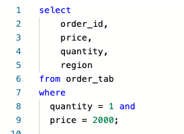
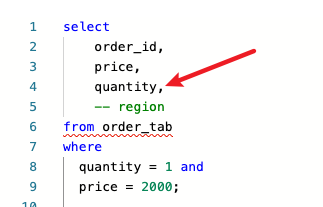

# SQL 最佳实践 Best Practise

## 注释自由

### 问题

过去写sql拉数据，总是这么写的

```sql
select 
	order_id, 
	price,
	quantity,
	region
from order_tab
where 
  quantity = 1 and 
  price = 2000
  ;
```

这么写没毛病



但会带来问题

-   当我们不想select region时需要把quantity后的逗号`,`去掉，会导致注释一个region连带着会需要删掉quantity后的逗号。想要取消region的注释也需要往quantity后加上逗号



同样地，如果我们想对where中的`price=2000`进行注释，也要把quantity行的`and`去掉；想要取消注释又要加回来。。


### 解决方案

一直以来我都是如上操作的，直到最近看到BI小姐姐发来的sql中，她把逗号放在下一行的前面而不是上一行的后面。看到的那一刻我很激动，原来如此简单就可以实现注释自由。


这样子写之后，我们想注释、或取消注释哪行都易如反掌了。


同样地，我们对where中的条件也可以执行这个哲学，把and和分号`;`都移到下一行前面。


实现注释自由


## 注释自由在LLM Prompt的应用

[Priompt ](https://github.com/anysphere/priompt) 是cursor团队在23年开源的一个库，旨在提高prompt的设计和微调速度；

定制了不同部分的tag，需要更改哪块tag、或注释哪块tag都可以轻松实现，实现注释自由。


## Reference

1.   Priompt https://github.com/anysphere/priompt