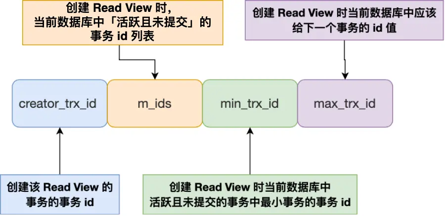
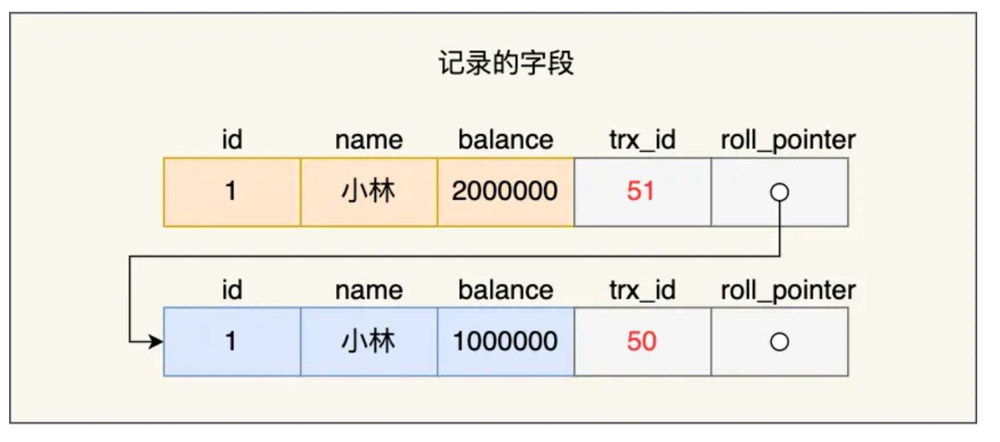
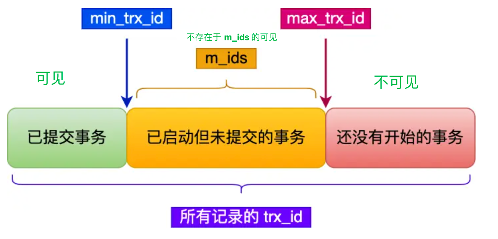

## Transaction

事务必须要遵守 4 个特性，分别如下：

-   **原子性（Atomicity）**：一个事务中的所有操作，要么全部完成，要么全部不完成，不会结束在中间某个环节，而且事务在执行过程中发生错误，会被回滚到事务开始前的状态，就像这个事务从来没有执行过一样，就好比买一件商品，购买成功时，则给商家付了钱，商品到手；购买失败时，则商品在商家手中，消费者的钱也没花出去。
-   **一致性（Consistency）**：是指事务操作前和操作后，数据满足完整性约束，数据库保持一致性状态。比如，用户 A 和用户 B 在银行分别有 800 元和 600 元，总共 1400 元，用户 A 给用户 B 转账 200 元，分为两个步骤，从 A 的账户扣除 200 元和对 B 的账户增加 200 元。一致性就是要求上述步骤操作后，最后的结果是用户 A 还有 600 元，用户 B 有 800 元，总共 1400 元，而不会出现用户 A 扣除了 200 元，但用户 B 未增加的情况（该情况，用户 A 和 B 均为 600 元，总共 1200 元）。
-   **隔离性（Isolation）**：数据库允许多个并发事务同时对其数据进行读写和修改的能力，隔离性可以防止多个事务并发执行时由于交叉执行而导致数据的不一致，因为多个事务同时使用相同的数据时，不会相互干扰，每个事务都有一个完整的数据空间，对其他并发事务是隔离的。也就是说，消费者购买商品这个事务，是不影响其他消费者购买的。
-   **持久性（Durability）**：事务处理结束后，对数据的修改就是永久的，即便系统故障也不会丢失。

InnoDB 引擎通过什么技术来保证事务的这四个特性的呢？

-   持久性是通过 redo log （重做日志）来保证的；
-   原子性是通过 undo log（回滚日志） 来保证的；
-   隔离性是通过 MVCC（多版本并发控制） 或锁机制来保证的；
-   一致性则是通过持久性+原子性+隔离性来保证；

## Problem

那么在同时处理多个事务的时候，就可能出现脏读（dirty read）、不可重复读（non-repeatable read）、幻读（phantom read）的问题。

### Dirty Read

读到其他事务未提交的数据

### Non-repeatable Read

前后读取的数据不一致

在一个事务内多次读取同一个数据，如果出现前后两次读到的数据不一样的情况，就意味着发生了「不可重复读」现象。

### Phantom Read

前后读取的记录数量不一致

在一个事务内多次查询某个符合查询条件的「记录数量」，如果出现前后两次查询到的记录数量不一样的情况，就意味着发生了「幻读」现象。

## Isolation Level

SQL 标准提出了四种隔离级别来规避这些现象，隔离级别越高，性能效率就越低，这四个隔离级别如下：

-   **读未提交（read uncommitted）**，指一个事务还没提交时，它做的变更就能被其他事务看到；
-   **读提交（read committed）**，指一个事务提交之后，它做的变更才能被其他事务看到；
-   **可重复读（repeatable read）**，指一个事务执行过程中看到的数据，一直跟这个事务启动时看到的数据是一致的，**MySQL InnoDB 引擎的默认隔离级别**；
-   **串行化（serializable ）**；会对记录加上读写锁，在多个事务对这条记录进行读写操作时，如果发生了读写冲突的时候，后访问的事务必须等前一个事务执行完成，才能继续执行；

针对不同的隔离级别，并发事务时可能发生的现象也会不同。

## MySQL Isolation Level

### Resolve the Phantom Read

MySQL 在「可重复读」隔离级别下，可以很大程度上避免幻读现象的发生（注意是很大程度避免，并不是彻底避免），所以 MySQL 并不会使用「串行化」隔离级别来避免幻读现象的发生，因为使用「串行化」隔离级别会影响性能。

-   针对**快照读**（普通 select 语句），是**通过 MVCC 方式解决了幻读**，因为可重复读隔离级别下，事务执行过程中看到的数据，一直跟这个事务启动时看到的数据是一致的，即使中途有其他事务插入了一条数据，是查询不出来这条数据的，所以就很好了避免幻读问题。
-   针对**当前读**（select ... for update 等语句），是**通过 next-key lock（记录锁+间隙锁）方式解决了幻读**，因为当执行 select ... for update 语句的时候，会加上 next-key lock，如果有其他事务在 next-key lock 锁范围内插入了一条记录，那么这个插入语句就会被阻塞，无法成功插入，所以就很好了避免幻读问题。

### Implementation

这四种隔离级别具体是如何实现的呢？

-   对于「读未提交」隔离级别的事务来说，因为可以读到未提交事务修改的数据，所以直接读取最新的数据就好了；
-   对于「串行化」隔离级别的事务来说，通过加读写锁的方式来避免并行访问；
-   对于「读提交」和「可重复读」隔离级别的事务来说，它们是通过 **Read View \**来实现的，它们的区别在于创建 Read View 的时机不同，大家可以把 Read View 理解成一个数据快照，就像相机拍照那样，定格某一时刻的风景。\**「读提交」隔离级别是在「每个语句执行前」都会重新生成一个 Read View，而「可重复读」隔离级别是「启动事务时」生成一个 Read View，然后整个事务期间都在用这个 Read View**。

TIPS:

>   注意，执行「开始事务」命令，并不意味着启动了事务。在 MySQL 有两种开启事务的命令，分别是：
-   第一种：begin/start transaction 命令；
-   第二种：start transaction with consistent snapshot 命令；
这两种开启事务的命令，事务的启动时机是不同的：
-   执行了 begin/start transaction 命令后，并不代表事务启动了。只有在执行这个命令后，执行了第一条 select 语句，才是事务真正启动的时机；
-   执行了 start transaction with consistent snapshot 命令，就会马上启动事务。

## Read View 在 MVCC 里如何工作的？

Read View 有四个重要的字段：

-   m_ids ：指的是在创建 Read View 时，当前数据库中「活跃事务」的**事务 id 列表**，注意是一个列表，**“活跃事务”指的就是，启动了但还没提交的事务**。
-   min_trx_id ：指的是在创建 Read View 时，当前数据库中「活跃事务」中事务 **id 最小的事务**，也就是 m_ids 的最小值。
-   max_trx_id ：这个并不是 m_ids 的最大值，而是**创建 Read View 时当前数据库中应该给下一个事务的 id 值**，也就是全局事务中最大的事务 id 值 + 1；
-   creator_trx_id ：指的是**创建该 Read View 的事务的事务 id**。

使用 InnoDB 存储引擎的数据库表，它的聚簇索引记录中都包含下面两个隐藏列：

-   trx_id，当一个事务对某条聚簇索引记录进行改动时，就会**把该事务的事务 id 记录在 trx_id 隐藏列里**；
-   roll_pointer，每次对某条聚簇索引记录进行改动时，都会把旧版本的记录写入到 undo 日志中，然后**这个隐藏列是个指针，指向每一个旧版本记录**，于是就可以通过它找到修改前的记录。

### Version Chain

### Repeatable Read

可见范围

实例

### Read-Commited

在事务 A 提交后，**由于隔离级别是「读提交」，所以事务 B 在每次读数据的时候，会重新创建 Read View**。 所以 B 会知道 A 已经提交了，之后可以读这个已经提交的更新。

