I note down the critical concept of distributed system. 

There may be mistakes, feel free to discuss with me here [issue](https://github.com/ColaLinN/fenglyu-docs-site-v1/issues).

##  Why Distributed Systems?

Dsitributed System has been used broadly in real life. It is necessary for the current internet world, such as Google, Meta, Tiktok, etc. 

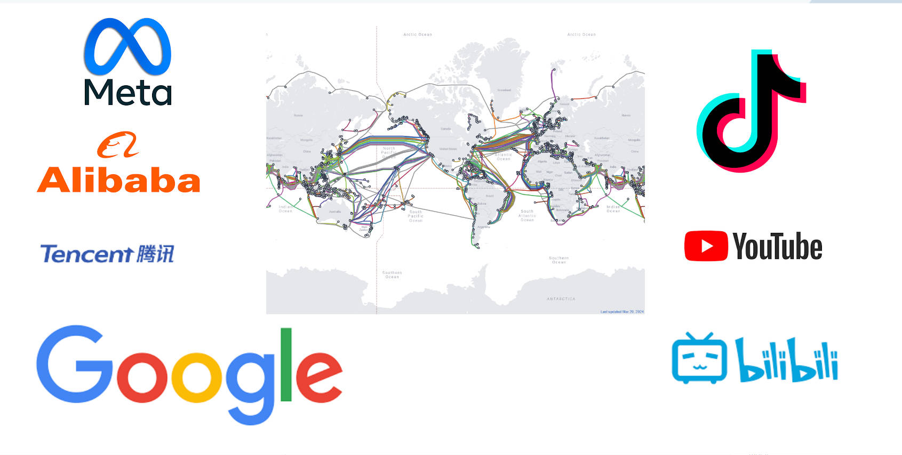

## The Challenges/Capabilities of distributed systems

1. Failure Tolerance
2. Managing Distributed State
3. Scalability
4. Architecture and Design

## Thought Experiement: Two General's Problem

> In the experiment, two generals are only able to communicate with one another by sending a messenger through enemy territory. The experiment asks how they might reach an agreement on the time to launch an attack, while knowing that any messenger they send could be captured.

From this thought experiement, we know that It is impossible to reach a final agreement with unstable communication channel.

But we can solve it in engineering ways by bypassing some assumptions and allow trade-offs. There are lots of solutions published, for example, the Consensus Algorithmn.

## A qucik tour of Distributed System [Video]

[『Made in Heaven』分布式系统要开始加速了，43秒带你速通 ！ 分布式系统概念 第01期](https://www.bilibili.com/video/BV1ap42127rE)

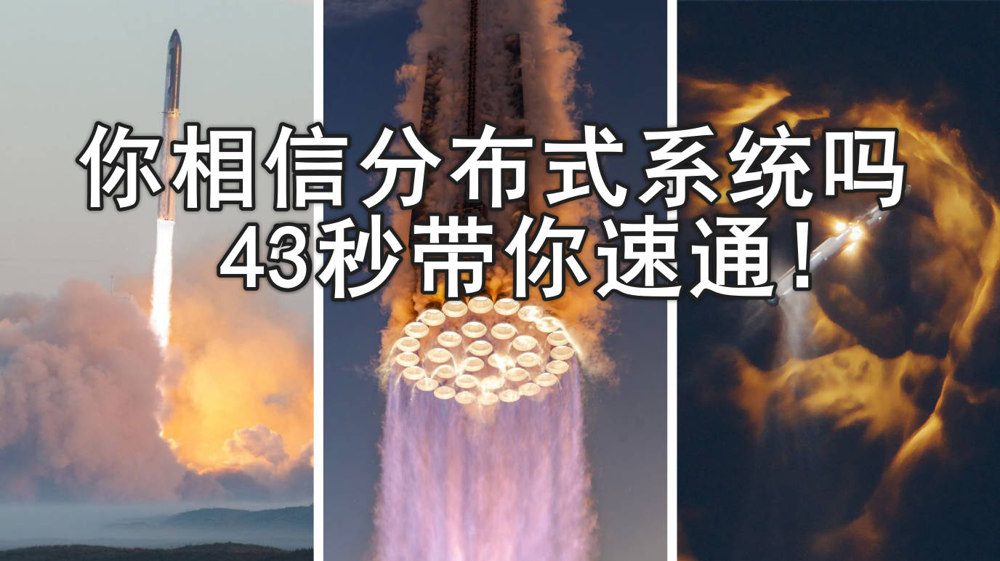

### CAP Theorem

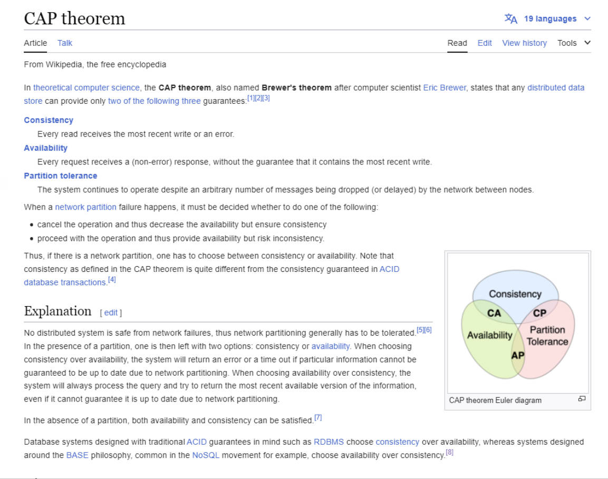

### RPC Semantics

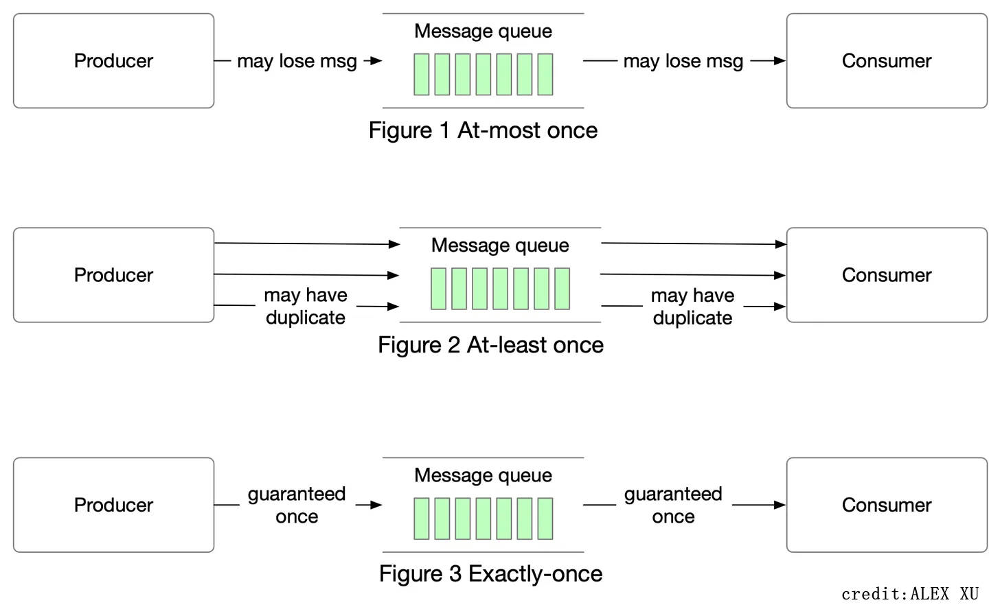

### Logical Lock

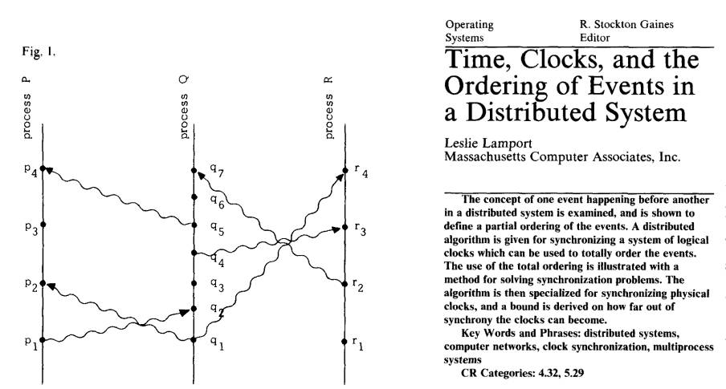

### Distributed State

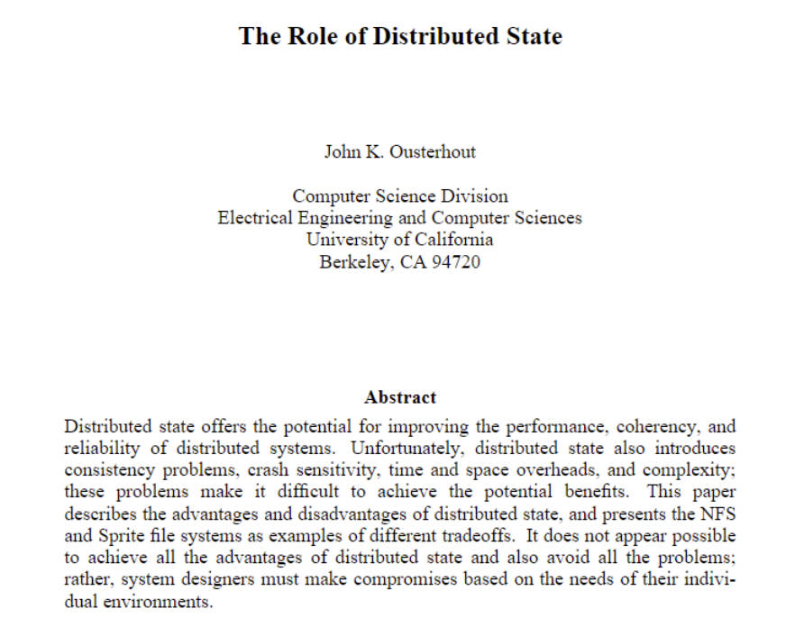

### Consistency

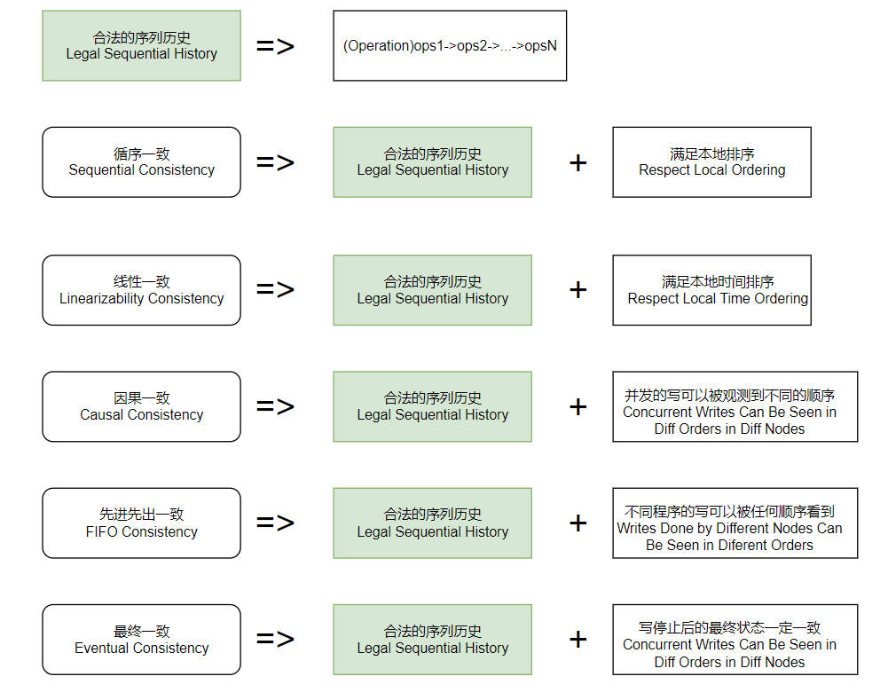

### Consensus Protocol

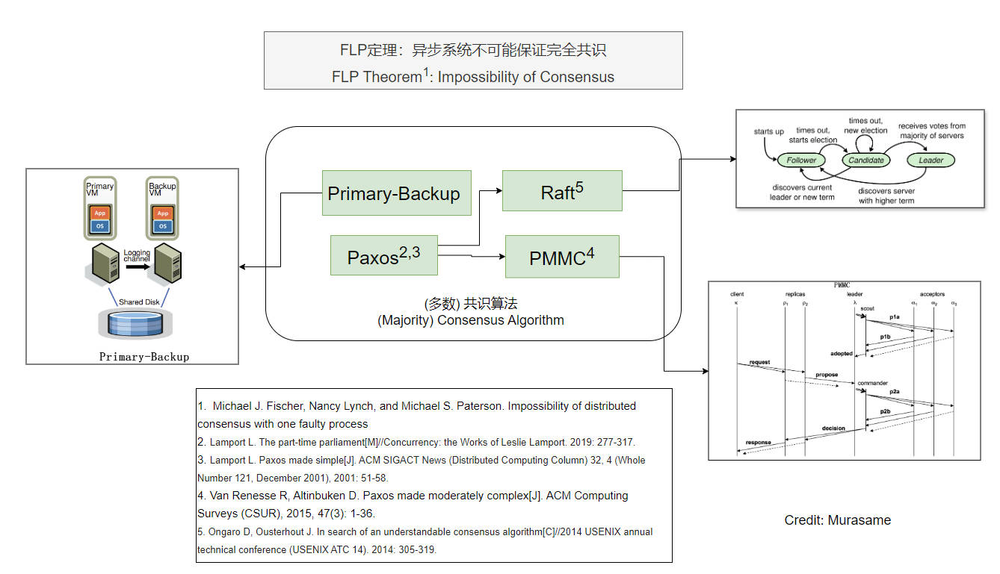

### Byzantine Fault Tolerance

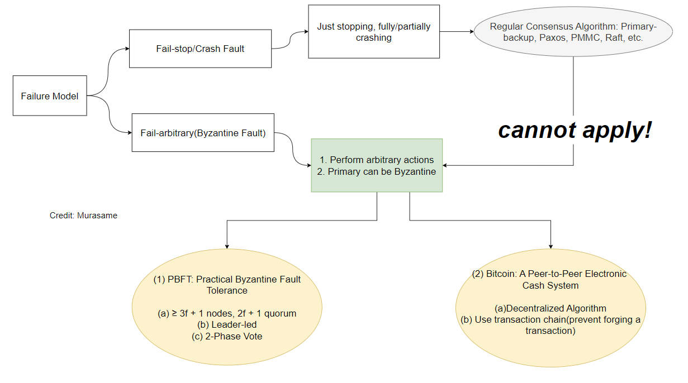

### Distributed Transaction

### Distributed File System

### Distributed Storage

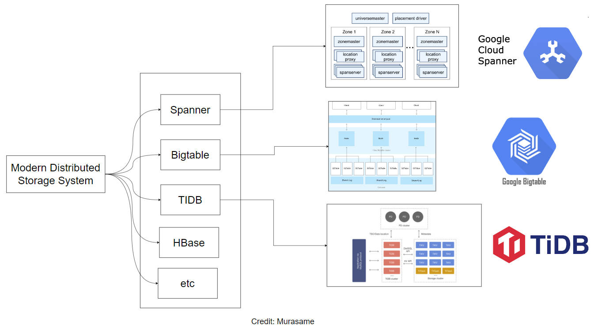

### Distributed Computing

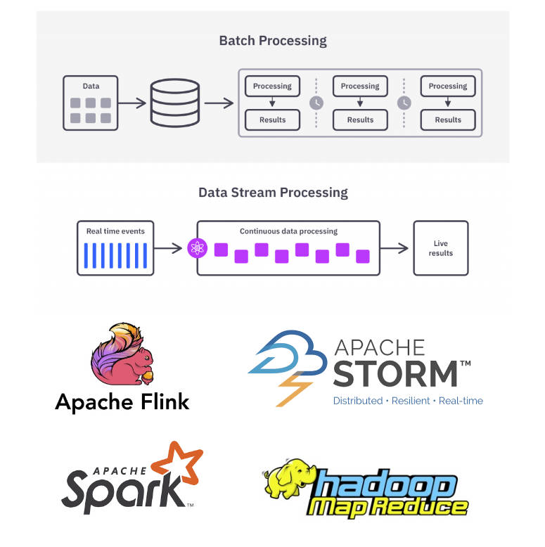

### Distributed Machine Learning

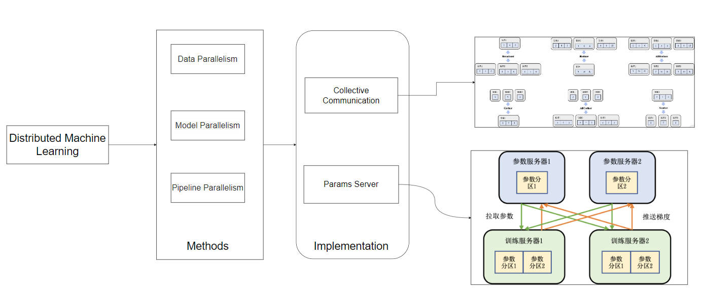

# Reference

1. [Two General's Problem, Wiki](https://en.wikipedia.org/wiki/Two_Generals%27_Problem)
1. [At most once, at least once, exactly once](https://blog.bytebytego.com/p/at-most-once-at-least-once-exactly)
1. [Time, Clock, and the Ordering of Events in a Distributed System](https://lamport.azurewebsites.net/pubs/time-clocks.pdf)
1. [Impossibility of Distributed Consensus with One Faulty Process](https://groups.csail.mit.edu/tds/papers/Lynch/jacm85.pdf)
1. [Paxos Made Simple](https://lamport.azurewebsites.net/pubs/paxos-simple.pdf)
1. [Paxos Made Moderately Complex](https://www.cs.cornell.edu/home/rvr/Paxos/paxos.pdf)
1. [In Search of an Understandable Consensus Algorithm](https://raft.github.io/raft.pdf)
1. [Practical byzantine fault tolerance](https://css.csail.mit.edu/6.824/2014/papers/castro-practicalbft.pdf)
1. [Spanner: Google’s Globally-Distributed Database](https://static.googleusercontent.com/media/research.google.com/en//archive/spanner-osdi2012.pdf)
1. etc
