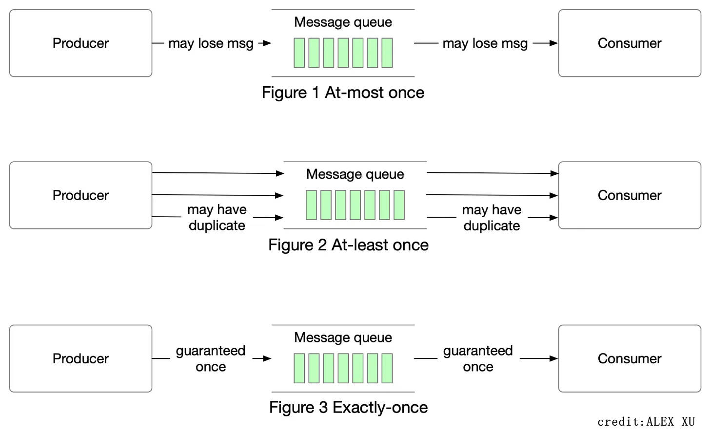

## RPC Semantics

### Definition

RPC (Remote Procedure Call)

Semantics = meaning

```
client() {
 RPC_deposit(server, 42, $50.00); 
}
```

### What should we expect when RPC returns?



## At-least-once

Procedure is executed on the server one or multiple times.

It is useful when the operation is Idempotent.

It is not useful when the operation is non-idempotent.

> An idempotent operation produces the same result whether it is executed once or multiple times.
>
> Examples include setting a specific value, deleting a resource, or incrementing a counter by a fixed amount.
>
> - call `getResult(record_id=1)` API, if it always returns same result, it is idempotent
> - call `paid(order_id=1)` API, it should only paid whenever how many times it is executed
> 

### Implementation

Client keep retrying until receiving the response.

## At-most-once

Procedure is either executed once or not executed at al

### Implementation

1. Client includes a unique `ID` in every request
2. Server keeps a history of requests it has already answered, their `ID`, and the result
3. If server encounters request with duplicate `ID`, server resends history result

### When should sesver garbage collect RPC history?

There are 3 options

Option 1: 

1. Never

Option 2: 

1. Unique `clientID`
2. Client includes a `seqID` and its `ClientID` for each message
3. Client include `seen all msg <= X`  with every RPC, server can discard the RPC history with `seqID <= X ` for this `ClientID`

Option 3: 

1. Each client only allow one outstanding request at a time
2. Server discards the `request with SeqNum <= CurSeq+1`

## Exactly-once

### Real-world usage

launch a missile, need to ensure the command is sent exactly once so that the boom will not be triggered twice

### Impossiblility

It is Impossible because the server can crash, either

1. The server crashed before the execution arrived
2. The server crashes after the execution arrives

### Implementation with workaround

We can ensure the same executed result with allowing retries and db record. Which is `At-most-once` + `client retries until success`.

## More

The Exactly Once Semantics in Kafka

Chauhan, A. (2024, March 5). *Demystifying Kafka Exactly Once Semantics (EOS) - HelloTech*. Medium. https://engineering.hellofresh.com/demystifying-kafka-exactly-once-semantics-eos-390ae1c32bba

## Reference

1. NUS CS5223 Distributed System Course
2. Xu, A. (2022, February 24). *At most once, at least once, exactly once*. ByteByteGo Newsletter. https://blog.bytebytego.com/p/at-most-once-at-least-once-exactly
3. Chauhan, A. (2024, March 5). *Demystifying Kafka Exactly Once Semantics (EOS) - HelloTech*. Medium. https://engineering.hellofresh.com/demystifying-kafka-exactly-once-semantics-eos-390ae1c32bba
