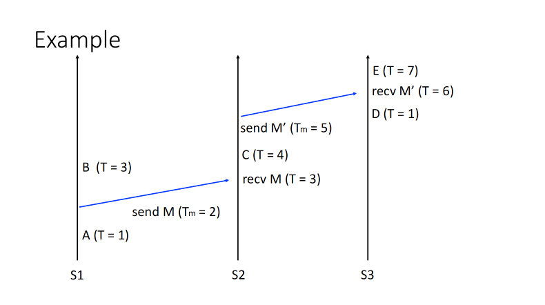
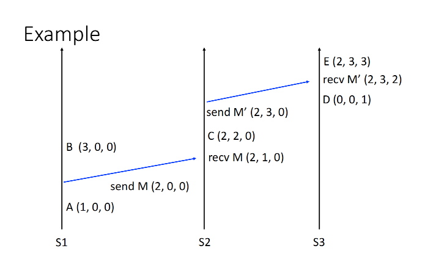

## Time, Clock, and Ordering of Event

## Questions

### Why do we need the logical lock?

Reason: The physical lock is not accurate and unique among all machines

### How do we sync the time?

Physical Lock
1. Beacon-based approach
   1. The master periodically broadcasts the time to clients
   2. Problem: the unstable latency in sending synchronize

2. Interrogation-based protocols
   1. The clients repeatedly query the server, the delay is RTT (Round Traced Time)
   2. Problem:  NTP, PTP (TBC)

### How to order events without the physical clock?

Happens-before

Sample:

1. For example, Cooking before Eating, Eating before Sleep
2. Transitivity: Cooking before Sleep

Happens before relationship

1. Captures logical causal dependencies between events
2. (Irreflexive) partial ordering: → (TBC)
   1. `a -> b, then b -\->a`
   2. `a -> b, b -> c then a -> c`

Concept (TBC)

1. Processes
2. Messages
3. Events: what's the event? send msg, recv msg, **event happens**

Rules

1. Within a process, a comes before b, we have a → b

   Transitivity: if `a → b` and` b → c` then `a → c`

2. `a → b` means "b could have been influenced by a"

3. `a → b` and `b → a`: events are **concurrent**

   1. Concurrent Means: No one can tell whether a or b happened first.

## Lamport Logical Clock

### Goal

if `a < b`, then `C(a) < C(b)`

### Conditions

1. In a process `i`, `a` comes before `b`, that means `Ci(a) < Ci(b)`
2. If `i` send a, and `j` receives b, `Ci(a) < Ci(b)`

### Implementation

1. Keep a local clock T
2. Increment T whenever an event happens
3. Send Clock value Tm (Time of Message) on all messages
4. On receiving or sending mesage: `T = max(T, Tm) + 1`
   1. The receiving message's T will reset the current machine's T

### Use the logical clock to form a total ordering

1. If `C(a) < C(b)`, then `a => b`
2. If `C(a)==C(b)`, we need to check the processID
3. **`a ->b` does not mean `a => b`. because the T on different processes is different**
   1. `a->b` means `a=>b`
   2. But `a=>b`, i.e. `C(a)<C(b)` doesn't mean `a->b`!!!!!

### Mutual Exclusion

Implementation

1. To acquire the lock: Send request to everyone, including itself

2. Three request types:

   1. Request (broadcast)
   2. Release  (broadcast)
   3. Acknowledge (on receipt)

3. Each Node:

   1. Holds the request queue
   2. Records the latest timestamp received from other Nodes

### Problem

1. When `a -> b`, then `C(a) < C(b)`
2. But on converse, if `C(a) < C(b)`, it doesn't mean a -> b, they could also be concurrent in different processes

## Vector Clock

One where the converse is true 

- If `C(a) < C(b)`, then `a → b`

Note that there must still be concurrent events

- Sometimes neither `C(a) < C(b)` or `C(b) < C(a)`

### Rules

1. Clock is a vector, the length is #(the number of) Nodes
2. On node `i`, increment `C[i]` on each event
   1. node 0 `(3, 5, 2)`; after event: `(4, 5, 2)`
3. On receipt of a message with clock `Cm` on node `i`:
   1. Increment `C[i]`
   2. For each `j != i`
      1. `C[j] = max(C[j], Cm[j])`
      2. Node 0 `(4, 5, 2)` receives a message `(2, 7, 0)`: `(5, 7, 2)`

~~Vector Clock doesn't increase itself clock based on the clock sent from others~~

### Properties

1. Concurrent
   1. For two vectors x and y, if `Cx[i] < Cy[i]`, and `Cx[j] > Cy[j]` for some `i` and `j`
2. Happens before
   1. If `Cx[i] <= Cy[i]` for all i, and there exists j such that `Cx[j] < Cy[j]`
      1. That means `Cx` happens before `Cy` 

## Others

TCP ensures the msg received is the newest and latest in the msg tunnel between `a and b`

## Reference

1. [Time, Clock, and the Ordering of Events in a Distributed System](https://lamport.azurewebsites.net/pubs/time-clocks.pdf)
2. NUS CS5223 Distributed System Course
3. Designing Data-Intensive Applications

