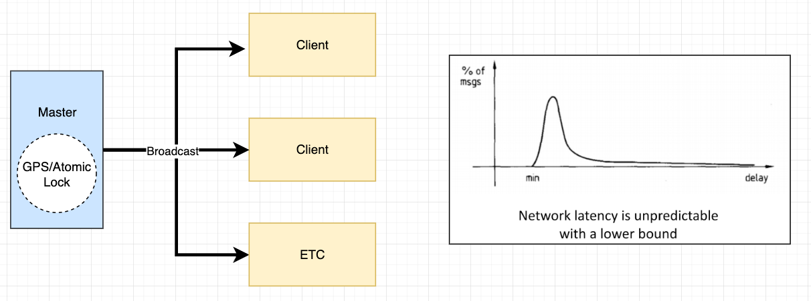
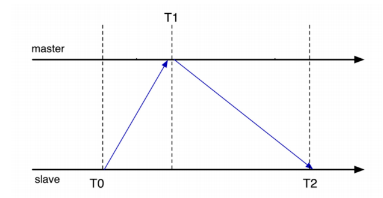
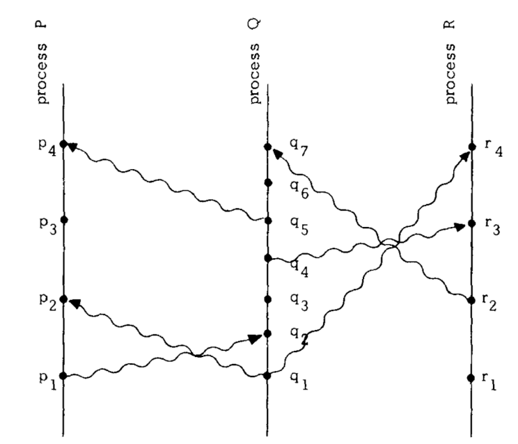

---
tags:
  - distributed system
  - system
sidebar_position: 3
---

# 物理时钟，Lamport 时钟与 Vector 时钟 Physical Clock, Lamport Logical Clock, and Vector Clock

## Time, Clock, and Ordering of Event

## Ordering of Event

### Why need to order event?

- In real life, some things should happen in order. 
- For example, 
  - News should be corrected before being released.
  - Membership card is only activated after the user paid
  - Multiple updates of content should happen in order.
  - The privacy should be updated before posting

### How to order event?

- Label each event with its physical time

## Physical Lock

### Approach #1 synchronization

Beacon-based approach 

1. Designate server with GPS/atomic clock as the master
2. The master periodically broadcasts the time to clients. Clients resets the time upon receipt
3. Problem: the unstable latency in event sending and receiving

### Approach #2 Interrogation-based protocols

1. Client queries server
2. Time = `T1 + (T2-T0)/2`
3. Multiple samples, average over several servers; throw out outliers
4. Take into account the clock rate skew
5. Protocols: 
   1. NTP (Network Time Protocol), used in server sync, log records, etc.
   2. PTP (Precision Time Protocol), used in electricity network, financial trading system, et.

### Physical Lock Problem

- Physical lock is not accurate.
- Physical lock is not the same among multiple machines.

## How to order events without physical clock?

### Happens-before relationship

1. Happens-before relationship captures logical (causal) dependencies between events.
2. For example,  Cooking before Eating; Eating before Sleep.
3. (Irreflexive) partial ordering: `->` 
   1. `a -/-> a`,  (an event cannot happen before itself)
   2. `a -> b, then b -\->a`, (if `a` happens before `b`, `b` cannot happen before `a`)
   3. `a -> b, b -> c then a -> c`, (if `a` happens before `b` and `b` happens before `c`, then `a` happens before `c`)

> Irreflexive Explanation
>
> Irreflexive means that no element is related to itself. In the context of happens-before relationships, it means an event cannot happen before itself (`a -/-> a`).
>
> Partial Ordering Explanation
>
> A partial ordering is a mathematical concept used to describe a set of elements where some pairs of elements are comparable, but not necessarily all. In the context of happens-before relationships, it helps define how events are related in terms of their order.

### Happens before In distributed systems

1. Processes
2. Messages
3. Events
   1. Send msg; Receive msg; Event happens

### Properties

1. **Happends-before**
   1. Within a process, `a` comes before `b`, we have `a -> b`

   2. `a -> b` means `b` could have been influenced by `a`

2. **Transitivity**
   1.  if `a -> b` and` b -> c` then `a -> c`

3. **Concurent**
   1. `a -/-> b` and `b -/-> a`: events are concurrent
   2. Concurrent means: No one can tell whether a or b happened first.

Example

1. Events with happens-before relationship
   1. Cooking before Eating, 
   2. Eating before Sleeping, 
   3. Washing before Sleeping
2. Transitivity: Cooking Before Sleep
3. Concurent: Washing is concurrent with Eating, we cannot determine the order based on limited given happens-before infomation.

## Lamport Logical Clock

### Goal

We need to mark each event with timestamp `C` to preserve the happens-before order of events.

if `a -> b`, then `C(a) < C(b)`

### Implementation

1. Keep a local clock `T` on each process
2. Increment T whenever an event happens
3. Send clock time on all messages as `Tm`
4. On message receipt: `T = max(T, Tm) + 1`

### Use the logical clock to form a total ordering

The following is just to define a new relation: `=>` based on `C() < C()`

> 大白话来讲，如果 a 的时间戳比 b 小，我们可以说 `a => b`。如果 a 发生在 b 之前，即 `a -> b`，我们可以说 a 的时间戳一定比 b 小， 即`a => b`。但反之不成立。

1. If `C(a) < C(b)`, then `a => b`
2. If `C(a)==C(b)`, the processID of `a` and `b` shoudl be different
3. `a->b` means `a=>b`
   1. In converse,  `a=>b`, i.e. `C(a)<C(b)` doesn't mean `a->b`. For example, the event `B(T=4) ` ie concurent to `D(T=1)`, we cannot said `D -> B` based on the `C(D) > C(B)`

### Logical Lock Problem

We cannot tell the ordering of events with conccurrent logical lock

1. When `a -> b`, then `C(a) < C(b)` But in converse, if `C(a) < C(b)`, it doesn't mean `a -> b`, they could also be concurrent in different processes
2. For other concurrents cases which not even `C(a) < C(b)`, we cannot tell the ordering of event as well based on physical lock.

## Vector Clock

Vector clock will resolve the logical lock problem.

### Rules

1. Clock is a vector, its length is `n`, i.e. the number of nodes.
2. On node `i`, increment `C[i]` on each event
   1. For exmaple
      1. Node `#0` with vector lock `(3, 5, 2)`; 
      2. After a event happen: `(4, 5, 2)`
3. On receipt of a message with clock `Cm` on node `i`:
   1. Increment `C[i]`
   2. For each `j != i`, `C[j] = max(C[j], Cm[j])`
      1. For example: 
         1. Node `#0` with vector lock `(4, 5, 2)` receives a message `(2, 7, 0)`, its vector lock is updated to`(5, 7, 2)`

### Properties

1. Happens before
   1. If `Cx[i] <= Cy[i]` for all `i`, and there exists j such that `Cx[j] < Cy[j]`
      1. That means `Cx` happens before `Cy` 
2. Concurrent
   1. For two vectors x and y, if `Cx[i] < Cy[i]`, and `Cx[j] > Cy[j]` for some `i` and `j`

## Others

TCP ensures the msg received is the newest and latest in the msg tunnel between `a and b`

## Reference

1. NUS CS5223 Distributed System Course
2. [Time, Clock, and the Ordering of Events in a Distributed System](https://lamport.azurewebsites.net/pubs/time-clocks.pdf)
3. [Designing Data-Intensive Applications](https://www.oreilly.com/library/view/designing-data-intensive-applications/9781491903063/)

