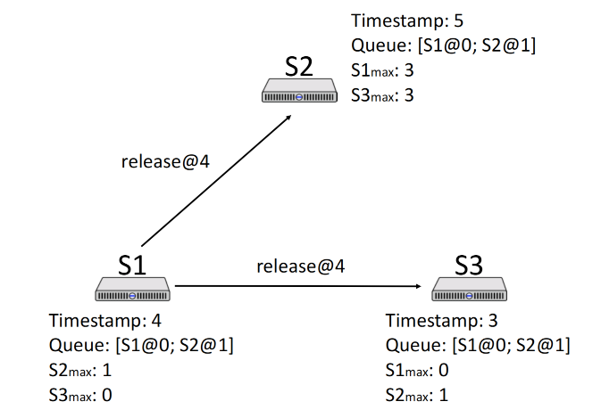

## Time, Clock, and Ordering of Event

## Ordering of Event

### Why need to order event?

- In real life, some things should happen in order. 
- For example, 
  - News should be corrected before being released.
  - Membership card is only activated after the user paid
  - Multiple updates of content should happen in order.
  - The privacy should be updated before posting

### How to order event?

- Label each event with its physical time

## Physical Lock

### Approach #1 synchronization

Beacon-based approach 

1. Designate server with GPS/atomic clock as the master
2. The master periodically broadcasts the time to clients. Clients resets the time upon receipt
3. Problem: the unstable latency in event sending and receiving

### Approach #2 Interrogation-based protocols

1. Client queries server
2. Time = `T1 + (T2-T0)/2`
3. Multiple samples, average over several servers; throw out outliers
4. Take into account the clock rate skew
5. Protocols: 
   1. NTP (Network Time Protocol), used in server sync, log records, etc.
   2. PTP (Precision Time Protocol), used in electricity network, financial trading system, et.

### Physical Lock Problem

- Physical lock is not accurate.
- Physical lock is not the same among multiple machines.

## How to order events without physical clock?

### Happens-before

1. Captures logical (causal) dependencies between events
2. For example, 
   1. Cooking before Eating, Eating before Sleep.
   2. Transitivity: Cooking Before Sleep

3. (Irreflexive) partial ordering: `->` 
   1. `a -/-> b`
   2. `a -> b, then b -\->a`
   3. `a -> b, b -> c then a -> c`

### Happens before In distributed systems

1. Processes
2. Messages
3. Events: send ms; receive msg; event happens

Rules

1. Happends-before
   1. Within a process, `a` comes before `b`, we have `a -> b`

   2. `a -> b` means `b` could have been influenced by `a`

2. Transitivity
   1.  if `a -> b` and` b -> c` then `a -> c`

3. Concurent
   1. `a -/-> b` and `b -/-> a`: events are **concurrent**
   2. Concurrent Means: No one can tell whether a or b happened first.

## Lamport Logical Clock

We need to mark each event with timestamp to preserve the happens-before order of events.

### Goal

if `a < b`, then `C(a) < C(b)`

### Conditions

1. In a process `i`, `a` comes before `b`, that means `Ci(a) < Ci(b)`
2. If `i` send a, and `j` receives b, `Ci(a) < Ci(b)`

### Implementation

1. Keep a local clock `T` on each process
2. Increment T whenever an event happens
3. Send clock time on all messages as `Tm`
4. On message receipt: `T = max(T, Tm) + 1`

### Use the logical clock to form a total ordering

1. New relation: `=>`
2. If `C(a) < C(b)`, then `a => b`
3. If `C(a)==C(b)`, we need to check the processID
4. `a->b` means `a=>b`
   1. In converse,  `a=>b`, i.e. `C(a)<C(b)` doesn't mean `a->b`. For example, the event `B(T=4) ` ie concurent to `D(T=1)`, we cannot said `D -> B` based on the `C(D) > C(B)`

### Mutual Exclusion Implementation with Logical Lock

1. Three types of requests:

   1. Acquire Lock (broadcast)
   2. Release Lock (broadcast)
   3. Acknowledge (on receipt)
2. Each node:

   1. Holds the lock `acquiring queue`
   2. Records the latest timestamp received from other Nodes

### Logical Lock Problem

1. When `a -> b`, then `C(a) < C(b)`
2. But on converse, if `C(a) < C(b)`, it doesn't mean `a -> b`, they could also be concurrent in different processes

## Vector Clock

One where the converse is true 

- If `C(a) < C(b)`, then `a → b`

Note that there must still be concurrent events

- Sometimes neither `C(a) < C(b)` or `C(b) < C(a)`

### Rules

1. Clock is a vector, the length is #(the number of) Nodes
2. On node `i`, increment `C[i]` on each event
   1. node 0 `(3, 5, 2)`; after event: `(4, 5, 2)`
3. On receipt of a message with clock `Cm` on node `i`:
   1. Increment `C[i]`
   2. For each `j != i`
      1. `C[j] = max(C[j], Cm[j])`
      2. Node 0 `(4, 5, 2)` receives a message `(2, 7, 0)`: `(5, 7, 2)`

~~Vector Clock doesn't increase itself clock based on the clock sent from others~~

### Properties

1. Concurrent
   1. For two vectors x and y, if `Cx[i] < Cy[i]`, and `Cx[j] > Cy[j]` for some `i` and `j`
2. Happens before
   1. If `Cx[i] <= Cy[i]` for all i, and there exists j such that `Cx[j] < Cy[j]`
      1. That means `Cx` happens before `Cy` 

## Others

TCP ensures the msg received is the newest and latest in the msg tunnel between `a and b`

## Reference

1. [Time, Clock, and the Ordering of Events in a Distributed System](https://lamport.azurewebsites.net/pubs/time-clocks.pdf)
2. NUS CS5223 Distributed System Course
3. Designing Data-Intensive Applications

