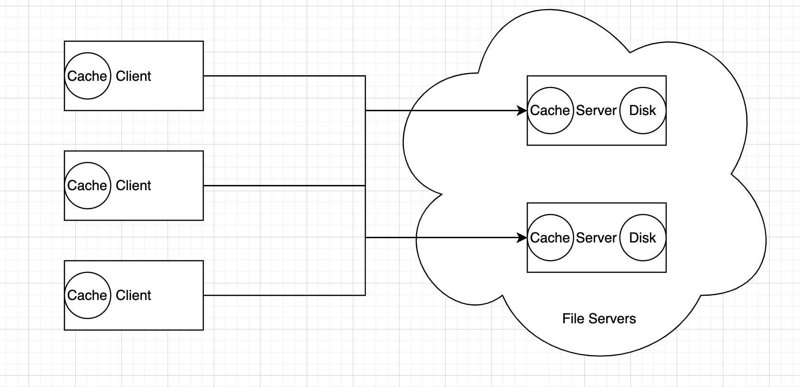
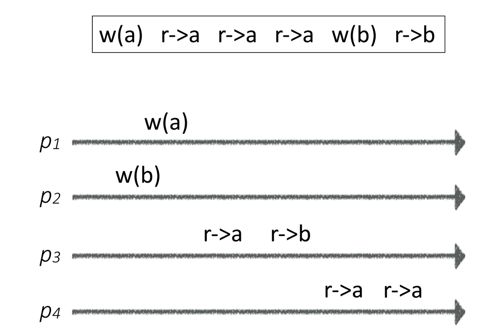
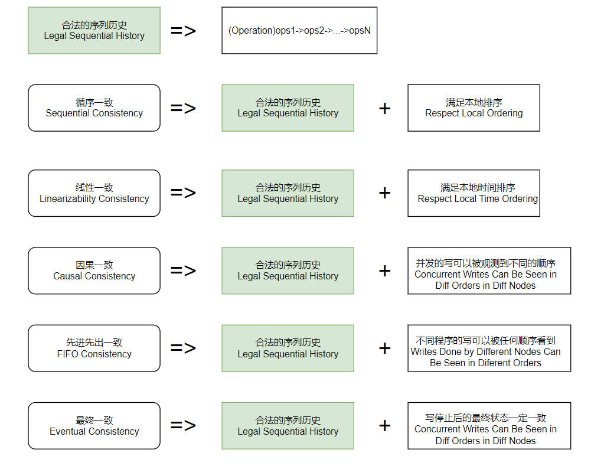
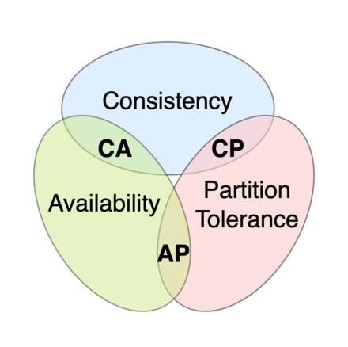

## Why Distributed State?

> One way of characterizing computation is as a set of operations applied to an initial state in order to produce some (presumably more interesting) fifinal state. In this interpretation, programming is the act of invoking and organizing state transitions. 
>
> -- The Role of Distributed State

Take distributed file system as an example, we may need to cache file conent for performance and reducing the overhead.

- Client cache the file content locally
- Server cache the file content in memory, so that it doesn't need to read them from disk which taks lots of time. 

### Cache

1. Exploit locality. Reduce load on bottleneck service. 
2. Batter Latency
3. Move the data to where it is used. So RPC is moving the computation to where the data is.

But cache may cause inconsistent distributed state.

Let's talk about two typical file system design.

- NFS
- Sprite

### NFS File System

Developed by Sun Microsystems in 1984

Design philosophy: **simplicity**

Stateless

- The file is only in the server's disk. Can still cache data in servers' memory, but they are unreliable and can not depend on them.
- Servers do not cache client's info as well.

Idempotent operations

- Write and read at offset
- Lookup

When client updates file

- Updates file cache locally
- Sends wirte request to server
- Server writes data to disks

Performance

- Performance is bad because all updates go though the server's disk

Consistency

- The client will periodically poll the file content from servers. Eventually reach a consistent state.

### Sprite File System

Sprite: Unix-like distributed OS from Berkeley

Track the file open/close status

Use `write-back cache`  (the other term is `write through`)

1. Store the modified block in cache first
2. Writes back to disk after 30s 

Update Protocol

1. Only one client opens the file
   1. Synchronously update
   2. Flush after 30s
2. Multiple clients open the file
   1. Read/write thorugh the servers (no clients can cache the files)

Pros and cons
   1. Pros:
      1. Consistency
      2. Performance
   2. Cons
      1. Complexity
      2. Durability and Disaster recovery
         1. Sprite can ensure Concurrent and Sequential Write-Sharing but cannot resolve the crash recovery. Say there is one client updates the file. Within 30s, the modification blocks are not yet updated to disk before the server crash. Then Sprite cannot ensure linearizability. (The modification is kept in volatile memory so it will disappear after system crashs).
   3. Trade-offs

## Distributed State

Distributed State: Information retained in one place that describes something, or is determined by something, somewhere else in the system.

Example of distributed state:

- A small table kept on each host to associate network addresses with the textual names of other hosts.

### Benefits

1. Performance
2. Reliability
3. Coherence

A new problem occurs while introducing a distributed state

How to ensure/maintain the consistency of distributed state. Take the caching file as an example, the data in multiple machines should be updated consistenly, otherwise different client will read different file content.

## Consistency

Why do we need formal Definition of consistency?

1. We need to define what's the latest data, whether we can see the stale data. Whether we relaly need to read the latest data. 
2. If there are multiple clients write or read simultaneously, what is the consistency, which one should client read? 

### Serializability Consistency

Requires that the history of operations be equivalent to a legal sequential history, where a legal sequntial history is one that respects the local ordering at each node.

1. Legal history sequence
2. Respect local event order

### Linearizability Consistency

One of the strongest guarantees for concurrent objects.

1. Legal history sequence
2. Respect local event order in real time

> Serializability in database is similar to linearizability. It emphasizes that the execution result of txns are like running them serializably, i.e. one by one, even if they are actually executed concurrently.

### Consistency

1. Causal Consistency
   1. Writes that are not concurrent (i.e., writes related by the happens before relation) must be seen in that order. Concurrent writes can be seen in different orders on different nodes.
   2. Lineariziblity implies Causal consistency
   3. Sometimes the a sequence is causal but not sequential.
2. FIFO Consistency: 
   1. writes done by the same process are seen in that order; writes by different processes can be seen in different orders.
3. Eventual Consistency: if all writes to an object stop, eventually all processes read the same value.

## CAP and BASE theorem

### CAP

1. Consistency
2. Availability
3. Partition Tolerance

> In database theory, the CAP theorem, also named Brewer's theorem after computer scientist Eric Brewer, states that any distributed data store can provide only two of the following three guarantees

These CAP properties cannot be acheived at the same time.

### BASE

1. Basically Available
2. Soft State
3. Eventually Consistent

BASE theorem is the result of the trade-off between consistency and availability in CAP. Its core idea is: if strong consistency cannot be achevied, each system can adopt their own approaches to make the system acheive eventual consistency.

## Reference

1. NUS CS5223 Distributed System Course
1. Distributed State by John K. Ousterhou
