If you have ever used MySQL, Redis, Kafka, Etcd, etc, you might have heard concepts such as Follower, Leader Election, Primary Backup, Raft, Paxos, and so on. Yes! In this article, we are going to discuss the consensus protocols.

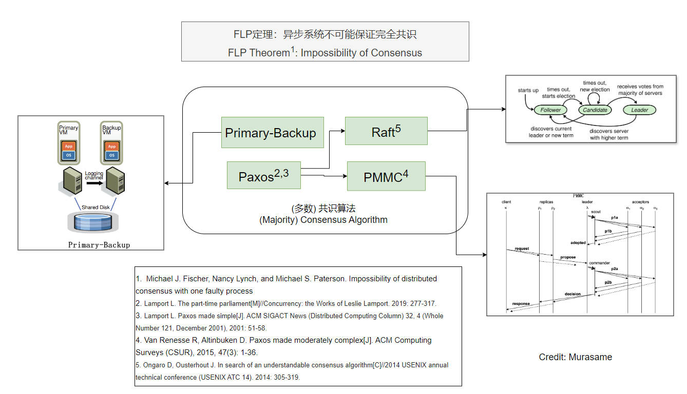

## Distributed Consensus

### What is distributed consensus?

In distributed computing, consensus is a procedure for a number of processes to agree on a single proposal made by one of them. 

The key consensus properties are:

- Safety
  - Uniformity: Only a single value is chosen
  - Non-triviality: Only a value that has been proposed may be chosen
  - A process never learns that a value has been chosen unless it has been.

- Liveness
  - Some proposed value is eventually chosen.
  - Irrevocability: Once agreed on a value, the processes do not change their decision.

### Example, Consensus is hard with faulty

You are making a travel plan with several friends. You need to determine the travel plan, i.e. reach a consensus which can tolerate the below problem.

- You can only point-to-point msg to each other.
- Unreliable Communication. The msg might lose, delay and some friends may be offline from time to time.
- Partition and Fault. Some friends may be offline or not able to see the msg at any time.

> Another typical example is *The Part-Time Parliament* written by Leslie Lamport.

### FLP: impossibility of consensus

It is impossible for a deterministic protocol to guarantee consensus in bounded time in an asynchronous distributed system (even with only one faulty process).

> Given this theorem, should we give up solving the consensus problem?
>
> **Paxos**: non-blocking as long as a **majority** of participants are alive, provided there is a sufficiently long period without further failures

## Primary-Backup State Machine Replication (SMR)

Primary-Backup protocol is the practical System for fault-tolerant virtual machines. 

It provides availability and consistency by State Machine Replication (SMR).

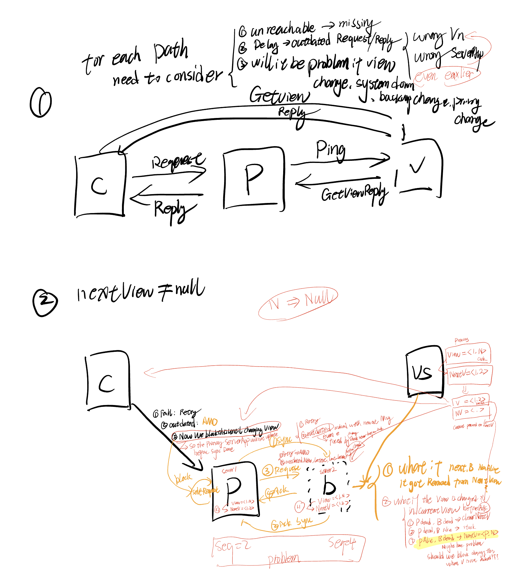

### Implementation

- Replicate the state machine across multiple servers. It is Primary and Backup here.

- Clients can view all servers as one state machine, and it only talks to Primary
- While Primary is down, Backup takes over the Primary. 

Goals

- Correct and available despite some failures

Basic Operation

1. Clients send operations (Put, Get, Append) to primary
2. Primary decides on order of ops
3. Primary forwards sequence of ops to backup
4. Backup performs ops in same order (hot standby) Or just saves the log of operations (cold standby)
5. After backup has executed/saved ops, primary replies to client

### Challenges

1. State Transfer between primary and backup.
2. Communication Problem: Msg lose or delay.
3. Server crushes, fails.
4. Client, Primary and Backup agree there is only one primary at a time.

### View Server

We have to have a something to determine the primary and backup.

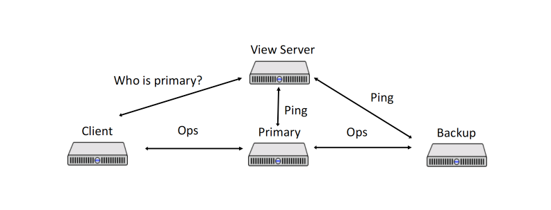

Hard parts

1. Single point of failure
2. Need to determine the Primary and Backup, must be only one Primary at a time.
3. Can not communicate with ViewServer everytime

The View:

1. An immutatble statement about the current system status
2. A list of views form a sequence of status in time: inlcuding primary and backup info.

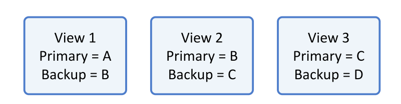

### Implementation of View Server

Implementation:

- Each server periodically send `ping()` to View Server, and ViewServer replies `ViewReply` to servers.

  > A `Ping` lets the `ViewServer` know that the server is alive; informs the server of the current view; and informs the `ViewServer` of the most recent view that the server knows about.

- ViewServer initials the first state with empty machines. It regards the first server who sends `ping()`  as the first Primary, later one as backup. Others are idle.

  > That is to say, View server maintains set of alive servers

- Detect Failure: If ViewServer doesn't receive a `Ping` from a server in-between two consecutive `PingCheckTimer`s, it should consider the server to be dead.

- State Transfer 

  - On Primary fails, ViewServer should transistion to next state with new Primary and Backup. The Primary should transfer the latest state to Backup.
  - On Backup Fails, ViewServer should transistion next state to change an idle server (if any) to Backup. The Primary should transfer the latest state to new Backup.
  - On no Backup, same as On Backup Fails.

- ViewServer waits for Primary ack to track whether Primary has acked (with ping) current view.

> PS: What is state? Please refer to the previous article for more details.
>
> 1. Such as the At-most-once state data
> 2. The client request logs, non-critical, etc

More Rules

1. The current Primary (state i+1) must be the Primary or Backup in the prevoius state(i) 

   - if not, split brain, there will be state(1) A, B, state(2): C, D

2. Primary must ensure the operations have been forwarded to Backup 

   - If not, It will cause missing writes if the asynchronous writes didn't reach Backup before Primary crashes

3. Primary should not Fast Read (Just reply to request) without forwarding to Backup.

   - => if not, It might returns stale read.

   - Ensure original Primary knows it's no longer a Primary. When original Primary fowards to Backup before responsing to client, it might know from B that itself is an old Primary

4. The backup should accept forwards when the view of state is correct. 

   - => to avoid partial split brain

5. Non-Primary shouldn't respond to client

6. Atomic state transfer: shouldn't accept

> Tips: What happens there be more than one servers all think they are Primary?
>
> Split Brain Problem => Split State

### Problem

1. ViewServer waits for Primary ack to track whether Primary has acked (with ping) current view.
2. How can we tell if primary has failed versus is just slow. If primary is just slow, might end up with two primaries!
3. System will lack progress when ViewServer is down.

### Industry Cases

MySQL is using Primary and Backup solutions.

## Paxos

Paxos is a consensus protocol Proposed by Lamport in *The Part-Time Parliament* in 1998.

Due to the complexity, he later published a simple version paper called *Paxos Made Simple* in 1999.

### Background, Goal, Roles, Terms

#### Background

1. A set of processes that can propose values. Processes can crash and recover
2. Assumptions:
   1. Asynchronous communications, msg can take arbitrarily long to be delivered.
   2. Message can be lost and duplicated, but not corrupted

#### Goal 

Consensus on a single node

#### 3 Types of Roles

1. Proposers
   1. Propose value (proposal) to be chosen
2. Acceptors
   1. Accept/Reject proposals
   2. Collectively accept the proposals
3. Learners
4. All logical roles
   1. A physical node can hold multiple roles 

#### Terminology

1. `Value`: a possible value/operation to reach consensus on
2. `Proposal`: to select a value, the proposals are uniquely numbered
3. `Accept`: A proposal/value is accepted by acceptor
4. `Chosen`: A proposal/value is chosen by majority
5. `Learned`: acceptors need to know the proposals is chosen

#### Majority

More than half of the participants

Majorities Intersect: For any two majorities `S` and `S'`, there is some node in both `S` and `S'`.

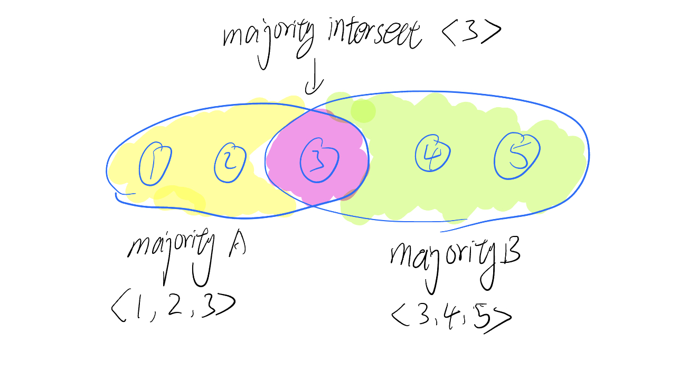

Proposal Number:

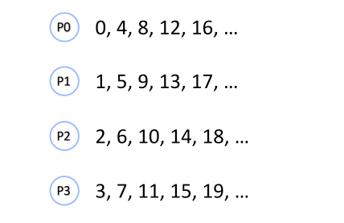

### Implementation, Choosing a Value

Phase 1: 

- Proposer chooses a new `n` and sends the `<proposal, n>` to a majority of Acceptor.
- If an acceptor a receives` <prepare,n’>`, where `n’ > n` of any `<prepare,n>` to which it has responded, then it responds to `<prepare, n’>` with
  - A promise not to accept any more proposals numbered less than `n`
  - The highest-numbered proposal (if any) that it has accepted

Phase 2:

- If the proposer receives a response to `<prepare,n>` from a majority of acceptors, then it sends to each `<accept,n,v>`, where `v` is either
  - The value of the highest-numbered proposal among the responses
  - Any value if the responses reported no proposals
- If an acceptor receives `<accept,n,v>`, it accepts the proposal unless it has in the meantime responded to `<prepare,n’>` , where `n’ > n`

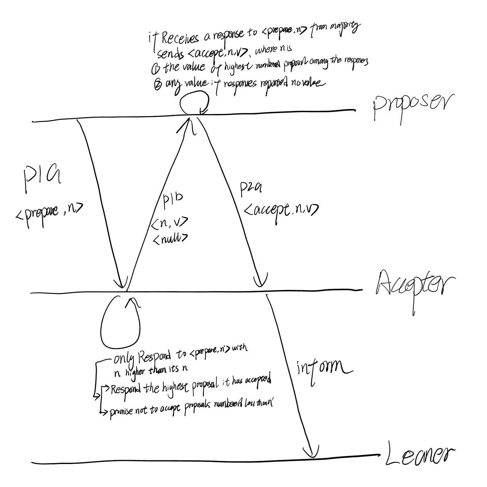

### Learning a Chosen Value

Once a value is chosen, learners should find out about it. Many strategies are possible:

1. Each acceptor informs each learner whenever it accepts a proposal.

2. Acceptors inform a distinguished learner, who informs the other learners.

### Problem

1. Liveness is not guaranteed because of race conditions of leader election.
   1. Solution? Have a stable/distinguished Leader

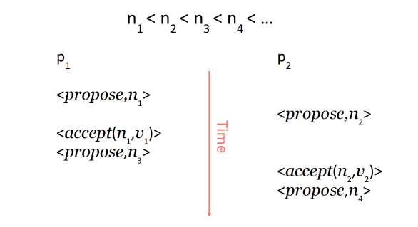

### Industry Cases

1. [The Chubby lock service for loosely-coupled distributed systems](http://labs.google.com/papers/chubby-osdi06.pdf)
2. [Apache ZooKeeper](http://zookeeper.apache.org/)
3. [Cassandra uses Paxos](http://www.datastax.com/dev/blog/lightweight-transactions-in-cassandra-2-0) to ensure that clients connected to different cluster nodes can safely perform write operations by adding "IF NOT EXISTS" to write operations. 

## PMMC, Paxos Made Moderate Complex, Multi-Paxos

High-level idea:

- Leader elects itself by running Paxos Phase 1 for all instances
- Once elected, only runs Paxos Phase 2 for each proposal
- If leader dies, other nodes repeat the process (elect themselves, etc.)
- Paxos ensures safety

Roles in PMMC

- Replicas (like learners) Keep log of operations, state machine, configs

- Leaders (like proposers) Get elected, drive the consensus protocol

- Acceptors (same as Paxos acceptors) “Vote” for leaders and accept ballots

Ballots Number: (leader, seqnum) pairs, so different server has different priorities

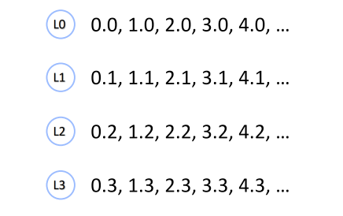

### Stable Leader

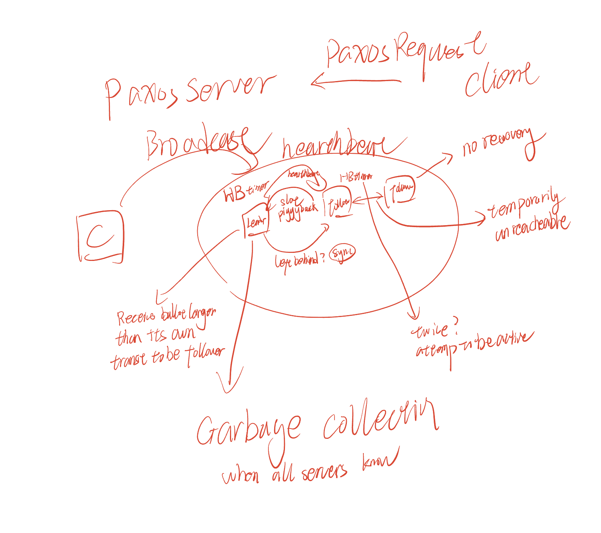

### Implementation

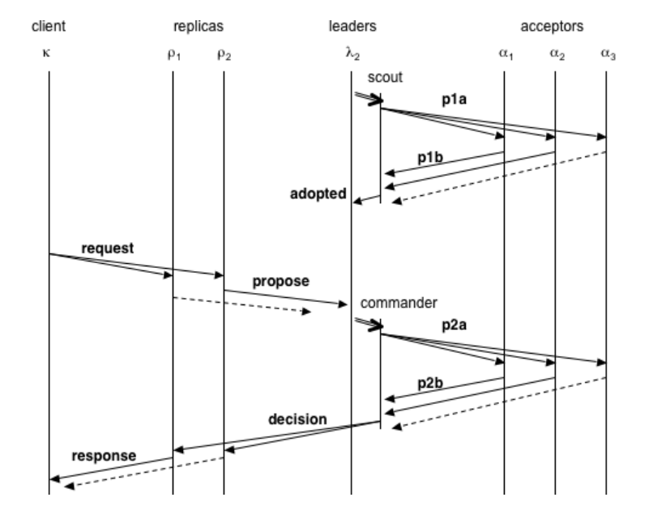

## Raft

Published in 2014. Goal: understandability

https://raft.github.io/

https://thesecretlivesofdata.com/raft/

## Implementation

Only one role: replica/server

Three states:

- Leader
- Follower
- Candidate

Two main protocols centered around an operation log

- Leader election

- Log replication

Divide time into terms

- Consecutive integers: term 1, 2, 3, …
- Similar to proposal numbers and ballot numbers
- Each term begins with an election

**At most one** replica will win the election in a term

- Or no leader gets elected

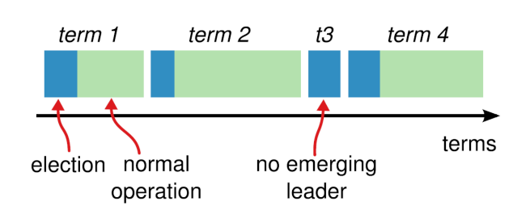

### log diverge

How to re-establish log consistency?

Leader forces follower to duplicate its log

Leader overwrites follower’s conflicting entries

Procedure

- When receives AppendEntries, follower deletes any conflicting entry (and all 

entries follow it), and rejects AppendEntries

- Leader retries AppendEntries with a lower index

- Eventually all conflicting entries are removed, and leader’s entries are 

installed

### Industry Cases

1. Kafka
2. Etcd 

### Question

> In the Raft protocol, a server accepts a RequestVote RPC if the candidate’s log is up-to date with its own log, where more up-to-date meaning the last log entry has a later term, or the same term but with a higher log index. Suppose we simply the Raft protocol by removing the latter requirement, i.e., the server only checks that the last log entry has the same or a later term, is the protocol still safe? If yes, justify your answer; if no, provide a sequence of events that leads to a linearizability violation.

**Answer:**

If the server only checks that the last log entry has same or a later term, **it is not safe.** 

Assuming a server's own log has the same term but with a higher log index than the RequestVote RPC, it indicates that server's own log is more up-to-date than a candidate who sent the RequestVote RPC. If the server omits this property, it will violate the linearizability.

A sequence that violates the linearizability:

1. Assuming there are three clients, server1, server2, and server3.
2. First round, server1 is leader, and it propogates several AppendEntities to server2 and server3.
3. Let's say the server1 log is `<1, 1, 1>`, server2 is `<1, 1, 1>`, server3 is `<1, 1>` (missing the last index 3).
4. The last index 3 is executed by server1 and server2 because they form a majority quorum.
5. If we only check that the last log entry has the same or a later term, in the possible new election, the server3 may be the new leader without the latest index 3 log, which violate the linearizability.

## Reference

1. [NUS CS5223 by Jialin](https://www.comp.nus.edu.sg/~lijl/)
2. Fischer, M. J., Lynch, N. A., & Paterson, M. S. (1985). Impossibility of distributed consensus with one faulty process. *Journal of the Association for Computing Machinery*, *32*(2), 374–382. https://doi.org/10.1145/3149.214121
3. *2. Week 02: SMR and Consensus Protocols — CS6213 2021*. (n.d.). https://ilyasergey.net/CS6213/week-02-consensus.html
4. Scales, D. J., Nelson, M., & Venkitachalam, G. (2010b). The design of a practical system for fault-tolerant virtual machines. *Operating Systems Review*, *44*(4), 30–39. https://doi.org/10.1145/1899928.1899932
5. Van Renesse, R., & Schneider, F. B. (2004). *Chain replication for supporting high throughput and availability*. 7. https://courses.cs.washington.edu/courses/csep552/16wi/papers/vanrenesse-chain-replication.pdf
6. Lamport, L. (1998). The part-time parliament. *ACM Transactions on Computer Systems*, *16*(2), 133–169. https://doi.org/10.1145/279227.279229
7. Lamport, L. (2001). *Paxos Made Simple*. 51–58. https://courses.cs.washington.edu/courses/cse490h/11wi/CSE490H_files/CSE550.paxos-simple.pdf
8. Dang, H. T., Canini, M., Pedone, F., & Soulé, R. (2016). Paxos Made Switch-y. *Computer Communication Review*, *46*(2), 18–24. https://doi.org/10.1145/2935634.2935638
9. Liskov, B., & Cowling, J. (2012). *Viewstamped Replication Revisited*. http://pmg.lcs.mit.edu/papers/vr-revisited.pdf
10. Ongaro, D., & Ousterhout, J. (2014). *In search of an understandable consensus algorithm*. 305–320. http://files.catwell.info/misc/mirror/raft/raft.pdf
11. [Raft Consensus](https://raft.github.io/)
