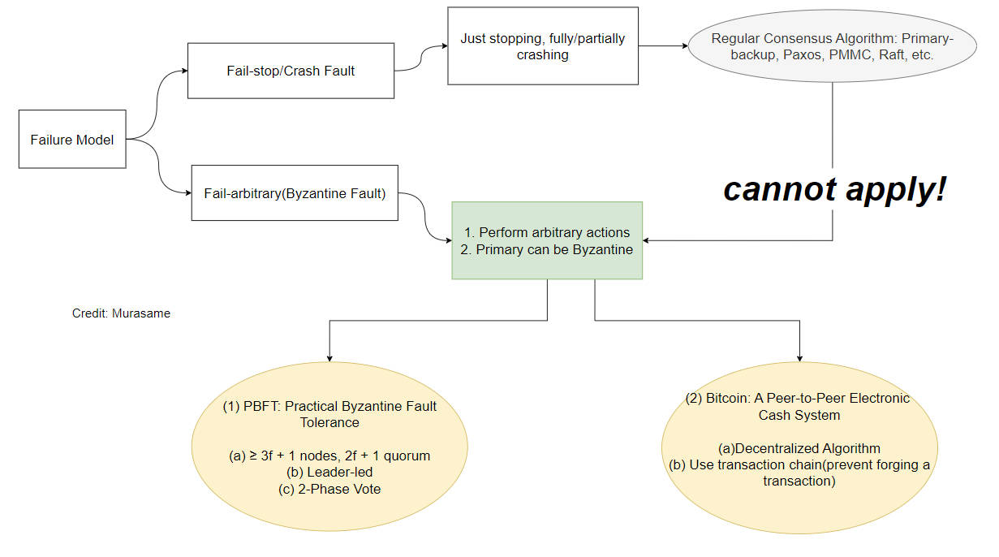

# 拜占庭容错 Byzantine Fault Tolerance

## Question 1, How does `PBFT` prevent impersonating?

> How does PBFT prevent faulty replicas from impersonating other non-faulty replicas?

**Answer:**

Because of the properties of faulty nodes, (1) At most Polynomial Computation Power. (2) Cannot violate cryptographic Primitives.

There is Solution: public-key cryptography

1. Servers and clients can sign messages and verify signatures
2. Signatures aren't forgeable
3. Anyone can verify signatures
4. We denote message `m` signed by `p` as `<m>p`

## Question 2, How does `PBFT` ensure consistency of execution?

> Consider a faulty primary that includes different client requests for sequence number *i* in pre-prepare messages it sends to backup replicas. How does PBFT ensure that non-faulty replicas do not execute different commands for log slot *i*?

**Answer:**

This is one of three worst conditions may caused by faulty primary, where primary assigns different commands to the same sequence number (aka. equivocation).

Solution: replicas exchange information about operation received from primary

- If equivocation leads to failure of quorum creation: (1) Dead-lock (2) Elect new Primary

- If it doesn’t, Its fine

## Question 3, Can `Commit` Pahse be removed?

> You have implemented PBFT, but realized it is too slow. You therefore decided to remove the commit phase of the protocol (Figure 1 of the PBFT paper). Is your optimized version of the protocol correct? If yes, justify your answer. If no, give a sequence of events that leads to a safety violation.

**Answer:**

No, the optimized version is not correct.

The reason why COMMIT phase is required is it is needed to prove that every quorum of `2f+1` servers has at least one non-faulty node with a `Prepare Certificate`.

Assuming this sequence, there are four servers numbered from 1 to 4, `server2` is Byzantine Faulty node, and others are honest servers (sever1, sever2, and server4). Network parttion could sometimes happens to partition them as 3 servers collections.

1. Assuming client sends a request to primary(server1).
2. Primay broadcast the `pre-prepare` to all backups(server2, server3, and server4)
3. All server broadcasts `prepare` for all others.
4. If server1, server2, and server3 form a network partition, while server2, server3, and sever4 form another.
5. Let's say sever2 (Byzantine Faulty node) is Byzantine Faulty node, it responds `prepare` to server1, while not responding to sever3 and server4. Thus only sever1 gets the `PREPARE CERTIFICATE 1`, while server4 and sever3 do not.
6. Client received two (f+1) matching `COMMIT REPLY` from the sever1 and server2(Byzantine Faulty node), and thought it was COMMIT successfully.
7. There will may be another round of commit, because of the operations of sever2 (Byzantine Faulty node), the server3 and sever4 get different `PREPARE CERTIFICATE 2` which is diff from the `PREPARE CERTIFICATE 1` in sever1.
8. After view change, the new leader needs to know which `PREPARE CERTIFICATE` to choose, if it chooses `PREPARE CERTIFICATE 2` based on the number of servers, it violates the linearizability because client thought the `PREPARE CERTIFICATE 1` has been committed but it does not exist in the new leader.
9. **If we don't do third `COMMIT` phase and let the server with `PREPARE CERTIFICATE` commit immediately, it will violdates the `safety`, i.e. majority of the severs commit together and will later violdate `linearizability`.**

## Reference

1. Castro, M., & Liskov, B. (1999). *Practical Byzantine fault tolerance*. 173–186. https://doi.org/10.5555/296806.296824
2. Squarepants, S. (2008b). Bitcoin: A Peer-to-Peer Electronic Cash System. *Social Science Research Network*. https://doi.org/10.2139/ssrn.3977007