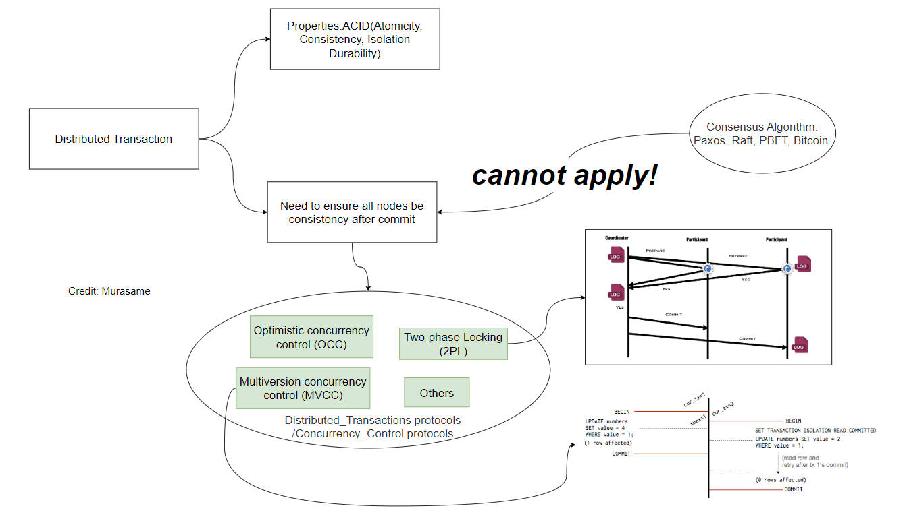

# 分布式事务 Distributed Transaction

In this article, we are going to talk about the Distributed Transaction.

## Question 1: Participant does not `log` after sending `Abort`?

> In the two-phase commit protocol, a participant writes a YES record to disk **before** sending a YES vote to the coordinator. But if the participant votes NO, it can log an ABORT record to disk either before or after sending the NO vote to the coordinator.

> Explain why the ABORT record can be written either before or after sending a NO vote.

If the ABORT record is 

- Wrriten before sending vote
  - The action is logged before responding to the coordinator. No matter when the failure of participant happens, and msg drop. The participant always knows it ABORT the PREPARE from the record in disk. It does not violate the atomicity.
- Written after sending vote, assuming participant 1 crashes after sending vote and before recording in disk. If it violates the atomic commitment guarantees? It does not violate because:
  - If the ABORT sent is not received by the coordinator, the coordinator will ABORT the transaction after timeout. 
  - If the ABORT sent is received by the coordinator, a coordinator will also ABORT the transaction.
  - Both cases are fine because Coordinator will not COMMIT, which is consistent with the Abort decision of Participant 1.

## Question 2: Participant `log` after sending `Commit`?

> Suppose the participant writes a YES record to disk after sending a YES vote. Give a sequence of events that leads to a violation of the atomic commitment guarantees.

**Answer:**

It violates the atomic commitment guarantees: If all failures are eventually repaired, the transaction is eventually either committed or aborted.

The possible violating sequence:

1. Coordinator send PREPARE to all participants
2. Participant 1
   1. Send YES vote
   2. Crash before recoding the YES to disk
3. The coordinator receive the YES votes from all Participants, COMMIT, and send COMMIT to all participants.
4. The COMMIT msg may or may not be received by participant 1 because of crash.
5. After recovery, there are some choices without the YES record in disk
   1. COMMIT: participant 1 can not commit because it does not have the YES vote log in the disk.
   2. ABORT: this decision is diff from the previous YES vote it made
   3. WAIT: it will not know it needs to ask the coordinator for the result without YES record in disk
6. Obviously, all of them do not lead to COMMIT decision in participant 1 while the coordinator COMMIT. It violate the atomic commitment guarantees.

## Question 3: Single-Key Transaction

> Suppose a distributed transactional system uses two-phase locking for concurrency control. You implement the following optimization: for single-key transactions (i.e., transactions that only read/write a single key), the transaction does not acquire any locks. Does this optimized protocol still enforce serializability? If yes, justify your answer. If no, give a sequence of transactions and execution schedule that leads to a serializability violation.

**Answer:**

It does not enforce serializability.

The definition of serializability is: **Each transaction's reads and writes are consistent with running them in a serial order,  one transaction at a time.** 

Suppose the initial value of A  is 0 at first. There are two transactions 1 and 2 as described below. The result of serial order (one transaction at a time) is that two reads of A of Transaction 1 both return 0 or 1. 

Inside the two-phase locking, assuming the coordinator is handling the request. If we allow the single-key transaction not to acquire any locks, the write of Transaction 2 can ignore the read-lock of A. So the write A of transaction 2 can be executed between two reads of A of transaction 1. It is possible that the first read of A returns 0 but second reads returns 1 in Transaction, which is not consistent to the expected serial result. It violates serializability.

- Transaction 1, multi-keys
  1. Read A
  2. (It's possible that the single-key transaction without lock is executed here)
  3. Read A
- Transaction 2, single-key
  - Write A  = 1

## Reference

1. [Distributed Recovery (7.1-7.4)](https://canvas.nus.edu.sg/courses/53007/files/3322730?wrap=1)
2. Corbett, J. C., Dean, J., Epstein, M., Fikes, A., Frost, C., Furman, J. J., Ghemawat, S., Gubarev, A., Heiser, C., Hochschild, P., Hsieh, W., Kanthak, S., Kogan, E., Li, H., Lloyd, A., Melnik, S., Mwaura, D., Nagle, D., Quinlan, S., . . . Woodford, D. (2012). *Spanner: Google’s globally-distributed database*. 251–264. https://doi.org/10.5555/2387880.2387905