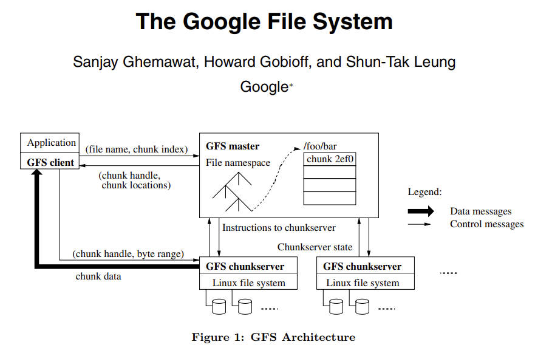
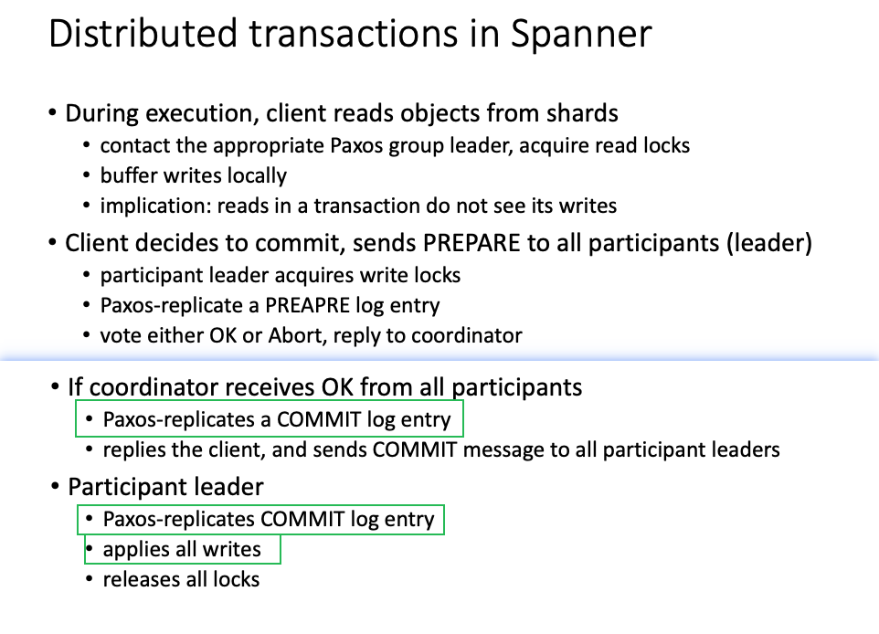

# Distributed File System



```
**Google File System**  => used by MapReduce(mainly)
1. Why? There are many other systems(NFS,..)
2. Special workload
   1. Big File, not optimized for small file
3. Interface
   1. app-level library, not POSIX interface
4. Architecture
   1. Single Master for storing the metadata
   2. Interesting points
      1. Client will send the data directly to any replica instead of the master. 
         1. Client -> follower -> Primary -> follower
         2. Resonbeing **the client might be far away from master**
      2. Client will need to ask Primary whether the ops is successful
      3. If one of the writes fail?
5. GFS file region state after mutation
   1. consistent
      1. all clients reads same meta
   2. defined
      1. all clients will see the mutation entierly
   3. inconsisent
      1. cleint might see different value at different time
6. Problem
   1. After all clients finished writes successfully
   2. is the state defined?
      1. NO: because the update will not be consistent
      2. Solution:
         1. Atmoic Record Append
         2. Only append to the end of Chunk
7. GFS endgame
   1. it scaled to ~50 million files, ~10 PB
   2. GFS eventually replcied with a n
```



## Question 1, GFS’s record duplicates?

> Give one scenario where GFS’s record append would insert duplicate records at the end of a file.

**Answer:**

1. Client A reads the metadata (file name, chunk index) of the file from the GFS Master.
2. Client sends `append` request to all replicas who owns the chunks (secondary and primary)
3. Client request primary server to execute the `append`
4. Primary brocasts the request to all secondary replicas, one of replica fails because of network partition or server failure, , others executed successfully.
5. Primary replies ERROR to Client because of not all replicas succeed.
6. Client retries the `append` and ask for executing it. The preivous successful replica might exectute the `append` at the end of same chunk of the file.

## Question 2, Why erroneous writing can be read.

> Suppose client A performs a record append to a GFS file, but the call returns an error. Client B later performs a read on the same file. However, client B is able to read client A’s data, even though client A’s write returned an error. Give a sequence of events that can lead to this behavior.

**Answer:**

1. Client A reads the metadata  (file name, chunk index)  of the file from the GFS Master.
2. Client A sends `append` request to all replicas who owns the chunks (secondary and primary)
3. Client A requests primary server to execute the `append`
4. Primary brocasts the request to all secondary replicas, one of replica fails because of network partition or server failure, others executed successfully.
5. Primary replies ERROR to Client A because of not all replicas succeed.
6. Client B reads the metadata  (file name, chunk index) of the file from the GFS Master.
7. Client B `read` same file from one of the replica which had executed successfully. Therefore, the Client B is able to read client A's data.

## Question 3, Does reading from any replicas ensure linearizability?

> GFS allows clients to read chunk data from any replica chunk server. Can this design choice lead to linearizability violation? If yes, give a sequence of events that lead to a violation. If no, justify your answer.

**Answer:**

Yes,  it will lead to linearizability violation.

1. As what we discussed above. The partialy failed write data (1) of client A may cuase inconsistent data in a chunk.
2. Client B reads data may read data (1) from the server who succeed at step 1, while cannot reads data (1) from the server who failes to operate. It is not consistent, and of course not linearizable.

## Reference

1. Ghemawat, S., Gobioff, H., & Leung, S. T. (2003). The Google file system. *Operating Systems Review*, *37*(5), 29–43. https://doi.org/10.1145/1165389.945450
2. Chang, F., Dean, J., Ghemawat, S., Hsieh, W. C., Wallach, D. A., Burrows, M., Chandra, T., Fikes, A., & Gruber, R. E. (2006). *Bigtable: a distributed storage system for structured data*. 205–218. https://doi.org/10.5555/1298455.1298475
3. Burrows, M. (2006). *The Chubby lock service for loosely-coupled distributed systems*. 335–350. https://doi.org/10.5555/1298455.1298487
