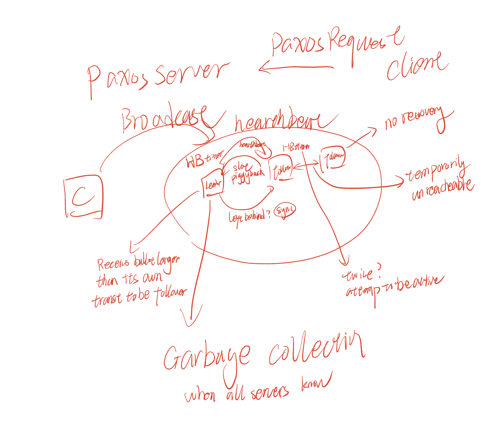

# Lab3 Paxos Fault Tolerance

> We are not allowed to share codes online. 
>
> For more details, Pls refer to NUS CS5223 Lab's Repo: https://github.com/nus-sys/cs5223-labs/tree/main/labs/lab3-paxos

1. PMMC
2. stable leader paxos
3. implementation details
4. garbage collection
5. state transfer
6. PaxosServer plays all the roles (replica, acceptor, leader) 
   1. simultaneously 
      1. Simplifications and optimizations
      2. Don’t create different types of nodes!
      3. Garbage collection
      4. Delete commands after **all** nodes have executed

7. 

PMMC

1. p1a, elect
2. p1b, approve
3. p2a, propose
4. p2b, accept
5. p2c, ack of acccept