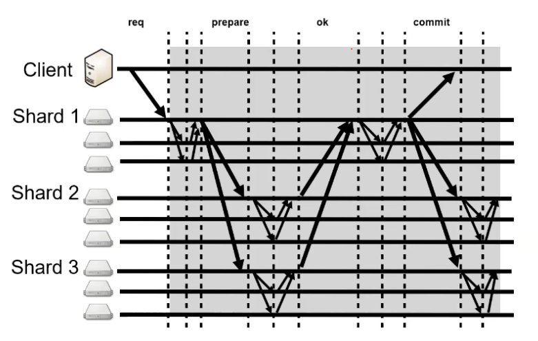
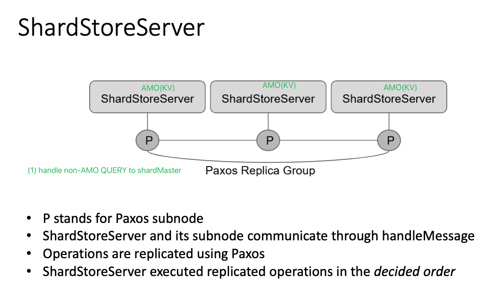

# Lab4 ShardStoreServer

> We are not allowed to share codes online. 
>
> For more details, Pls refer to NUS CS5223 Lab's Repo: https://github.com/nus-sys/cs5223-labs/tree/main/labs/lab4-shardedstore 

1. Shard Master
2. 2 phase commit
3. Use Paxos to record the decisions
4. Distributed Transaction

## Part 1 ShardMaster

所以反推join和leave的balance逻辑：

1. Join
   1. totalShardNum / groupNum `==` EvenGroupNum
   2. 计算出当前的max和min（差值不超过1）
   3. 计算需要的remainingShards Number
      1. shards数量少于EvenGroupNum的group需要补到min
      2. newGroup需要一个min
   4. 从多于max的group中拿到多于的shards：RemainingShards
   5. 如果nonNecessaryShards少于min，把当前拥有max的group尽量一个拆一个，不要小于min了
   6. 把多于的shards分给
      1. shards数量少于EvenGroupNum的group
      2. newGroup
2. leave
   1. totalShardNum / groupNum `==` NewGroupNum
   2. 计算出当前的max和min（差值不超过1）
   3. 把leave的group的shards拿出来：RemainingShards
   4. 从多于max的group中拿到多于的shards：RemainingShards
   5. 把多于的shards分给
      1. shards数量少于EvenGroupNum的group，都分成至少min
      2. 再考虑把剩余的平均分给数量为min的group

演算算法：

### Operations

1. Join

   1. Req
      1. groupID
      1. a set of server addresses

   2. Resp
      1. Process
         1. should divide the shards as evenly as possible among the groups
         2. should move as few shards as possible
      2. Return
         1. Ok upon Join successfully
         2. Error if the group already exists

2. Leave

   1. Req
      1. groupID(should be a previously joined group)
   1. Resp
      1. Process
         1. create a new config that doesn't include the group, and assign the group to the remaining groups
         2. The new configuration should **divide the shards as evenly** as possible among the groups, 
         3. and should **move as few shards** as possible to achieve that goal. 

      2. Return
         1. Ok upon successful ops
         2. Error if the group didn't exist

3. Move

   1. Req

      1. shard number
      2. []GroupID

   2. Resp

      1. Process
         1. create a config in which the shard is assigned to the group 
         2. the shard is moved from the previous config

         2. Return
            1. OK upon successful completion of Move
            2. Error otherwise (e.g., if the shard was already assigned to the group).
    
      3. Others
    
         1. A `Join` or `Leave` following a `Move` could undo a `Move`, since `Join` and `Leave` re-balance.
         2. Purpose: The main purpose of `Move` is to
            allow us to test your software, but it might also be useful to load balance if
            some shards are more popular than others or some replica groups are slower than
            others.

4. Query

   1. Req
      1. configNum
   1. Resp

      1. return `shardConfig` associated with the configNum
      2. if number is `-1` or larger than the largest known config number

         1. return the latest config
      3. The fist `query` after `Join` is executed

         1. should be numbered by `INITIAL_CONFIG_NUM`
      4. Before the first config is created
         1. should return `Error` instead of a `shardConfig` object

### Test Analysis

1. Test1
   1. Join group1(server1, server2, server3) and group2(server4, server5, server6)
   2. move group2 to the shards of group1
      1. Expect OK
   3. leave group2
      1. Expect OK
2. Test2
   1. query configNum(-1)
      1. Expect Error because there is no shards 
3. test3: Bad commands return ERROR
   1. join 
      1. repeately
   2. leave 
      1. a non-joined gorup
   3. move 
      1. a group to it's existing group
      2. a non-existing group
      3. a group to a non-existing sharNum, such as 0 or more than Default_num_shards
   4. End
4. test4: Initial config correct
   1. check the first initial config num is 0
   2. and all shards have been assigned to group1
5. test5: Basic join/leave
   1. checkConfig
      1. what is a balanced config?
         1. max and min are not null
         2. max - min `<=` 1 + (2 * numMoved)  `<==` 因为一个move可能会把min移到max上
      2. Check that groups have the right addresses
         1. i.e. the group1 have (server1, server2, server3)
      3. Check mappings are distinct and union to the full shard range
         1. which is to check each groups are assigned distinct shards. All of the shards should be the full shard range.
   2. checkShardMovement
      1. 遍历previous和current，找到变化的numMoved
      2. 查看previous和current的group数量差是否小于1
      3. 如果previous的group数量大于当前group的数量
         1. 就是leave操作，移除一个group。或者MOVE操作移动group到另一个shard覆盖掉了（）
         2. 找到current缺少的group，判断：
            1. previous的group的shards等于numMoved
      4. 如果previous的group数量小于当前group的数量
         1. 就是join操作了
         2. 找到current多的group，判断：
            1. current的这个group的shard number等于numMoved
            2. 并且查看是否even：totalShardNum / groupNum `==` groupNum
      5. 如果previous的group数量等于当前group的数量
         1. 就是MOVE操作移动group到另一个shard了，assertEquals(1, numMoved);
   3. 所以反推join和leave的balance逻辑：
      1. Join
         1. totalShardNum / groupNum `==` EvenGroupNum
         2. 计算出当前的max和min（差值不超过1）
         3. 从多于max的group中拿到多于的shards：RemainingShards
         4. 如果nonNecessaryShards少于min，把当前拥有max的group尽量一个拆一个，不要小于min了
         5. 把多于的shards分给
            1. shards数量少于EvenGroupNum的group
            2. newGroup
      2. leave
         1. totalShardNum / groupNum `==` NewGroupNum
         2. 计算出当前的max和min（差值不超过1）
         3. 把leave的group的shards拿出来：RemainingShards
         4. 从多于max的group中拿到多于的shards：RemainingShards
         5. 把多于的shards分给
            1. shards数量少于EvenGroupNum的group，都分成至少min
            2. 再考虑把剩余的平均分给数量为min的group
      3. end
6. test6: Historical queries
   1. query the configs ranges from INT(0) to MAX(5) done in test5
7. test7: Move command
   1. 
8. test8
9. end

## Part 2: Sharded Key/Value Server, Reconfiguration

### Test Analysis

问题：

1. 我们可以只让shardStoreLeader去和Client联系吗？
2. unreliable会阻断client和leader的联系吗？
   1. 如果是的话，我们需要考虑让follower的store给leader的store发命令吗？
3. 会有并发的join、leave、move吗？也就是问会有并发的、密集的reconfig吗？
4. reconfig和普通操作会如何重叠
5. 如何知道自己在reconfig需要receive或者send shard？
   1. 比较一下previous和current的shards
   2. previous有，current没有的：需要找到下家并send
   3. previous无，current有的：需要等待receive new shard

6. 只要收到ack和receive shark就可以开始proceed了对吗？对
   1. 因为leader知道了代表整个paxos group都承认了，所以需要把send，receive ack和receive shark都做成一个command，用以保持paxos一致性

7. 所以recofing的command有
   1. reconfigs prepare，stop processing
      1. ~~needSend = True~~ duplicate with 2
      2. needAck = True
      3. needReceive = True

   2. reconfig send
   3. reconfig receive shard
   4. reconfig receive ack of send

8. end

key points

1. just initiate: should get the latest config
2. after which: should get the next config one by one
3. the config should be regard as a AMOcmd
4. send shards should be []KV per move

1. Test1: single group(3 servers inside), shardsMaster(3 servers), client(1), numshards(10)

   1. join group1
   2. Simplewordload

2. Test2: Multi-group join/leave

   1. joinGroup(1, 3);，这里没有用默认值，意思是以后有测试：一个group可以只join一部分server address给shardmaster？？？
   2. 一个client，三个store group（3个servers）, shardMaster(3 servers), numberShards(10)
   3. join group1
   4. put 100 keys
   5. join group 2 and 3
   6. wait for 5sec
   7. check 100 key contents added above
   8. 
   9. replace 100 keys values
   10. leave group 1 and 2
   11. **wait for 5 sec**
   12. check 100 key contents replaced above

3. Test3: Shards move when group joins

   1. 2 groups of SSS, shardNumber 100
   2. join group 1
   3. add 100 key-values
   4. join group 2, should be evenly, 50 keys on group2
   5. sleep 5sec
   6. remove all servers of group1
   7. query the values of all shards
   8. the shardsFound should be (1/3, 2/3)

4. Test4: Shards move when moved by ShardMaster

   1. join group 1
   2. add 100 key-values
   3. join group 2, should be evenly, 50 keys on group2
   4. move 
   5. a series of re-config....
   6. Move 10 shrads from 1 to group 2 one by one :star:
   7. Sleep 5sec
   8. remove all node in group1
   9. add a client to each shard for group1 and group2 to get values of key
   10. sleep 10sec
   11. invariant:
       1. client of group2 should compelte operations
       2. clients of group1 shouldn't complete ops

5. Test5: Progress with majorities in each group

   1. 每个StoreGroup和shardMasterGroup都只保留Majority :star:
   2. Test2: Multi-group join/leave

6. Test6：Repeated partitioning of each group

   1. join 3 StoreGroup with 3 Servers; numShardMasters = 3, numShards = 10,
   2. Startup the clients with 10ms inter-request delay (infinite workload)
   3. Clients with different keys and infinite workload
   4. // Re-partition -> 2s -> unpartition -> 2s
      1. Re-partition，即每回合随机禁掉一个StoreGroup的minority，即一个server :star:
   5. 等待50s
      1. 确保每个client的query都在正常工作
   6. 检查最大等待时间不超过2s

7. Test7：Repeated shard movement

   1. join 3 StoreGroup with 3 Servers; numShardMasters = 3, numShards = 10,
   2. Startup the clients with 10ms inter-request delay (infinite workload)
   3. 不断地随机移动shard，sleep 4s，所以每个move必须4s内完成，期待make progress
   4. 等待50s
   5. 确保每个client的query都是线性的
   6. 检查最大等待时间不超过5s

8. Test8: Multi-group join/leave 【Unreliable】

   1. network deliver rate 0.8
   2. Test2: Multi-group join/leave

9. Test9: Repeated shard movement 【Unreliable】

   1. network deliver rate 0.8
   2. Test7：Repeated shard movement

10. Test10: Single client, single group 【search test】

    1. storegroup:1, serverNum: 1, shardMasterNum: 1, shardNum: 10
    2. client: 1

11. Test11: Single client, multi-group 【search test】

    1. storegroup:2, serverNum: 1, shardMasterNum: 1, shardNum: 10
    2. client: 1

12. Test12: Multi-client, multi-group 【search test】

    1. storegroup:2, serverNum: 1, shardMasterNum: 1, shardNum: 2
    2. two clients' workload

13. Test13: One server per group random search【search test】

    1. storegroup:2, serverNum: 1, shardMasterNum: 1, shardNum: 2
    2. cmd:
       1. join group1 
       2. Join group2
       3. leave group1
    3. Four clients with their workloads
    4. end

14. Test14: Multiple servers per group random search【search test】

    1. storegroup:2, serverNum: 3, shardMasterNum: 1, shardNum: 2
    2. same as Test13

15. end

## Part 3: Transactions

### Test Cases Analysises

1. 被lock挡住的普通amocmd（get，put，append）该怎么办
2. 被lock挡住的reconfig怎么办
3. 被reject的txn怎么办？
4. 需要在接受txnPrepare的时候，直接检查锁并reject嘛？不能！
5. :arrow_up: 相信奇迹吧
6. 怎么样paxos-replicate TxnMsg
7. TODO：在handleMsg和在handlePaxosDecision的时候reject效果是不同的
   1. 一个是直接就不让paxos判断，一个是经过paxos决定，但是实际却不执行。。。。
   2. TODO: !!! maybe this drop will cause the client cannot get the response /or cause serializability problem
8. TODO: replicate recieved msg to leader
9. TODO: cancel the isleader() limitation, let follower can forward msg.
10. TODO: but I think the problem is happening during reconfig

1. Test1: Single group, simple transactional workload
   1. 
2. Test2: Multi-group, simple transactional workload
3. Test3: No progress when groups can't communicate
   1. Client can talk to both groups, but they can't talk to each other
   2. So only the txn within a shard is successful, otherwise stuck
4. Test4: Isolation between MultiPuts and MultiGets
   1. 就是说put的write lock会把get隔绝
5. :new:
6. Test5: Repeated MultiPuts and MultiGets, different keys
   1. repeatedPutsGetsInternal() => doesn't including movement
7. Test6: Repeated MultiPuts and MultiGets, different keys 【unreliable】
   1. networkDeliverRate(0.8)
   2. repeatedPutsGetsInternal() => doesn't including movement
8. Test7: Repeated MultiPuts and MultiGets, different keys; constant movement 【unreliable】
   1. networkDeliverRate(0.8)
   2. repeatedPutsGetsInternal() => including movement
9. 
10. Test8: Single client, single group; MultiPut, MultiGet 【Serach】
11. Test9: Single client, multi-group; MultiPut, MultiGet 【Serach】
12. Test10: Multi-client, multi-group; MultiPut, **Swap**, MultiGet 【Serach】
13. Test11: One server per group random search 【Serach】
    1. randomSearch
    2. client1 multiPut("foo-1", "X", "foo-2", "Y")
    3. Client2 multiGet("foo-1", "foo-2")
    4. 要么没有结果，要么结果全为空、要么结果为（X，Y）
14. Test12: Multiple servers per group random search 【Serach】
15. End
