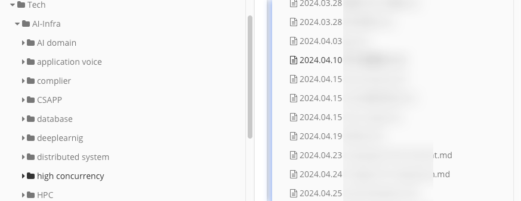

## 缘起，遗忘的痛苦

这十几年的学习让我明白一件事：不用的知识是一定会忘掉的。比如高考后两个月就把物理化知识忘得一干二净只剩模糊的记忆，比如本科学习的课程考试完后就逐步遗忘，工作了三年更是觉得如此。

这背后的脑科学原理我并不了解，但从过去几十年的经验来看，对抗遗忘最好的方式就是输出。可以写出来、讲给别人听、做成视频。

输出的好处有：

- 即使输出后长时间不用忘掉了，以后也可以凭借自己的输出快速拾起来
- 输出的东西是一个 showcase，适合展示自己的能力、涉猎知识、所学所悟

怎么输出呢？ 通过什么渠道呢？

我曾以为，自己学了什么想了什么记到笔记就好了。所以就在自己的私密 doc repo 中记录自己的学习，所思所想。等到有时间润色后再发到自己的 blog [fenglyu.lin](https://fenglyulin.com/) 上。这样子做了两年，效果并不好，学习后的输出常常匆匆开始、草草结束。

我觉得主要原因如下

1. 如果笔记只是写给自己看，那就容易懈怠，容易写的很潦草，并不考虑观感，时常自己回头看都一头雾水。
   1. 所以，要公开出来给大家看
2. 自己写的笔记都东一块西一块的，写完过一阵子就忘了有这回事了。有时我翻自己的笔记时，常常惊讶于我居然想过这个问题？我当时就这么想了？
   1. 所以，要系统化归纳

## 建立自己的知识文档网站

以前我建立过很多的博客网站：https://colalinn.github.io/、https://fenglyulin.com/。

但博客网站不适合这样子的归纳式、系统式的更新。直到在 NUS 的这学期上完分布式系统和机器学习课程后，我看着自己潦草的笔记，灵光一闪：为何不做一个自己的文档分享网站？就像大家所熟悉的技术文档官网：[go.dev](https://go.dev/)、[python.org](https://www.python.org/)、[vuejs.org](https://vuejs.org/)。

在这个文档网站 [doc.fenglyulin.com](https://doc.fenglyulin.com/) 上线和不断更新的一个月中，我也看到了许多系统化输出知识的前辈们：

1. [峰华前端工程师](https://zxuqian.cn/)
2. [Kuizuo](https://kuizuo.cn/en/)
3. [Zhenglai Liu](https://liuzhenglai.com/posts)
   1. [System Design](https://lzl124631x.notion.site/System-Design-3632e6e8941d42089f7e87c9e4e6bb55)
   2. [Algorithm](https://liuzhenglaichn.gitbook.io/algorithm)

4. [draveness.me 代码沉思录 为什么这么设计系列文章](https://draveness.me/whys-the-design/)
5. [cyc2018](https://cyc2018.github.io/CS-Notes/#/)
6. [小林coding](https://xiaolincoding.com/)
7. [rene.wang](https://rene.wang/en-US)
   1. [前端沉淀小册](https://febook.rene.wang/)

8. [凤凰架构](https://icyfenix.cn/distribution/consensus/)
9. [DDIA 翻译](http://ddia.vonng.com/#/ch1)
10. etc

## 思考

在不断复习温习过去所学的知识、输出的过程中，我获得了些感悟：

1. 做事情不能太完美主义，做完最重要，先做出粗糙的第一版，再反复快速迭代。所以这个文档网站首要任务是把 todo list 拉满了，后期再考虑尽善尽美、逐个击破的事情。
2. 后续的反复迭代同样重要，要不然写了很多天书，以后回头看，也看不懂了。
3. 形式不重要。其实文档网站只是一个形式，随着了解的大佬越来越多，我发现分享并不需要局促于自己搭建的文档网站这一种平台。这个平台可以是微信公众号、知乎、twitter、blog（按 tag 分类）、甚至是 [notion](https://lzl124631x.notion.site/System-Design-3632e6e8941d42089f7e87c9e4e6bb55)、甚至是 [基于 github issue 的 blog](https://dylanninin.com/blog/2023/05/08/github-issue-as-a-blog.html)，形式之多，让我感叹人类的创造力。但形式真的不重要，重要的是内容。当然，网站的排版也是很重要的，从这一点看，文档网站优势就很明显了。
4. 学技术要以需求为导向，动手实践。一味地学习没有意义、枯燥、且无法真正理解。如果有明确的需求，学习实践起来就会有动力。学框架最快的方式是看已有的模版项目，参考前人经验，而不是自己看教程手搓。
5. 写的再多，也不如实际做过的项目更有说服力。

## 更多

我也喜欢做一些知识分享视频发布到网上

- [『Made in Heaven』分布式系统要开始加速了，43秒带你速通 ！ 分布式系统概念 第01期](https://www.bilibili.com/video/BV1ap42127rE/)
- 敬请期待

