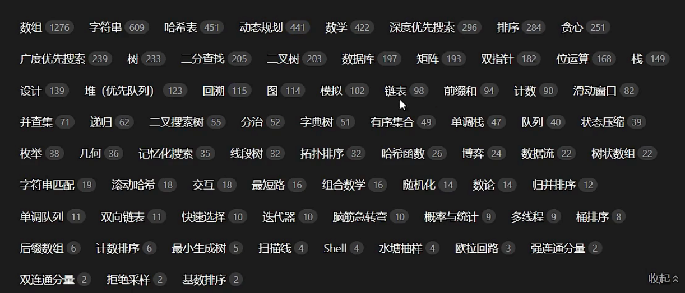
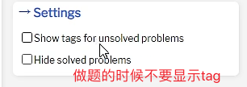
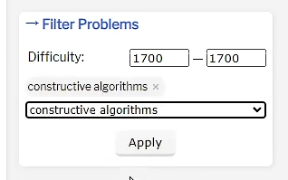

# 为什么要学习 LeetCode？ Why practice Leetcode?

1. Enhance personal competitiveness; currently, development positions at companies in the internet, banking, and quantitative hedging sectors require coding tests.
2. Improve coding speed, reduce development time at work, and increase personal free time.
3. Exercise personal thinking, improve problem-solving abilities, and enrich perspectives on modeling problems.

## [灵茶山艾府](https://codeforces.com/profile/0x3F) 的练习思路

### 上手路线

1. 偶尔三题
   1. 属于基础的算法类型没完全掌握的
2. 按分数段来做负重训练，100分为一段
   1. 假如自己的分数是2000，找到自己的弱项，做难度为自己当前 rating+200 的相关题目。
   1. 多做构造题能有效提高自己的思维水平（开脑洞的能力），从而更快地找到切题入口。（构造题即 constructive algorithms，可以通过 problemset 页面右侧的 Filter Problems 来搜索）
   1. 大多数时候，思考 10 分钟没有思路可以直接看题解。这是因为**如果思考 10 分钟没有思路，可能是有一个概念不知道，或者有一个观察错过了**。在你训练的过程中，最好是解决更多的问题，积累更多的解题技巧。
3. 题量很重要
   1. 1000题、2000题、3000题是一个门槛

### 按分类刷题

双指针

1. 相向双指针
2. 同向双指针

二分查找

1. Red-Blue Painting Approach

链表

1. Reverse
2. Fast Slow Pointer。链表中点，环形链表入口
3. 删除

二叉树

1. DFS, Depth First Search
2. BFS, Breadth First Search
3. Pre-order, In-order, Post-order Traversal
4. Level-order Traversal

回溯

1. 子集型，选或不选
1. 组合型，选哪个
1. 排列型，排除已选

动态规划

1. Dp principle
2. Backup DP
3. Linear DP
4. State Machine DP
5. Interval DP
6. Tree DP
7. etc

数据结构

1. 线段树
2. 树状数组
3. 堆、大小顶堆
4. 栈、单调栈
5. 队列、优先队列
6. etc

### Details

做题的时候不要显示tag

构造题

### 怎么得知自己的分数呢？

登陆codeforce网站

1. 按分数筛选题目1500-1500，按过题人数递减排序，看看自己做的轻不轻松
   1. if 轻松，继续加100分
   2. else，往下减100分

## 吾辈楷模

多看看大佬，给点压力

1. [灵茶山艾府](https://codeforces.com/profile/0x3F)，算法讲师，力扣竞赛 Top10
2. [一只粗糙的疯子](https://leetcode.cn/u/yi-zhi-cu-cao-de-feng-zi/)
3. [zackwu](https://leetcode.com/izackwu/)，稳定四题选手

## Target

- [x] 筑基：三题。
- [x] 一转：稳定三题。前1500
- [ ] 二转：四题。前300
- [ ] 三转：稳定四题。前100
- [ ] 三转巅峰：周赛前10

## 其他

在github homepage上加上leetcode的数据：https://github.com/JacobLinCool/LeetCode-Stats-Card?tab=readme-ov-file

## 参考

1. [如何科学上分 —— 灵茶山艾府](https://www.bilibili.com/read/cv22332590/?spm_id_from=333.999.0.0)
2. [CodeForces 怎么上分? - 灵茶山艾府的回答 - 知乎](https://www.zhihu.com/question/353734418/answer/2353160035) 
3. [力扣竞赛题目打分网站](https://huxulm.github.io/lc-rating/#/zen)
4. [算法竞赛模板库 by 灵茶山艾府](https://github.com/EndlessCheng/codeforces-go?tab=readme-ov-file)
5. [OI Wiki](https://oi-wiki.org/)
6. [Algorithm Doc from liuzhenglaichn](https://liuzhenglaichn.gitbook.io/algorithm)
