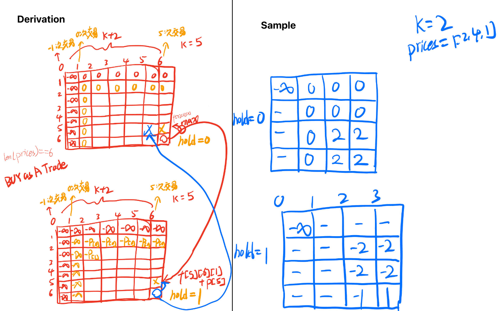
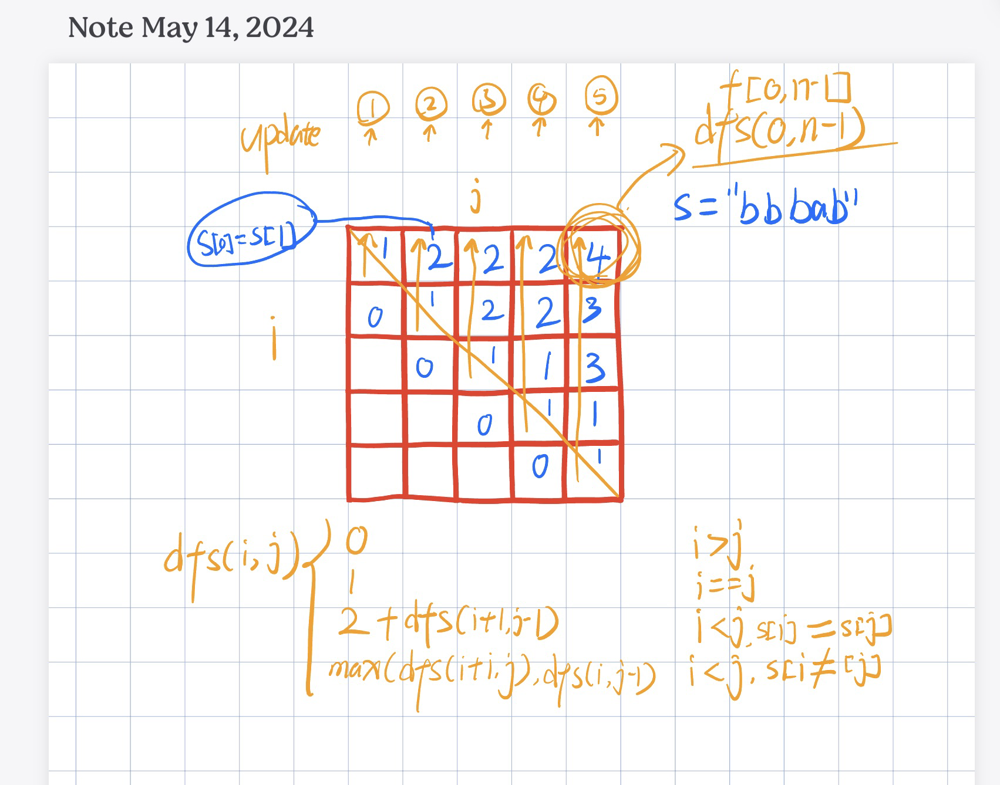

# Algorithm summary

## Category

双指针

1. 相向双指针
2. 同向双指针

二分查找

1. Red-Blue Painting Approach

链表

1. Reverse
2. Fast Slow Pointer。链表中点，环形链表入口
3. 删除

二叉树

1. DFS, Depth First Search
2. BFS, Breadth First Search
3. Pre-order, In-order, Post-order Traversal
4. Level-order Traversal

回溯

1. 子集型，选或不选
1. 组合型，选哪个
1. 排列型，排除已选

动态规划

1. Dp principle
2. Backup DP
3. Linear DP
4. State Machine DP
5. Interval DP
6. Tree DP
7. etc

数据结构

1. 线段树
2. 树状数组
3. 堆、大小顶堆
4. 栈、单调栈
5. 队列、优先队列
6. etc

## 双指针

### 1 双向双指针

经典题目有

1. 两数之和
2. 目标数
3. 三个目标数
4. 小于某个数的连续子集
5. 接雨水 Waterfall
   1. 也是一种前缀集的题

```
func twoSum(numbers []int, target int) []int {
    var i int = 0
    var j = len(numbers) - 1
    var res = make([]int, 0)
    for i < j {
        var curSum int = numbers[i] + numbers[j]
        if curSum < target {
            i +=1
        } else if curSum > target {
            j -=1
        } else {
            res = []int{i + 1, j +1}
            break
        }
    }
    return res
```

### 2 同向双指针

## 回溯

### 1 子集型（选或不选）

Intro

1. 本质上是看选不选某个元素，是一个增量构造答案的过程，这个过程适合用递归解决。
2. 举例
   1. 构造长为n的字符串
   2. 枚举一个字母
   3. 构造长为n-1的字符串
3. 回溯三问：
   1. 当前操作？当前的`i`元素要不要跳过
   2. 子问题？从下标`>=i`的数字中构造子集
   3. 下一个子问题？从下标`>=i+1`的数字中构造子集
4. 两个视角（不是很清楚为什么两个视角不同，其实在我看来都差不多）
   1. 输入的视角
   2. 答案视角

[78. Subsets](https://leetcode.cn/problems/subsets/)

sample

```
Example 1:

Input: nums = [1,2,3]
Output: [[],[1],[2],[1,2],[3],[1,3],[2,3],[1,2,3]]
```

code

```python
class Solution:
    def subsets(self, nums: List[int]) -> List[List[int]]:
        n = len(nums)
        if n == 0: # 为空直接返回
            return []
        
        ans = [] # 答案列表
        path = [] # 回溯遍历的路径

        # (1) 这是从输入的角度考虑，（选或不选）。
        # 遍历一颗满二叉树（即每一层的元素都是满的，所以遍历的时间复杂度实际上是2^n）
        def dfs(i): # 深度遍历
            if i == n: # 边界条件。当遍历到叶子节点后生成答案
                ans.append(path.copy()) # 这边使用copy()避免path地址引用改变已生成的结果，这边的copy其实也花了时间
                # ans.append(''.join(path)) # 这是把string类型的数组内容join起来
                return

            dfs(i+1) # 跳过当前数字

            path.append(nums[i]) # 添加到路径中
            dfs(i+1) # 这回是把当前数字放到path里
            path.pop() # 恢复现场，lol
        
        # (2) 这是从答案的角度来考虑的（选哪个数）。每个叶子节点都是答案
        # 我们可以每层都递归数组的所有元素，但要注意下一个数的下标应当大于当前数的下标。
        # 比如之前添加过子数组[1,2]，接下来不应该加[2,1]了
        # 也就是说递归思路如下
        # - 当前元素？应该选择 j >= i 的j元素
        # - 子问题？从下标 >=i 的数组中构造子集
        # - 下一个子问题？从下标 >= i+1 的数组中构造子集
        def dfsV2(i): # 深度遍历
            ans.append(path.copy()) # 这边使用copy()避免path地址引用改变已生成的结果，这边的copy其实也花了时间
            if i == n: # 边界条件。当遍历到叶子节点后生成答案
                # ans.append(''.join(path)) # 这是把string类型的数组内容join起来
                return

            for j in range(i, n): # 枚举选中的数字
                path.append(nums[j]) # 添加到路径中
                dfsV2(j+1) # 这回是把当前数字放到path里
                path.pop() # 恢复现场，lol
        dfsV2(0) # 从零开始
        return ans
```

### 2 组合型与剪枝（选哪个）

###  3 排列型（需要考虑排除已选的数）

【回溯算法套路③排列型回溯+N皇后【基础算法精讲 16】】 https://www.bilibili.com/video/BV1mY411D7f6/?share_source=copy_web&vd_source=5d4accef9045e3ed4e08bbb7a80f3c70

[46. Permutations](https://leetcode.cn/problems/permutations/) 全排列

```python
class Solution:
    def permute(self, nums: List[int]) -> List[List[int]]:
        n = len(nums)
        if n == 0:
            return []

        ans = []
        path = [0] * n
        def dfs(i, s): # 使用set来帮助统计path
            if i == n:
                ans.append(path.copy())
                return
            for x in s:
                path[i] = x
                dfs(i+1, s - {x}) # python的set的语法糖
        dfs(0, set(nums))
        return ans
```

## Backup DP

【0-1背包 完全背包】 https://www.bilibili.com/video/BV16Y411v7Y6/?share_source=copy_web&vd_source=5d4accef9045e3ed4e08bbb7a80f3c70

1. 递归，自顶向下
2. 记忆化搜索
3. 递推，自底向上
4. 二维数组
5. 一维数组

### 零一背包

有 n 个物品，第 i 个物品的体积为 w[i]，价值为 v[i]，**每个物品至多选一个**，求体积和不超过 capacity 时的最大价值和。

1. 当前 dfs 维
2. `dfs[i][j] = max(dfs[i-1][j], dfs[i-1][j-w[i]] + v[i]])`
3. 一维数组递推，从右往左，因为

### 完全背包

有 n 个物品，第 i 个物品的体积为 w[i]，价值为 v[i]，**每个物品可以重复选**，求体积和不超过 capacity 时的最大价值和。

1. 一维数组递推，从左往右

### 常见变形

1. 至多装capacity，求方案数/最大价值和
2. 恰好装capacity，求方案数/最大/最小价值和
3. 至少装capacity，求方案数/最小价值和

### [494. Target Sum](https://leetcode.cn/problems/target-sum/)

递归写法

1. if nums[i] > c
   1. dfs(n, c) = dfs(n-1, c)
2. else
   1. dfs(n, c) = dfs(n-1, c) + dfs(n-1, nums[i]-c)

```python
class Solution:
    def findTargetSumWays(self, nums: List[int], target: int) -> int:
        # p
        # s-p
        # p-(s-p)=t
        # p=(t+s)/2
        n = len(nums)
        s = sum(nums)
        cap = (s+target)/2
        @cache
        def dfs(i, c):
            if i < 0:
                return 1 if c == 0 else 0
            if nums[i] > c:
                return dfs(i-1, c)
            return dfs(i-1, c)+ dfs(i-1, c-nums[i])
        return dfs(n-1, cap)
```

## 线性DP

### 最长公共子序列

【最长公共子序列 编辑距离】 https://www.bilibili.com/video/BV1TM4y1o7ug/?share_source=copy_web&vd_source=5d4accef9045e3ed4e08bbb7a80f3c70

术语

1. 子数组、子串：subarray/substring，一般是连续的
2. 子序列：subsequence，是不连续的

启发思路：

1. 两个字符串的每个字母对，本质上也是选或不选。

考虑字符串S1和S2的最后一对字母X与Y，有

1. 选X和Y
2. 选X，不选Y
3. 不选X，选Y
4. 不选X，不选Y

则最长公共子序列有两种情况，对于s1[i]=X和s2[j]=Y

1. 如果X=Y
   1. dfs(i, j) = max(dfs(i-1, j), dfs(i, j-1), dfs(i-1, j-1)+1)
   2. 对于dfs(i, j)，如果X=Y。那么dfs(i-1, j-1)的长度一定>=max(dfs(i-1, j), dfs(i, j-1))，所以我们在X=Y的情况下可以忽略dfs(i-1, j), dfs(i, j-1)，所以有：
   3. dfs(i, j) = dfs(i-1, j-1)+1
2. 如果X≠Y
   1. dfs(i, j) = max(dfs(i-1, j), dfs(i, j-1), dfs(i-1, j-1))
   2. 对于X≠Y，dfs(i-1, j)不考虑j的情况就变成了dfs(i-1, j-1)。dfs(i, j-1)不考虑i的情况也变成了dfs(i-1, j-1)。dfs(i-1, j-1)是被max(dfs(i-1, j), dfs(i, j-1))包含在内的，所以有：
   3. dfs(i, j) = max(dfs(i-1, j), dfs(i, j-1))

```python
class Solution:
    def longestCommonSubsequence(self, text1: str, text2: str) -> int:
        n = len(text1)
        m = len(text2)
        dp = [[0 for j in range(m+1)] for i in range(n+1)]

        for i in range(1, n+1, 1):
            for j in range(1, m+1, 1):
                if text1[i-1] == text2[j-1]:
                  	# note, here dp[i-1][j-1] should plus 1 because we count current `text1[i-1] == text2[j-1]`
                    dp[i][j] = max(dp[i-1][j-1] + 1, dp[i-1][j], dp[i][j-1])
                else:
                    dp[i][j] = max(dp[i-1][j], dp[i][j-1])
        print(dp)
        return dp[n][m]
```

### 最长递增子序列

【最长递增子序列【基础算法精讲 20】】 https://www.bilibili.com/video/BV1ub411Q7sB/?share_source=copy_web&vd_source=5d4accef9045e3ed4e08bbb7a80f3c70

动态规划做法：

1. 递归：`dfs[j] = max(nums[i]) + 1`
   1. 子问题：结尾为nums[j]的最长递增子序列长度是？
   2. 当前操作：往前`[0, j)`枚举小于nums[j]的nums[i]
   3. 下一个子问题：结尾为nums[i]的最长递增子序列长度是？
2. 时间复杂度`O(n^2)`，空间复杂度`O(n)`

```python
class Solution:
    def lengthOfLIS(self, nums: List[int]) -> int:
        @cache
        def dfs(j):
            res = 0
            for i in range(j):
                if nums[i] < nums[j]:
                    res = max(res, dfs(i))
            return res + 1
        return max(dfs(i) for i in range(len(nums)))
```

数组版记忆化搜索

- 时间复杂度`O(n^2)`，空间复杂度`O(n)`

```python
class Solution:
    def lengthOfLIS(self, nums: List[int]) -> int:
        cache = [-inf] * len(nums)
        # @cache
        def dfs(j):
            if cache[j] >= 0: return cache[j]
            res = 0
            for i in range(j):
                if nums[i] < nums[j]:
                    res = max(res, dfs(i))
            cache[j] = res + 1
            return cache[j]
        return max(dfs(i) for i in range(len(nums)))
```

递归改递推：`f[j] = max(f[i]) + 1`

- 时间复杂度`O(n^2)`，空间复杂度`O(n)`

```python
class Solution:
    def lengthOfLIS(self, nums: List[int]) -> int:
        f = [0] * len(nums)
        for j in range(len(nums)):
            for i in range(j):
                if nums[i] < nums[j]:
                    f[j] = max(f[i], f[j]) 
            f[j] += 1
        return max(f)
```

进一步优化时间复杂度，引入新概念：g数组

1. g数组的长度代表当前最长递增子序列长度
   1. 更新算法
      1. 如果找到g数组中第一个大于nums[i]的元素g[k]，将g[k]更新为nums[i]
      2. 如果g数组中没有大于nums[i]的元素，则把nums[i]加到g数组的后面
   2. 可以反证、归纳证明g一定是严格递增的
      1. 假设`j-1 <= j`有`g[j-1] == g[j]`，但是根据我们的更新算法，对于`i <= j`, g[i]一定小于g[j]，与`g[j-1] == g[j]`矛盾
2. 时间复杂度`O(nlongn)`, 即数组长度n乘以每次二分查找的logn
3. 空间复杂度`O(n)`

```python
class Solution:
    def lengthOfLIS(self, nums: List[int]) -> int:
        g = []
        for i in range(len(nums)):
            k = bisect_left(g, nums[i])
            if k == len(g):
                g.append(nums[i])
            else:
                g[k] = nums[i]
        return len(g)
```

进一步优化空间复杂度为O(1)

```python
class Solution:
    def lengthOfLIS(self, nums: List[int]) -> int:
        ng = 0
        for i in range(len(nums)):
            k = bisect_left(nums, nums[i], 0, ng)
            if k == ng:
                nums[k] = nums[i]
                ng += 1
            else:
                nums[k] = nums[i]
        return ng
```

## 状态机 DP

### 至多交易 k 次

[188. Best Time to Buy and Sell Stock IV](https://leetcode.cn/problems/best-time-to-buy-and-sell-stock-iv/)

```markdown
Input: k = 2, prices = [3,2,6,5,0,3]
Output: 7
Explanation: Buy on day 2 (price = 2) and sell on day 3 (price = 6), profit = 6-2 = 4. Then buy on day 5 (price = 0) and sell on day 6 (price = 3), profit = 3-0 = 3.
```

递归要点

- 持有时 `hold == 1`，卖出 `dfs(i, j, 0) = max(dfs(i-1, j, 0), dfs(i-1, j - 1, 1) + prices[i])`
- 不持有时 `hold == 0`, 买入 `dfs(i, j, 1) = max(dfs(i-1, j, 1), dfs(i-1, j, 0) - prices[i])`
- 买入或卖出算作一次交易。代码中的 `j-1` 可以是在买股票的时候，也可以是在卖股票的时候



dfs 递归写法

```python
class Solution:
    def maxProfit(self, k: int, prices: List[int]) -> int:
        n = len(prices)
        @cache
        def dfs(i: int, j: int, hold: bool) -> int:
            if j < 0:
                return -inf
            if i < 0:
                return -inf if hold else 0
            if hold:
                return max(dfs(i - 1, j, True), dfs(i - 1, j - 1, False) - prices[i])
            return max(dfs(i - 1, j, False), dfs(i - 1, j, True) + prices[i])
        return dfs(n - 1, k, False)
```

## 区间 DP 

【区间 DP：最长回文子序列】 https://www.bilibili.com/video/BV1Gs4y1E7EU/?share_source=copy_web&vd_source=5d4accef9045e3ed4e08bbb7a80f3c70

[516. Longest Palindromic Subsequence](https://leetcode.cn/problems/longest-palindromic-subsequence/)

### 递归

区间 DP 是对某个区间 `[i, j]` 来搜索

`dfs(i, j)` =

- `if i > j` return 0
- `if i == j` return 1
- `if s[i] == s[j]` return `2 + dfs(i+1, j-1)`
- return `max(dfs(i+1, j), dfs(i, j-1))`

```python
class Solution:
    def longestPalindromeSubseq(self, s: str) -> int:
        n = len(s)
        @cache
        def dfs(i, j):
            if i > j:
                return 0
            if i == j: 
                return 1
            if s[i] == s[j]:
                return 2 + dfs(i+1, j-1)
            return max(dfs(i+1, j), dfs(i, j-1))
        return dfs(0, n-1)
```

时间复杂度 `O(n^2)`

- 动态规划的时间复杂度为：状态个数 X 单个状态的转移次数，此题状态个数为 `O(n^2)` 

空间复杂度 `O(n^2)`

- 因为是二维 `i, j` 记忆化搜索，所以是 `O(n^2)`

### 递推



```python
class Solution:
    def longestPalindromeSubseq(self, s: str) -> int:
        n = len(s)
        dp = [[0 for _ in range(n)] for _ in range(n)]
        for j in range(n):
            for i in range(j, -1, -1):
                if i == j:
                    dp[i][j] = 1
                else: 
                    if s[i] == s[j]:
                        dp[i][j] = 2 + dp[i+1][j-1]
                    else:
                        dp[i][j] = max(dp[i+1][j], dp[i][j-1])
        return dp[0][n-1]
```

### 空间优化，两个数组

考虑到当前 `f[i][j]` 需要 `f[i+1][j-1]`，以及 `f[i+1][j]` 和 `f[i][j-1]`。可以看出  `f[i+1][j-1]` 和  `f[i][j-1]` 都属于前一列`f` 值，而  `f[i+1][j]` 属于当前列 `f` 值。所以状态更新实际上只需要两个数组。

```python
class Solution:
    def longestPalindromeSubseq(self, s: str) -> int:
        n = len(s)
        dp = [[0 for _ in range(2)] for _ in range(n)]
        for j in range(n):
            for i in range(j, -1, -1):
                j2 = j % 2
                if i == j:
                    dp[i][j2] = 1
                else:
                    if s[i] == s[j]:
                        dp[i][j2] = 2 + dp[i + 1][(j2 + 1) % 2]
                    else:
                        dp[i][j2] = max(dp[i + 1][j2], dp[i][(j2 + 1) % 2])
        return dp[0][(n - 1) % 2]
```

### 空间优化，一个数组

因为当前 `f[i][j]` 计算需要的  `f[i+1][j-1]` 和  `f[i][j-1]` 都属于前一列`f` 值，而  `f[i+1][j]` 属于当前列 `f` 值。

如果用一个数组，由于更新  `f[i+1][j]`  会更新原值  `f[i+1][j-1]` ，我们可以用一个变量 `pre` 把 `f[i+1][j-1]` 存起来

```python
class Solution:
    def longestPalindromeSubseq(self, s: str) -> int:
        n = len(s)
        dp = [0 for _ in range(n)]
        for j in range(n):
            pre = 0
            for i in range(j, -1, -1):
                tmp = dp[i]
                if i == j:
                    dp[i] = 1
                else:
                    if s[i] == s[j]:
                        dp[i] = 2 + pre
                    else:
                        dp[i] = max(dp[i + 1], dp[i])
                pre = tmp
        return dp[0]
```

## Tree DP

## [543. Diameter of Binary Tree](https://leetcode.cn/problems/diameter-of-binary-tree/)

`dfs(node) = max(dfs(node), dfs(node.left) + dfs(node.right) + 2)`

```python
# Definition for a binary tree node.
# class TreeNode:
#     def __init__(self, val=0, left=None, right=None):
#         self.val = val
#         self.left = left
#         self.right = right
class Solution:
    def diameterOfBinaryTree(self, root: Optional[TreeNode]) -> int:
        ans = 0
        def calc(node):
            if node is None:
                return -1
            rLen = calc(node.right)
            lLen = calc(node.left)
            nonlocal ans
            ans = max(ans, lLen + rLen + 2)
            return max(rLen, lLen) + 1
        calc(root)
        return ans
```

