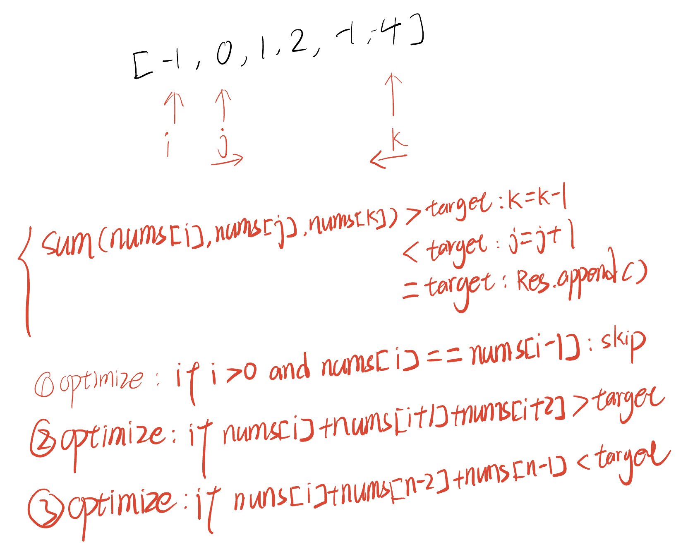
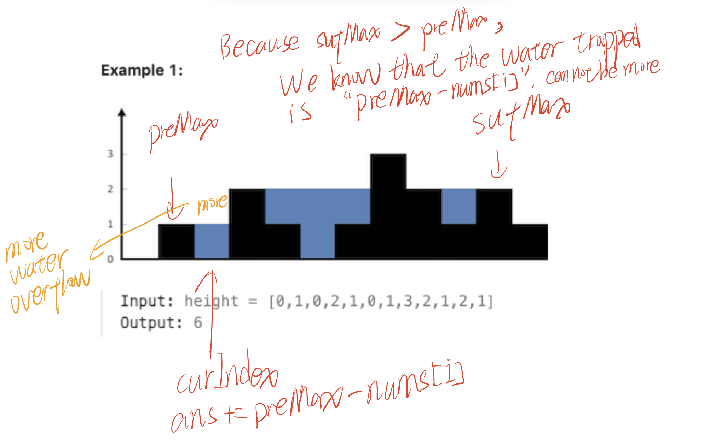

# Template - 3Sum



```python
class Solution:
    def threeSum(self, nums: List[int]) -> List[List[int]]:
        nums = sorted(nums)
        res = []
        for i in range(len(nums) - 2):
            # optimize 1, skip repeat nums[i]
            if i > 0 and nums[i - 1] == nums[i]:
                continue
            # optimize 2, skip impossible number
            if nums[i] + nums[i + 1] + nums[i + 2] > 0:
                break
            # optimize 2, skip impossible number
            if nums[i] + nums[len(nums) - 1] + nums[len(nums) - 2] < 0:
                continue

            j = i + 1
            k = len(nums) - 1
            while j < k:
                curSum = nums[i] + nums[j] + nums[k]
                if curSum < 0:
                    j += 1
                if curSum > 0:
                    k -= 1
                if curSum == 0:
                    res.append([nums[i], nums[j], nums[k]])

                    # optimize 3, skip same number[j], number[k]
                    j += 1
                    while j < k and nums[j - 1] == nums[j]:
                        j += 1
                    k -= 1
                    while j < k and nums[k] == nums[k + 1]:
                        k -= 1
        return res
```

## Key Points

May need to sort the array in ascending order

1. Brute Force Solution can only get O(1) info by O(1) Time
2. Double Pointer uses O(1) time to konw O(n) info, remove the rest O(n) possibility

## [167. Two Sum II - Input Array Is Sorted](https://leetcode.cn/problems/two-sum-ii-input-array-is-sorted/)

```python
class Solution:
    def twoSum(self, numbers: List[int], target: int) -> List[int]:
        i = 0
        j = len(numbers) - 1
        while i < j:
            s = numbers[i] + numbers[j]
            if s < target:
                i += 1
            elif s > target:
                j -= 1
            else:
                return [i + 1, j + 1]
        return None
```

## [15. 3Sum](https://leetcode.cn/problems/3sum/)

```python
class Solution:
    def threeSum(self, nums: List[int]) -> List[List[int]]:
        nums = sorted(nums)
        res = []
        for i in range(len(nums) - 2):
            # optimize 1, skip repeat nums[i]
            if i > 0 and nums[i - 1] == nums[i]:
                continue
            # optimize 2, skip impossible number
            if nums[i] + nums[i + 1] + nums[i + 2] > 0:
                break
            # optimize 2, skip impossible number
            if nums[i] + nums[len(nums) - 1] + nums[len(nums) - 2] < 0:
                continue

            j = i + 1
            k = len(nums) - 1
            while j < k:
                curSum = nums[i] + nums[j] + nums[k]
                if curSum < 0:
                    j += 1
                if curSum > 0:
                    k -= 1
                if curSum == 0:
                    res.append([nums[i], nums[j], nums[k]])

                    # optimize 3, skip same number[j], number[k]
                    j += 1
                    while j < k and nums[j - 1] == nums[j]:
                        j += 1
                    k -= 1
                    while j < k and nums[k] == nums[k + 1]:
                        k -= 1
        return res
```

## [16. 3Sum Closest](https://leetcode.cn/problems/3sum-closest/)

```python
class Solution:
    def threeSumClosest(self, nums: List[int], target: int) -> int:
        nums.sort()
        n = len(nums)
        min_diff = inf
        for i in range(n - 2):
            x = nums[i]
            if i and x == nums[i - 1]:
                continue  # 优化三

            # 优化一
            s = x + nums[i + 1] + nums[i + 2]
            if s > target:  # 后面无论怎么选，选出的三个数的和不会比 s 还小
                if s - target < min_diff:
                    ans = s  # 由于下一行直接 break，这里无需更新 min_diff
                break

            # 优化二
            s = x + nums[-2] + nums[-1]
            if s < target:  # x 加上后面任意两个数都不超过 s，所以下面的双指针就不需要跑了
                if target - s < min_diff:
                    min_diff = target - s
                    ans = s
                continue

            # 双指针
            j, k = i + 1, n - 1
            while j < k:
                s = x + nums[j] + nums[k]
                if s == target:
                    return s
                if s > target:
                    if s - target < min_diff:  # s 与 target 更近
                        min_diff = s - target
                        ans = s
                    k -= 1
                else:  # s < target
                    if target - s < min_diff:  # s 与 target 更近
                        min_diff = target - s
                        ans = s
                    j += 1
        return ans
```

## [2824. Count Pairs Whose Sum is Less than Target](https://leetcode.cn/problems/count-pairs-whose-sum-is-less-than-target/)

Brute Force Solution

```
func countPairs(nums []int, target int) int {
    var cnt int = 0
    for i := 0; i < len(nums) - 1; i++ {
        for j := i+1; j < len(nums); j++ {
            if nums[i] + nums[j] < target {
                cnt += 1
            }
        }
    }
    return cnt
}
```

Opposite Double Pointer

```python
class Solution:
    def countPairs(self, nums: List[int], target: int) -> int:
        nums = sorted(nums)
        
        ans = 0
        for i in range(len(nums)):
            j = len(nums) - 1
            while i < j:
                if nums[i] + nums[j] < target:
                    ans += j - i
                    break
                else:
                    j -= 1
        return ans
```

## [611. Valid Triangle Number](https://leetcode.cn/problems/valid-triangle-number/)

```
func triangleNumber(nums []int) int {
    sort.Ints(nums)

    cnt := 0
    for i := 0; i < len(nums) - 2; i++ {
        if nums[i] == 0 {
            continue
        }

        x := nums[i]
        for j := i+1; j < len(nums) - 1; j++ {
            var k int = len(nums) - 1
            for j < k {
                if x + nums[j] <= nums[k] {
                    k--
                } else {
                    cnt += k-j
                    break
                }
            }
        }
    }
    return cnt
}
```

## [11. Container With Most Water](https://leetcode.cn/problems/container-with-most-water/)

```python
class Solution:
    def maxArea(self, height: List[int]) -> int:
        left = 0
        right = len(height)-1
        res = 0
        while left < right:
            res = max(res, (right-left)*min(height[right], height[left]))
            if height[left] < height[right]:
                left+=1
            else:
                right-=1
        return res
```

## Prefix Sum

## [42. Trapping Rain Water](https://leetcode.cn/problems/trapping-rain-water/)



```
func trap(height []int) int {
    res := 0
    left := 0
    right := len(height) - 1
    preMax := 0
    sufMax := 0
    for left < right {
        if height[left] > preMax { //更新preMax
            preMax = height[left]
        }
        if height[right] > sufMax { //更新sufMax
            sufMax = height[right]
        }

        if preMax <= sufMax {
            res = res + preMax - height[left]
            left++
        } else {
            res = res + sufMax - height[right]
            right--
        }
    }
    return res
}
```

## Reference

1. [灵神视频](https://www.bilibili.com/video/BV1bP411c7oJ/?vd_source=66a0b89065d7f04805223fd7f2d613a6)
