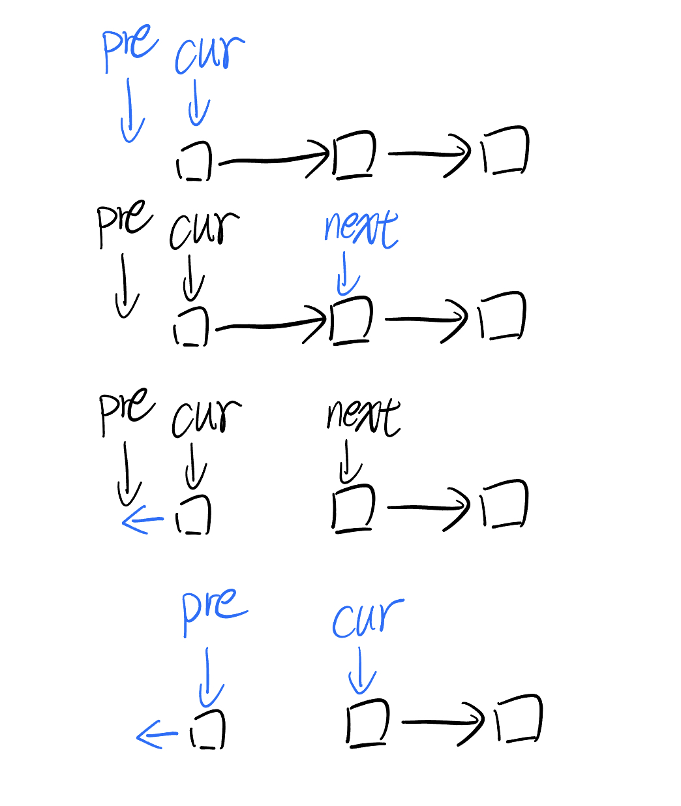
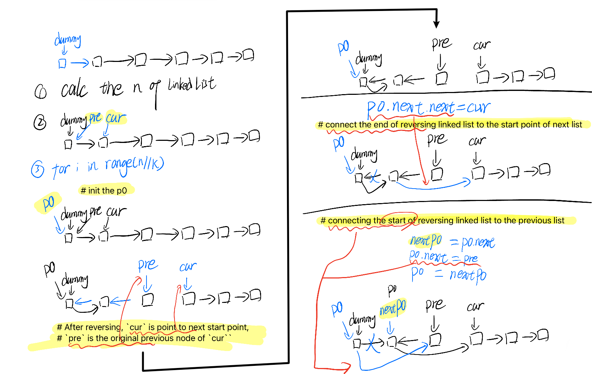

## Idea

### Reverse linked list

```python
# Definition for singly-linked list.
# class ListNode:
#     def __init__(self, val=0, next=None):
#         self.val = val
#         self.next = next
class Solution:
    def reverseList(self, head: Optional[ListNode]) -> Optional[ListNode]:
        # dummy = ListNode(0, head)
        cur = head
        prev = None
        while cur:
            next = cur.next
            cur.next = prev
            prev = cur
            cur = next
        return prev
```



### Reverse Nodes in K-Group

```python
# Definition for singly-linked list.
# class ListNode:
#     def __init__(self, val=0, next=None):
#         self.val = val
#         self.next = next
class Solution:
    def reverseKGroup(self, head: Optional[ListNode], k: int) -> Optional[ListNode]:
        dummy = ListNode(0, head)
        pre = dummy
        cur = head
        
        # 1. Calc the length of linked list
        n = 0
        while cur:
            cur = cur.next
            n += 1
        
        cur = head
        for i in range(n//k):
            # init the p0
            p0 = pre
            for j in range(k):
                nxt = cur.next
                cur.next = pre
                pre = cur
                cur = nxt
            # After reversing, `cur` is point to next start point, 
            # `pre` is the original previous node of `cur``

            # connect the end of reversing linked list to the start point of next list
            p0.next.next = cur

            # cache the end of reversing linked list
            nxtP0 = p0.next

            # connecting the start of reversing linked list to the previous list
            p0.next = pre
            pre = nxtP0
        return dummy.next
```



## [206. Reverse Linked List](https://leetcode.cn/problems/reverse-linked-list/)

prev = pre

next = nxt

```python
# Definition for singly-linked list.
# class ListNode:
#     def __init__(self, val=0, next=None):
#         self.val = val
#         self.next = next
class Solution:
    def reverseList(self, head: Optional[ListNode]) -> Optional[ListNode]:
        # dummy = ListNode(0, head)
        cur = head
        prev = None
        while cur:
            next = cur.next
            cur.next = prev
            prev = cur
            cur = next
        return prev
```

## [92. Reverse Linked List II](https://leetcode.cn/problems/reverse-linked-list-ii/)

```python
# Definition for singly-linked list.
# class ListNode:
#     def __init__(self, val=0, next=None):
#         self.val = val
#         self.next = next
class Solution:
    def reverseBetween(self, head: Optional[ListNode], left: int, right: int) -> Optional[ListNode]:
        dummy = ListNode(0, head)
        cur = head
        pre = dummy
        for i in range(left-1):
            pre = cur
            cur = cur.next

        p0 = pre # p0 is the node before the reversed starting node
        # leftNext = cur # p0.next
        for i in range(right-left+1):
            nxt = cur.next
            cur.next = pre 
            pre = cur
            cur = nxt
        p0.next.next = cur
        p0.next = pre
        return dummy.next
```

## [25. Reverse Nodes in k-Group](https://leetcode.cn/problems/reverse-nodes-in-k-group/)

```python
# Definition for singly-linked list.
# class ListNode:
#     def __init__(self, val=0, next=None):
#         self.val = val
#         self.next = next
class Solution:
    def reverseKGroup(self, head: Optional[ListNode], k: int) -> Optional[ListNode]:
        dummy = ListNode(0, head)
        pre = dummy
        cur = head
        
        # 1. Calc the length of linked list
        n = 0
        while cur:
            cur = cur.next
            n += 1
        
        cur = head
        for i in range(n//k):
            # init the p0
            p0 = pre
            for j in range(k):
                nxt = cur.next
                cur.next = pre
                pre = cur
                cur = nxt
            # After reversing, `cur` is point to next start point, 
            # `pre` is the original previous node of `cur``

            # connect the end of reversing linked list to the start point of next list
            p0.next.next = cur

            # cache the end of reversing linked list
            nxtP0 = p0.next

            # connecting the start of reversing linked list to the previous list
            p0.next = pre
            pre = nxtP0
        return dummy.next
```

## [24. Swap Nodes in Pairs](https://leetcode.cn/problems/swap-nodes-in-pairs/)

```python
# Definition for singly-linked list.
# class ListNode:
#     def __init__(self, val=0, next=None):
#         self.val = val
#         self.next = next
class Solution:
    def swapPairs(self, head: Optional[ListNode]) -> Optional[ListNode]:
        dummy = ListNode(0, head)
        pre = dummy
        cur = head
        while cur:
            p0 = pre
            for i in range(2):
                if cur == None:
                    break
                next = cur.next
                cur.next = pre
                
                pre = cur
                cur = next
            p0.next.next = cur
            preTmp = p0.next
            p0.next = pre
            pre = preTmp
        return dummy.next
```

## [2816. Double a Number Represented as a Linked List](https://leetcode.cn/problems/double-a-number-represented-as-a-linked-list/)

```python
# Definition for singly-linked list.
# class ListNode:
#     def __init__(self, val=0, next=None):
#         self.val = val
#         self.next = next
class Solution:
    def doubleIt(self, head: Optional[ListNode]) -> Optional[ListNode]:
        def reverseList(head):
            cur = head
            pre = None
            while cur:
                next = cur.next
                cur.next = pre
                pre = cur
                cur = next
            return pre 
        def addTwoLists(headA, headB):
            curA = headA
            curB = headB
            quotient = 0
            while curA and curB:
                curSum = curA.val + curB.val + quotient
                quotient = curSum // 10
                remain = curSum - quotient*10
                curA.val = remain
                if curA.next == None:
                    if quotient != 0:
                        curA.next = ListNode(quotient)
                    break
                curA = curA.next
                curB = curB.next
            return headA
        rHead = reverseList(head)
        dHead = addTwoLists(rHead, rHead)
        return reverseList(dHead)
```

## [445. Add Two Numbers II](https://leetcode.cn/problems/add-two-numbers-ii/)

```python
# Definition for singly-linked list.
# class ListNode:
#     def __init__(self, val=0, next=None):
#         self.val = val
#         self.next = next
class Solution:
    def addTwoNumbers(self, l1: Optional[ListNode], l2: Optional[ListNode]) -> Optional[ListNode]:
        def reverseList(head):
            cur = head
            pre = None
            while cur:
                next = cur.next
                cur.next = pre
                pre = cur
                cur = next
            return pre 
        def addTwoLists(headA, headB):
            curA = headA
            curB = headB
            quotient = 0
            while curA and curB:
                curSum = curA.val + curB.val + quotient
                quotient = curSum // 10
                remain = curSum - quotient*10
                curA.val = remain
                if curA.next == None:
                    if curB.next != None:
                        curA.next = ListNode(0)
                    elif quotient != 0:
                        curA.next = ListNode(quotient)
                        break
                elif curB.next == None:
                    curB.next = ListNode(0)
                curA = curA.next
                curB = curB.next
            return headA
        rl1 = reverseList(l1)
        rl2 = reverseList(l2)
        al1 = addTwoLists(rl1, rl2)
        ral1 = reverseList(al1)
        return ral1
```

## [2. Add Two Numbers](https://leetcode.cn/problems/add-two-numbers/)

```python
# Definition for singly-linked list.
# class ListNode:
#     def __init__(self, val=0, next=None):
#         self.val = val
#         self.next = next
class Solution:
    def addTwoNumbers(self, l1: Optional[ListNode], l2: Optional[ListNode]) -> Optional[ListNode]:
        def reverseList(head):
            cur = head
            pre = None
            while cur:
                next = cur.next
                cur.next = pre
                pre = cur
                cur = next
            return pre 
        def addTwoLists(headA, headB):
            curA = headA
            curB = headB
            quotient = 0
            while curA and curB:
                curSum = curA.val + curB.val + quotient
                quotient = curSum // 10
                remain = curSum - quotient*10
                curA.val = remain
                if curA.next == None:
                    if curB.next != None:
                        curA.next = ListNode(0)
                    elif quotient != 0:
                        curA.next = ListNode(quotient)
                        break
                elif curB.next == None:
                    curB.next = ListNode(0)
                curA = curA.next
                curB = curB.next
            return headA
        al1 = addTwoLists(l1, l2)
        return al1
```

ENG

1. `k` is a positive integer and is less than or equal to the length of the linked list. If the number of nodes is not a multiple of `k` then left-out nodes, in the end, should remain as it is.
   1. the number of nodes is not a multiple of `k` then left-out nodes
   2. should remain as it is.

## Reference

1. [灵神视频，反转链表](https://www.bilibili.com/video/BV1sd4y1x7KN/?spm_id_from=333.788&vd_source=66a0b89065d7f04805223fd7f2d613a6)