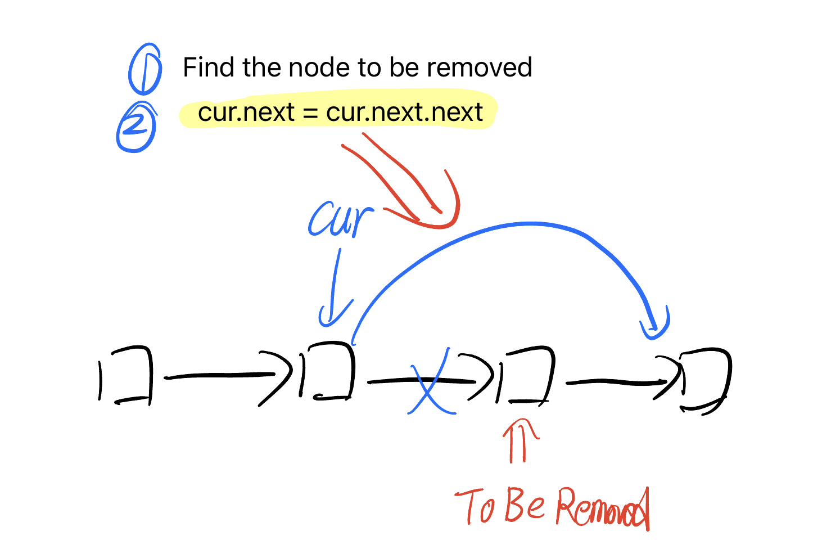
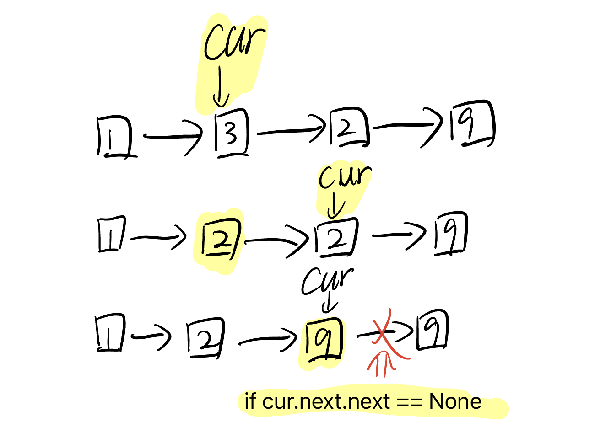
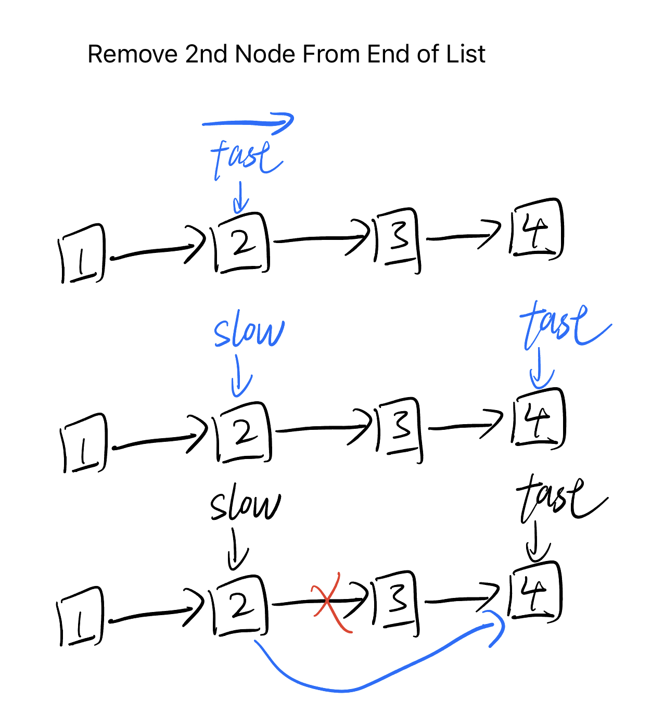
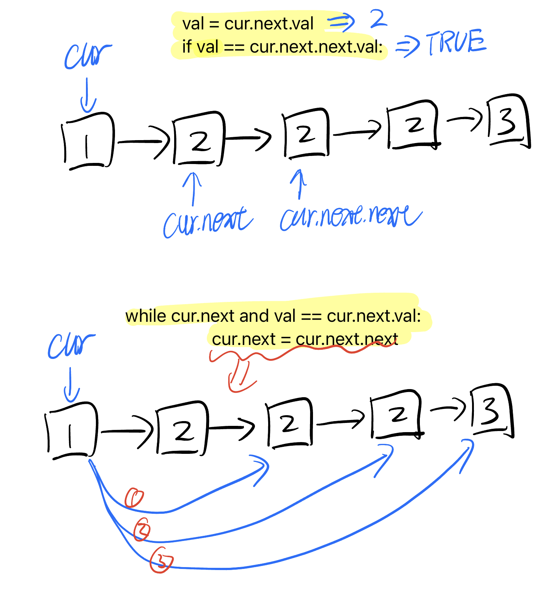

## Idea

- Find the node to be removed
- `cur.next = cur.next.next`



## [237. Delete Node in a Linked List](https://leetcode.cn/problems/delete-node-in-a-linked-list/)



```python
# Definition for singly-linked list.
# class ListNode:
#     def __init__(self, x):
#         self.val = x
#         self.next = None

class Solution:
    def deleteNode(self, node):
        """
        :type node: ListNode
        :rtype: void Do not return anything, modify node in-place instead.
        """
        cur = node
        while cur and cur.next:
            cur.val = cur.next.val
            if cur.next.next == None:
                cur.next = None
            else:
                cur = cur.next
```

## [19. Remove Nth Node From End of List](https://leetcode.cn/problems/remove-nth-node-from-end-of-list/)



```python
# Definition for singly-linked list.
# class ListNode:
#     def __init__(self, val=0, next=None):
#         self.val = val
#         self.next = next
class Solution:
    def removeNthFromEnd(self, head: Optional[ListNode], n: int) -> Optional[ListNode]:
        dummy = ListNode(next=head)
        slow = dummy
        fast = dummy
        for i in range(n):
            fast = fast.next
        while fast.next:
            slow = slow.next
            fast = fast.next
        slow.next = slow.next.next
        return dummy.next
```

## [83. Remove Duplicates from Sorted List](https://leetcode.cn/problems/remove-duplicates-from-sorted-list/)

```python
# Definition for singly-linked list.
# class ListNode:
#     def __init__(self, val=0, next=None):
#         self.val = val
#         self.next = next
class Solution:
    def deleteDuplicates(self, head: Optional[ListNode]) -> Optional[ListNode]:
        dummy = ListNode(next=head)
        cur = dummy.next
        while cur and cur.next:
            if cur.val == cur.next.val:
                cur.next = cur.next.next
            else:
                cur = cur.next
        return head
```

## [82. Remove Duplicates from Sorted List II](https://leetcode.cn/problems/remove-duplicates-from-sorted-list-ii/)



```python
# Definition for singly-linked list.
# class ListNode:
#     def __init__(self, val=0, next=None):
#         self.val = val
#         self.next = next
class Solution:
    def deleteDuplicates(self, head: Optional[ListNode]) -> Optional[ListNode]:
        dummy = ListNode(next=head)
        cur = dummy
        while cur.next and cur.next.next:
            val = cur.next.val
            if val == cur.next.next.val:
                while cur.next and val == cur.next.val:
                    cur.next = cur.next.next
            else:
                cur = cur.next
        return dummy.next
```

## Reference

1. [灵神视频，删除链表重复节点 基础算法精讲 08](https://www.bilibili.com/video/BV1VP4y1Q71e/?share_source=copy_web&vd_source=5d4accef9045e3ed4e08bbb7a80f3c70)
