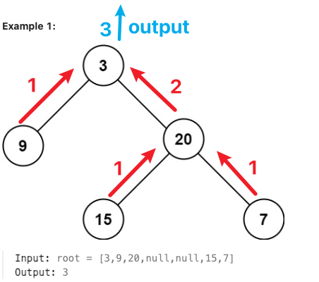

## Idea

Recursion

1. Current problem
2. Current operation
3. Next sub-problem



## [104. Maximum Depth of Binary Tree](https://leetcode.cn/problems/maximum-depth-of-binary-tree/)

```
# Definition for a binary tree node.
# class TreeNode:
#     def __init__(self, val=0, left=None, right=None):
#         self.val = val
#         self.left = left
#         self.right = right
class Solution:
    def maxDepth(self, root: Optional[TreeNode]) -> int:
        if root == None:
            retunr 0
        leftDepth = maxDepth(root.left)
        rightDepth = maxDepth(root.right)
        return max(leftDepth, rightDepth) + 1
```

## Reference

1. [二叉树与递归 - 深入理解](https://www.bilibili.com/video/BV1UD4y1Y769/)
