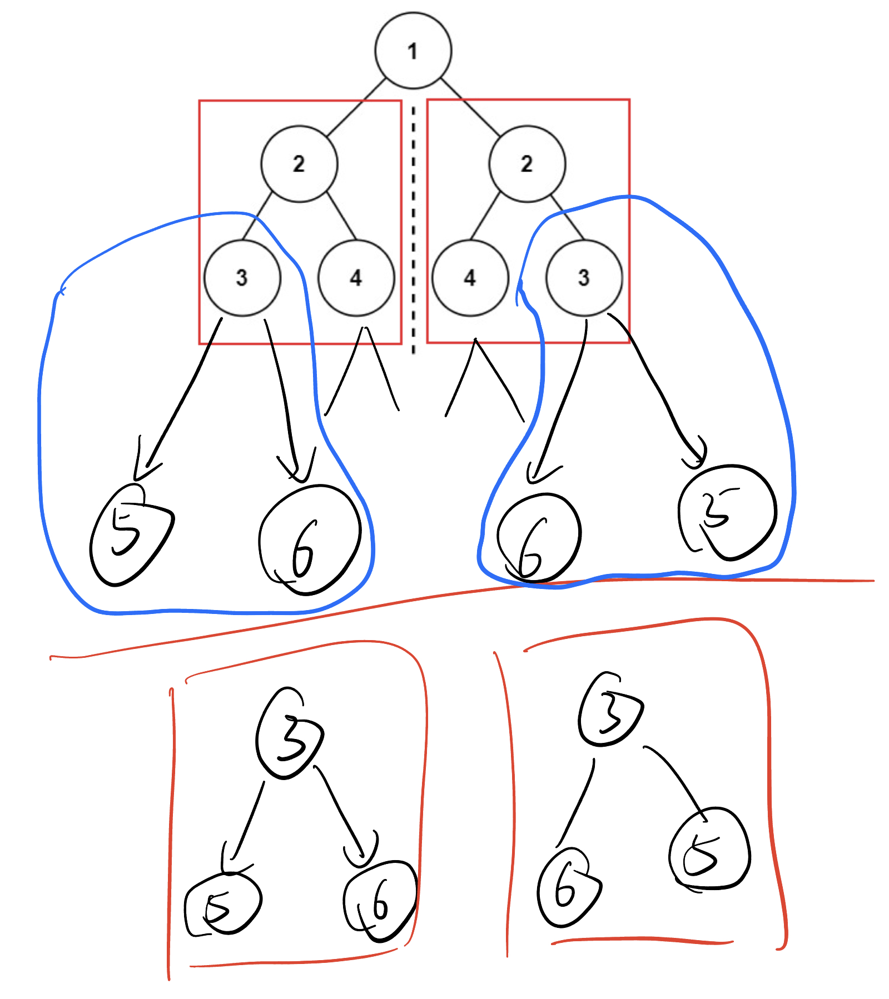
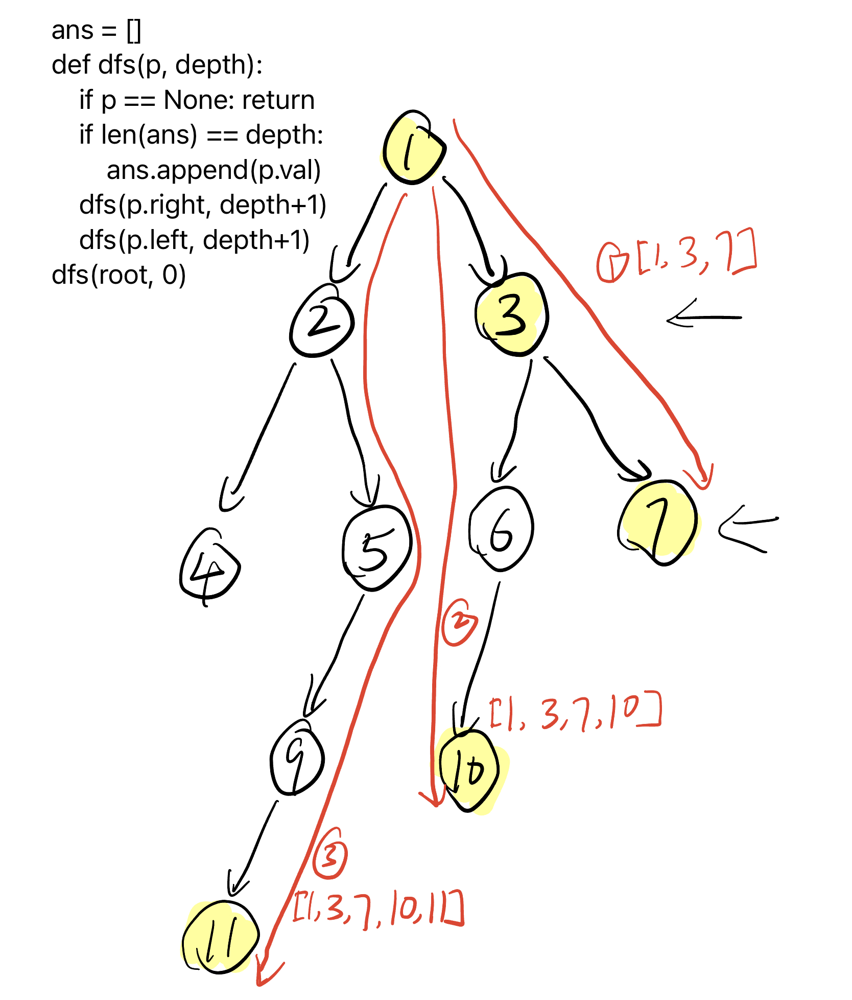

## [100. Same Tree](https://leetcode.cn/problems/same-tree/)

```
# Definition for a binary tree node.
# class TreeNode:
#     def __init__(self, val=0, left=None, right=None):
#         self.val = val
#         self.left = left
#         self.right = right
class Solution:
    def isSameTree(self, p: Optional[TreeNode], q: Optional[TreeNode]) -> bool:
        if p == None or q == None:
            return p == q
        return p.val == q.val and self.isSameTree(p.left, q.left) and self.isSameTree(p.right, q.right)
```

## [101. Symmetric Tree](https://leetcode.cn/problems/symmetric-tree/)

要理解递归思路，要知道不管怎么样都可以递归成比较两个子树是否symmetric对称



```
# Definition for a binary tree node.
# class TreeNode:
#     def __init__(self, val=0, left=None, right=None):
#         self.val = val
#         self.left = left
#         self.right = right
class Solution:
    def isSameTree(self, p: Optional[TreeNode], q: Optional[TreeNode]) -> bool:
        if p == None or q == None:
            return p == q
        return p.val == q.val and self.isSameTree(p.left, q.right) and self.isSameTree(p.right, q.left)

    def isSymmetric(self, root: Optional[TreeNode]) -> bool:
        return self.isSameTree(root.left, root.right)
```

## [110. Balanced Binary Tree](https://leetcode.cn/problems/balanced-binary-tree/)

```
# Definition for a binary tree node.
# class TreeNode:
#     def __init__(self, val=0, left=None, right=None):
#         self.val = val
#         self.left = left
#         self.right = right
class Solution:
    def isBalanced(self, root: Optional[TreeNode]) -> bool:
        def getHeight(p):
            if p == None: 
                return 0
            leftHeight =  getHeight(p.left)
            if leftHeight == -1: 
                return -1
            rightHeight = getHeight(p.right)
            if rightHeight == -1: 
                return -1
            if abs(leftHeight - rightHeight) > 1: 
                return -1
            return max(leftHeight, rightHeight) + 1
        return getHeight(root) != -1
```

## [199. Binary Tree Right Side View](https://leetcode.cn/problems/binary-tree-right-side-view/)



```python
# Definition for a binary tree node.
# class TreeNode:
#     def __init__(self, val=0, left=None, right=None):
#         self.val = val
#         self.left = left
#         self.right = right
class Solution:
    def rightSideView(self, root: Optional[TreeNode]) -> List[int]:
        ans = []
        def dfs(p, depth):
            if p == None: return
            if len(ans) == depth:
                ans.append(p.val)
            dfs(p.right, depth+1)
            dfs(p.left, depth+1)
        dfs(root, 0)
        return ans
```

## Reference

1. [二叉树与递归 - 深入理解](https://www.bilibili.com/video/BV1UD4y1Y769/)
2. [如何灵活运用递归？基础算法精讲 10](https://www.bilibili.com/video/BV18M411z7bb/?share_source=copy_web&vd_source=5d4accef9045e3ed4e08bbb7a80f3c70)
