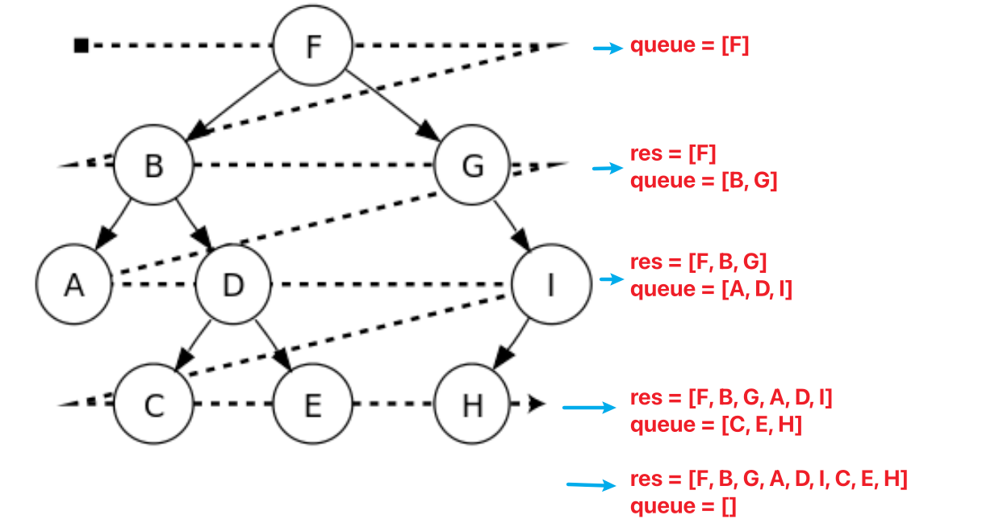

## Idea



## [102. Binary Tree Level Order Traversal](https://leetcode.cn/problems/binary-tree-level-order-traversal/)

```python
# Definition for a binary tree node.
# class TreeNode:
#     def __init__(self, val=0, left=None, right=None):
#         self.val = val
#         self.left = left
#         self.right = right
class Solution:
    def levelOrder(self, root: Optional[TreeNode]) -> List[List[int]]:
        # queue = deque()
        # queue.append(root)
        queue = [root]
        res = []
        while len(queue) > 0:
            tmp = [] # key point
            nxt = []
            for i in range(len(queue)):
                cur = queue[i]
                if cur != None:
                    tmp.append(cur.val)
                    nxt.append(cur.left)
                    nxt.append(cur.right)
            if len(tmp) > 0:
                res.append(tmp)
            queue = nxt
        return res
```

## Reference

1. [二叉树的层序遍历](https://www.bilibili.com/video/BV1hG4y1277i/?spm_id_from=333.788&vd_source=66a0b89065d7f04805223fd7f2d613a6)
1. [Wiki Tree Traversal](https://zh.wikipedia.org/zh-sg/%E6%A0%91%E7%9A%84%E9%81%8D%E5%8E%86)
