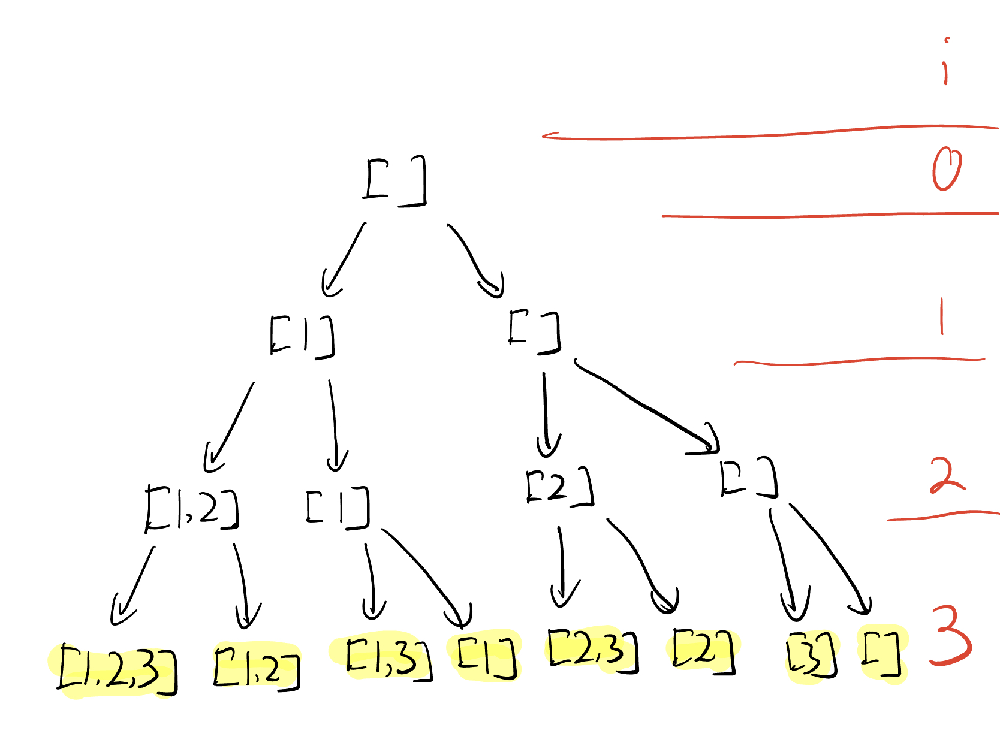
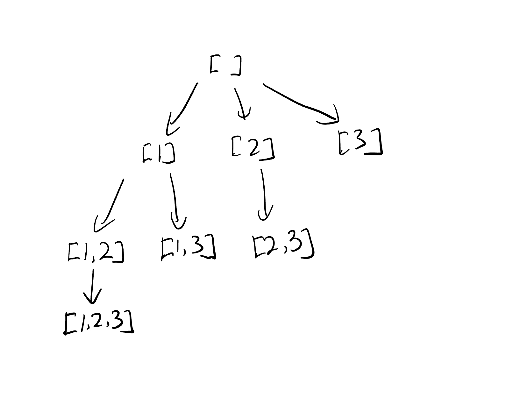

## Idea

回溯三问
1. 子问题？
2. 当前操作？
3. 下一个子问题？

## Template [78. Subsets](https://leetcode.cn/problems/subsets/)

### Example

```
Input: nums = [1,2,3]
Output: [[],[1],[2],[1,2],[3],[1,3],[2,3],[1,2,3]]
```

### Template 1



Thinking on the perspective of input, choose or not choose?

- Choose

  ```python
  path.append(nums[i]) # append current number to path
  dfs(i+1)
  path.pop() # recover path
  ```

- Not Choose

  ```python
  dfs(i+1) # skip current number
  ```


Time Complexity: Traverse a Binary Tree `O(n^2)`

Space Complexity: `O(n)`

```python
class Solution:
    def subsets(self, nums: List[int]) -> List[List[int]]:
        n = len(nums)
        if n == 0:
            return []
        
        ans = []
        path = [] # 遍历的路径

        def dfs(i):
            if i == n: # 边界条件。当遍历到叶子节点后生成答案
                ans.append(path.copy()) # 这边使用copy()避免path地址引用改变已生成的结果，这边的copy其实也花了时间
                # ans.append(''.join(path)) # 这是把string类型的数组内容join起来
                return

            dfs(i+1) # 跳过当前数字

            path.append(nums[i]) # 添加到路径中
            dfs(i+1)
            path.pop() # 恢复现场
        dfs(0)
        return ans
```

### Template 2

Thinking on the perspective of answer，Which to choose?

- Each node is an answer.

- Traverse every remaining elements at each layer.

Algorithm

1. 子问题？从下标 `>=i` 的数组中构造子集
2. 当前元素？应该选择满足 `j >= i` 的 `j` 元素加入路径
3. 下一个子问题？从下标 `>= j+1` 的数组中构造子集



```python
class Solution:
    def subsets(self, nums: List[int]) -> List[List[int]]:
        n = len(nums)
        if n == 0:
            return []
        
        ans = []
        path = [] # 遍历的路径

        def dfs(i):
            ans.append(path.copy()) # 使用copy()避免 path 地址引用改变已生成的结果，这边的copy其实也花了时间
            # ans.append(''.join(path)) # 这是把string类型的数组内容join起来
            if i == n: # 边界条件，返回
                return

            for j in range(i, n):
                path.append(nums[j]) # 添加到路径中
                dfs(j+1) 
                path.pop() # 恢复现场
        dfs(0) # 从零开始
        return ans
```

## Reference

1. [子集型回溯，分割回文串](https://www.bilibili.com/video/BV1mG4y1A7Gu/?spm_id_from=333.788&vd_source=66a0b89065d7f04805223fd7f2d613a6)
