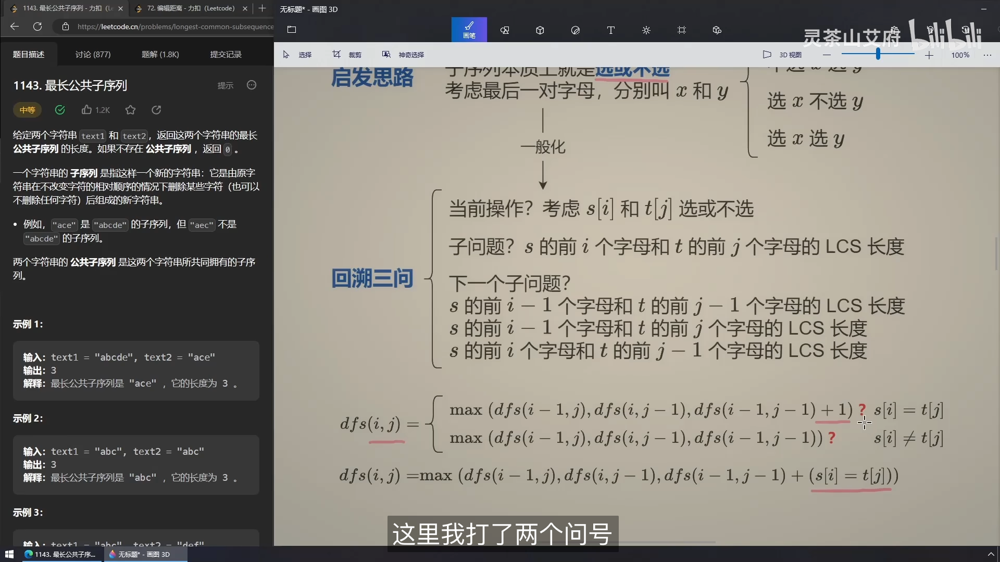

## 最长公共子序列

### 01 例题最长公共子序列

【最长公共子序列 编辑距离】 https://www.bilibili.com/video/BV1TM4y1o7ug/?share_source=copy_web&vd_source=5d4accef9045e3ed4e08bbb7a80f3c70

术语

1. 子数组、子串：subarray/substring，一般是连续的
2. 子序列：subsequence，是不连续的

启发思路：

1. 两个字符串的每个字母对，本质上也是选或不选。

考虑字符串S1和S2的最后一对字母X与Y，有

1. 选X和Y
2. 选X，不选Y
3. 不选X，选Y
4. 不选X，不选Y

则最长公共子序列有两种情况，对于s1[i]=X和s2[j]=Y

1. 如果X=Y
   1. dfs(i, j) = max(dfs(i-1, j), dfs(i, j-1), dfs(i-1, j-1)+1)
   2. 对于dfs(i, j)，如果X=Y。那么dfs(i-1, j-1)的长度一定>=max(dfs(i-1, j), dfs(i, j-1))，所以我们在X=Y的情况下可以忽略dfs(i-1, j), dfs(i, j-1)，所以有：
   3. dfs(i, j) = dfs(i-1, j-1)+1
2. 如果X≠Y
   1. dfs(i, j) = max(dfs(i-1, j), dfs(i, j-1), dfs(i-1, j-1))
   2. 对于X≠Y，dfs(i-1, j)不考虑j的情况就变成了dfs(i-1, j-1)。dfs(i, j-1)不考虑i的情况也变成了dfs(i-1, j-1)。dfs(i-1, j-1)是被max(dfs(i-1, j), dfs(i, j-1))包含在内的，所以有：
   3. dfs(i, j) = max(dfs(i-1, j), dfs(i, j-1))


灵神的回溯、递归三步走

1. 当前操作对应着根据当前的判断（X=Y）做出的选择
2. 子问题，是计算当前dfs(i, j)
3. 下一个子问题，是计算当前的dfs(i, j)，需要多少下一个子问题来联合判断



### 02 [72. Edit Distance](https://leetcode.cn/problems/edit-distance/)

编辑距离：

1. if(x=y)
   1. dfs(i, j) = dfs(i-1, j-1)
2. else
   1. Dfs(i, j) = min(dfs(i-1, j) + dfs(i, j-1) + dfs(i-1, j-1)) + 1


## 最长递增子序列 Longest Increasing Subqequence

【最长递增子序列【基础算法精讲 20】】 https://www.bilibili.com/video/BV1ub411Q7sB/?share_source=copy_web&vd_source=5d4accef9045e3ed4e08bbb7a80f3c70

动态规划做法：

1. 递归：`dfs[j] = max(nums[i]) + 1`
   1. 子问题：结尾为nums[j]的最长递增子序列长度是？
   2. 当前操作：往前`[0, j)`枚举小于nums[j]的nums[i]
   3. 下一个子问题：结尾为nums[i]的最长递增子序列长度是？
2. 时间复杂度`O(n^2)`，空间复杂度`O(n)`

```python
class Solution:
    def lengthOfLIS(self, nums: List[int]) -> int:
        @cache
        def dfs(j):
            res = 0
            for i in range(j):
                if nums[i] < nums[j]:
                    res = max(res, dfs(i))
            return res + 1
        return max(dfs(i) for i in range(len(nums)))
```

数组版记忆化搜索

- 时间复杂度`O(n^2)`，空间复杂度`O(n)`

```python
class Solution:
    def lengthOfLIS(self, nums: List[int]) -> int:
        cache = [-inf] * len(nums)
        # @cache
        def dfs(j):
            if cache[j] >= 0: return cache[j]
            res = 0
            for i in range(j):
                if nums[i] < nums[j]:
                    res = max(res, dfs(i))
            cache[j] = res + 1
            return cache[j]
        return max(dfs(i) for i in range(len(nums)))
```

递归改递推：`f[j] = max(f[i]) + 1`

- 时间复杂度`O(n^2)`，空间复杂度`O(n)`

```python
class Solution:
    def lengthOfLIS(self, nums: List[int]) -> int:
        f = [0] * len(nums)
        for j in range(len(nums)):
            for i in range(j):
                if nums[i] < nums[j]:
                    f[j] = max(f[i], f[j]) 
            f[j] += 1
        return max(f)
```

进一步优化时间复杂度，引入新概念：g数组

1. g数组的长度代表当前最长递增子序列长度
   1. 更新算法
      1. 如果找到g数组中第一个大于nums[i]的元素g[k]，将g[k]更新为nums[i]
      2. 如果g数组中没有大于nums[i]的元素，则把nums[i]加到g数组的后面
   2. 可以反证、归纳证明g一定是严格递增的
      1. 假设`j-1 <= j`有`g[j-1] == g[j]`，但是根据我们的更新算法，对于`i <= j`, g[i]一定小于g[j]，与`g[j-1] == g[j]`矛盾
2. 时间复杂度`O(nlongn)`, 即数组长度n乘以每次二分查找的logn
3. 空间复杂度`O(n)`

```python
class Solution:
    def lengthOfLIS(self, nums: List[int]) -> int:
        g = []
        for i in range(len(nums)):
            k = bisect_left(g, nums[i])
            if k == len(g):
                g.append(nums[i])
            else:
                g[k] = nums[i]
        return len(g)
```

进一步优化空间复杂度为O(1)

```python
class Solution:
    def lengthOfLIS(self, nums: List[int]) -> int:
        ng = 0
        for i in range(len(nums)):
            k = bisect_left(nums, nums[i], 0, ng)
            if k == ng:
                nums[k] = nums[i]
                ng += 1
            else:
                nums[k] = nums[i]
        return ng
```

