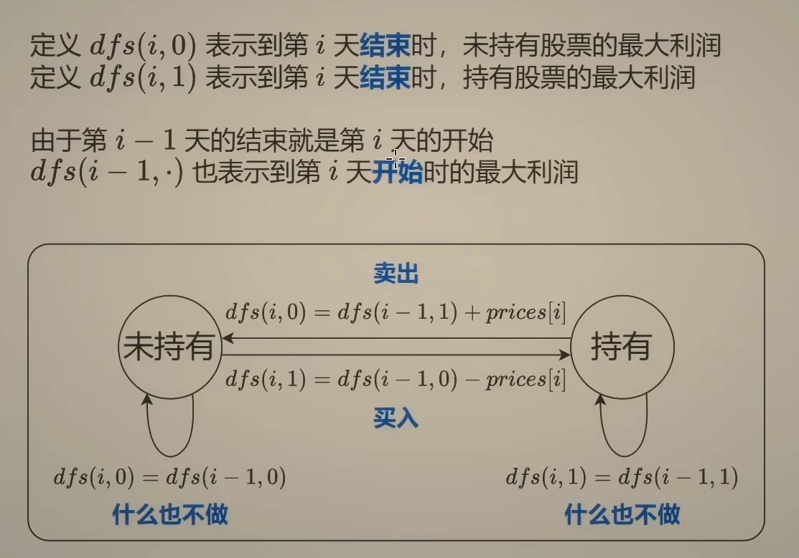
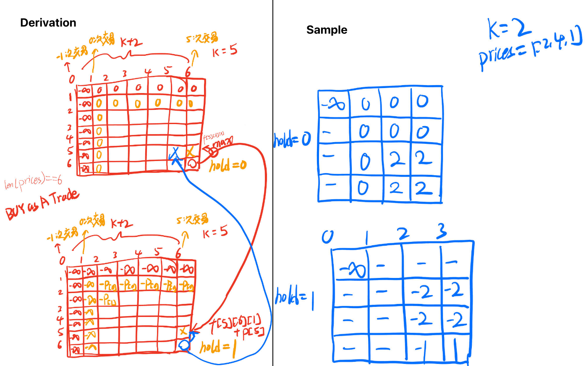
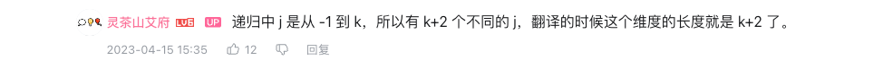
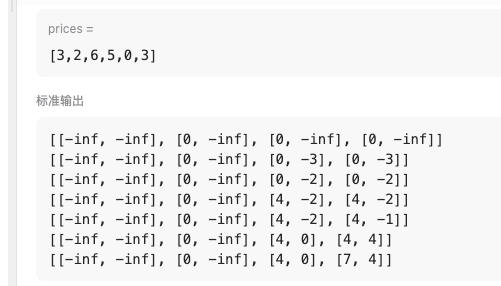

# State Machine DP

## Idea



## [122. Best Time to Buy and Sell Stock II](https://leetcode.cn/problems/best-time-to-buy-and-sell-stock-ii/)

```python
class Solution:
    def maxProfit(self, prices: List[int]) -> int:
        f0 = 0
        f1 = -inf
        for i, p in enumerate(prices):
            new_f0 = max(f0, f1 + p)
            f1 = max(f1, f0 - p)
            f0 = new_f0
        return f0
```

## [123. Best Time to Buy and Sell Stock III](https://leetcode.cn/problems/best-time-to-buy-and-sell-stock-iii/) => At most two transactions

```python
class Solution:
    def maxProfit(self, prices: List[int]) -> int:
        dp=[[[0,0] for i in range(3)] for j in range(len(prices))]
        dp[0][1][0]=dp[0][2][0]=0
        dp[0][1][1]=dp[0][2][1]=-prices[0]
        for i in range(1,len(prices)):
            for j in range(1, 3):
                dp[i][j][0] = max(dp[i-1][j][0], dp[i-1][j][1] + prices[i])
                dp[i][j][1] = max(dp[i-1][j][1], dp[i-1][j-1][0] - prices[i])
        return dp[len(prices)-1][2][0]
```

## [188. Best Time to Buy and Sell Stock IV](https://leetcode.cn/problems/best-time-to-buy-and-sell-stock-iv/) => At most k transactions

```markdown
Input: k = 2, prices = [3,2,6,5,0,3]
Output: 7
Explanation: Buy on day 2 (price = 2) and sell on day 3 (price = 6), profit = 6-2 = 4. Then buy on day 5 (price = 0) and sell on day 6 (price = 3), profit = 3-0 = 3.
```

### 递归要点

- 持有时 `hold == 1`，卖出 `dfs(i, j, 0) = max(dfs(i-1, j, 0), dfs(i-1, j - 1, 1) + prices[i])`
- 不持有时 `hold == 0`, 买入 `dfs(i, j, 1) = max(dfs(i-1, j, 1), dfs(i-1, j, 0) - prices[i])`
- 买入或卖出算作一次交易。代码中的 `j-1` 可以是在买股票的时候，也可以是在卖股票的时候



### dfs 递归写法

```python
class Solution:
    def maxProfit(self, k: int, prices: List[int]) -> int:
        n = len(prices)
        @cache
        def dfs(i: int, j: int, hold: bool) -> int:
            if j < 0:
                return -inf
            if i < 0:
                return -inf if hold else 0
            if hold:
                return max(dfs(i - 1, j, True), dfs(i - 1, j - 1, False) - prices[i])
            return max(dfs(i - 1, j, False), dfs(i - 1, j, True) + prices[i])
        return dfs(n - 1, k, False)
```

### 用另一种形式去做边界值也是可以的

```python
class Solution:
    def maxProfit(self, k: int, prices: List[int]) -> int:
        n = len(prices)
        @cache
        def dfs(i: int, j: int, hold: bool) -> int:
            # if j < 0:
            #     return -inf
            # if i < 0:
            #     return -inf if hold else 0
            if j == 0:
                return -inf if hold else 0
            if i == 0:
                return -prices[i] if hold else 0
            if hold:
                return max(dfs(i - 1, j, True), dfs(i - 1, j - 1, False) - prices[i])
            return max(dfs(i - 1, j, False), dfs(i - 1, j, True) + prices[i])
        return dfs(n - 1, k, False)
```

### 递归写法，翻译上面的第一个 dfs 的边界值处理

1. 理解为什么是 dfs(n - 1, k, False)，因为 k == 0 时是最多交易 0 次，是有意义的。
2. 递归中 j 是从 -1 到 k，所以有 k+2 个不同的 j，这个维度是 k+2
3. 如果我们把 `i == -1` 当做边界，那需要 handle 从 -1 到 n - 1 的 i，所以有 n+1 个不同的 i，这个维度是 n+1



```python
class Solution:
    def maxProfit(self, k: int, prices: List[int]) -> int:
        n = len(prices)
        f = [[[-inf] * 2 for _ in range(k + 2)] for _ in range(n + 1)]
        for j in range(1, k + 2):
            f[0][j][0] = 0
        for i, p in enumerate(prices):
            for j in range(1, k + 2):
                f[i + 1][j][0] = max(f[i][j][0], f[i][j][1] + p)
                f[i + 1][j][1] = max(f[i][j][1], f[i][j - 1][0] - p)
        for i in range(n+1):
            print(f[i])
        return f[-1][-1][0]
```

### f sample



## 至少交易k次

## 正好交易k次

## [309. Best Time to Buy and Sell Stock with Cooldown](https://leetcode.cn/problems/best-time-to-buy-and-sell-stock-with-cooldown/)

## [714. Best Time to Buy and Sell Stock with Transaction Fee](https://leetcode.cn/problems/best-time-to-buy-and-sell-stock-with-transaction-fee/)

## Reference

1. [买卖股票的最佳时机【基础算法精讲 21】](https://www.bilibili.com/video/BV1ho4y1W7QK/?share_source=copy_web&vd_source=5d4accef9045e3ed4e08bbb7a80f3c70)
