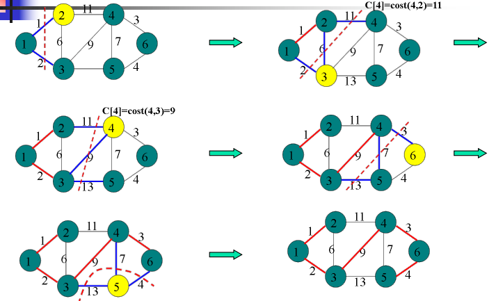

# Graph V2

## 单源最短路径

### Dijkstra

给定带权有向图 `G =(V,E)`，其中每条边的权是非负实数。另外，还给定 `V` 中的一个顶点，称为**源**。

- **单源最短路径**：要计算从源到所有其他各顶点的各边权之和的最短长度

## 最小生成树

设 `G=(V, E)` 是连通无向带权图，`V = {1, 2,..., n}`，即一个网络。E 中每条边 `(v, w)` 的权位 `c[v][w]`。

- **生成树**：如果 `G` 的子图 `G'` 是一颗包含 `G` 的所有顶点的树，则称 `G'` 为 `G` 的生成树。

- **最小生成树**：生成树上各边权的总和称为该生成树的耗费。在 `G` 的所有生成树中，耗费最小的生成树称为 `G` 的最小生成树。

构造 G 的最小生成树算法：

- Prim 避圈法
- Kruskai 破圈法

### Prim 避圈法

1. 首先初始化构造集 `X={1}`

2. 然后，只要 `X` 是 `V` 的真子集，就作如下的贪心选择选取权重最小的边 `(x,y)`,其中`x ∈ X`，`y ∈ Y`，

   - 将边 `(x,y)` 加入当前的最小生成树， 

   - 将顶点 `y` 从 `Y` 移到 `X` 中，

3. 这个过程一直进行到构造集 `X=V` 时为止。在这个过程中选取到的所有边恰好构成 `G` 的一棵最小生成树。

### Kruskai 破圈法

1. 对 `G` 的边 `E` 按权重以非降序排列
2. 初始时输出树 `T={}`  依次取排序表中的每条边，若加入 `T` 不形成回路，则加入 `T` 否则将其丢弃;
3. 不断重复步骤 2，直到树 `T` 包含 `n-1` 条边（即 `n` 个节点），算法结束。

## Reference

1. [My Chinese Blog](https://colalinn.github.io/2020/07/07/2020-07-07-algorithm/#more)