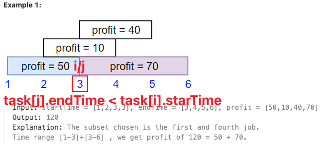

[1235. Maximum Profit in Job Scheduling](https://leetcode.cn/problems/maximum-profit-in-job-scheduling/)

动态规划题

思路

- 按结束时间排序元组`<startTime，startTime，profit>`，得到排序后的 jobs
- 动态规划：
  - 从前往后遍历元组
  - 找到 jobs 中第一个满足 `j.endTime <= i.startTime` 下标 `j`
  - 对于 i 位置元素`<entTime, startTime, profit>`，计算 `f[i+1] = max(f[i], f[j]+p)`



```python
class Solution:
    def jobScheduling(self, startTime: List[int], endTime: List[int], profit: List[int]) -> int:
        jobs = sorted(zip(endTime, startTime, profit))  # 按照结束时间排序
        f = [0] * (len(jobs) + 1)
        for i, (_, st, p) in enumerate(jobs):
            j = bisect_left(jobs, (st + 1,), hi=i)  # hi=i 表示二分上界为 i（默认为 n）
            print(i, st, j, jobs[j])
            # 状态转移中，为什么是 j 不是 j+1：上面找到的是 j index whose endTime < startTime of i + 1，也即 j.endTime <= i.startTime
            f[i + 1] = max(f[i], f[j] + p)
        return f[-1]
```

