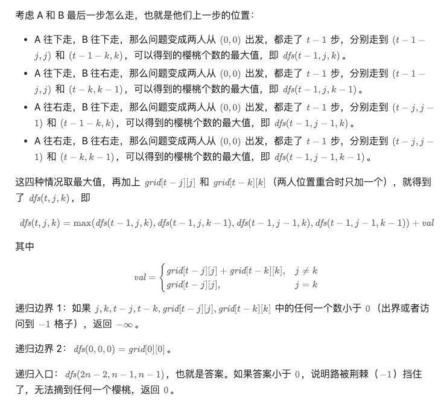

[741. Cherry Pickup](https://leetcode.cn/problems/cherry-pickup/)

my solution: twice DP, but it might miss the global maximum

```python
class Solution:
    def cherryPickup(self, grid: List[List[int]]) -> int:
        n = len(grid)
        if n == 1:
            return grid[0][0]

        def iterateRound1(vmap):
            for i in range(1, n):
                preV = vmap[0][i - 1]
                if preV >= 0 and vmap[0][i] >= 0:
                    vmap[0][i] += preV
                else:
                    vmap[0][i] = -1

                upV = vmap[i - 1][0]
                if upV >= 0 and vmap[i][0] >= 0:
                    vmap[i][0] += upV
                else:
                    vmap[i][0] = -1

            for i in range(1, n):
                for j in range(1, n):
                    maxV = max(vmap[i - 1][j], vmap[i][j - 1])
                    if maxV >= 0 and vmap[i][j] >= 0:
                        vmap[i][j] += maxV
                    else:
                        vmap[i][j] = -1

        def updateRound2(vmap, updatMap):
            i = j = n - 1
            while i != 0 or j != 0:
                if i > 0 and vmap[i - 1][j] + 1 >= vmap[i][j]:
                    updatMap[i][j] = 0
                    i = i - 1
                    continue
                if j > 0 and vmap[i][j - 1] + 1 >= vmap[i][j]:
                    updatMap[i][j] = 0
                    j = j - 1
                    continue
            updatMap[i][j] = 0

        firstMap = copy.deepcopy(grid)
        iterateRound1(firstMap)
        if firstMap[n - 1][n - 1] < 0:
            return 0
        res = firstMap[n - 1][n - 1]

        secondMap = copy.deepcopy(grid)
        updateRound2(firstMap, secondMap)
        print(secondMap, res)

        iterateRound1(secondMap)
        res += secondMap[n - 1][n - 1]
        return res

```


灵神DP

```python
class Solution:
    def cherryPickup(self, grid: List[List[int]]) -> int:
        @cache  # 缓存装饰器，避免重复计算 dfs 的结果（记忆化）
        def dfs(t: int, j: int, k: int) -> int:
            # 不能出界，不能访问 -1 格子
            if j < 0 or k < 0 or t < j or t < k or grid[t - j][j] < 0 or grid[t - k][k] < 0:
                return -inf
            if t == 0:  # 此时 j = k = 0
                return grid[0][0]
            return max(dfs(t - 1, j, k), dfs(t - 1, j, k - 1), dfs(t - 1, j - 1, k), dfs(t - 1, j - 1, k - 1)) + \
                grid[t - j][j] + (grid[t - k][k] if k != j else 0)
        n = len(grid)
        return max(dfs(n * 2 - 2, n - 1, n - 1), 0)
```

精髓

1. 把整个题当做两个同时进行的DP
2. 并且把两个DP的状态变化作为一个


