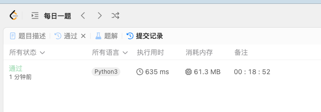

[1463. Cherry Pickup II](https://leetcode.cn/problems/cherry-pickup-ii/)

```python
class Solution:
    def cherryPickup(self, grid: List[List[int]]) -> int:
        n = len(grid)
        m = len(grid[0])
        @cache
        def dfs(i, j, j2):
            if j < 0 or j >= m or j2 < 0 or j2 >= m: return -inf
            if i == n:
                return 0
            # print(i, j, j2)
            val = grid[i][j] + (grid[i][j2] if j2 != j else 0)
            res = -inf
            for k in [-1, 0, 1]:
                # print(i, k)
                res = max(res, dfs(i+1, j-1, j2+k), dfs(i+1, j, j2+k), dfs(i+1, j+1, j2+k))
            return res + val
        return dfs(0, 0, m-1)
```

我起了，一枪秒了，有什么好说的？

思路很简单，和上一题一样

1. 把整个题当做两个同时进行的DP
2. 把两个DP的状态变化作为一个整体 dfs


