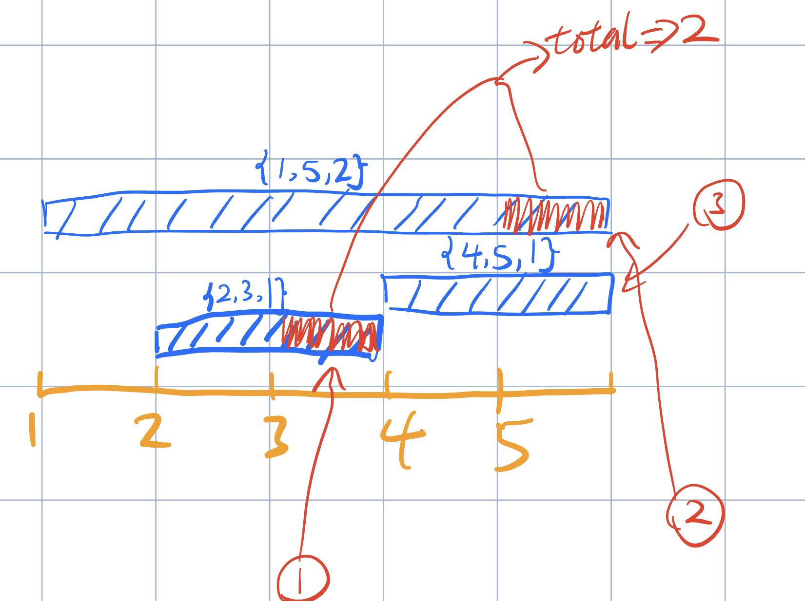

[2589. Minimum Time to Complete All Tasks](https://leetcode.cn/problems/minimum-time-to-complete-all-tasks/)

## 暴力

```
1 <= tasks.length <= 2000
1 <= starti, endi <= 2000
```

由于题目要求的数值空间范围并不大，我们可以考虑暴力法，用一个数组标记 activate (run) 的时间

1. 按结束时间升序排序。
2. 从前往后遍历数组，对于每个 task，看其所需的 duration 是否已经被已有的 activate 的时间满足。
3. 如果没有被满足，则需要新增 active 的时间点，从后往前遍历 `range(end, start - 1, -1)` 找到可以 activate 的时间点。这样子可以尽可能的使 active 的时间点被后面的 task 使用。

```python
class Solution:
    def findMinimumTime(self, tasks: List[List[int]]) -> int:
        tasks = sorted(tasks, key=lambda task: task[1])
        activeTime = [0] * (tasks[-1][1] + 1)
        for start, end, d in tasks:
            activeMins = sum(activeTime[start : end + 1])
            needMins = d - activeMins
            if needMins > 0:
                for i in range(end, start - 1, -1):
                    if activeTime[i] == 0:
                        activeTime[i] = 1
                        needMins -= 1
                    if needMins == 0:
                        break
        return sum(activeTime)
```



## 数值空间大的话，线段树

```python
class Solution:
    def findMinimumTime(self, tasks: List[List[int]]) -> int:
        tasks.sort(key=lambda t: t[1])
        u = tasks[-1][1]
        m = 2 << u.bit_length()
        cnt = [0] * m
        todo = [False] * m

        def do(o: int, l: int, r: int) -> None:
            cnt[o] = r - l + 1
            todo[o] = True

        def spread(o: int, l: int, m: int, r: int) -> None:
            if todo[o]:
                todo[o] = False
                do(o * 2, l, m)
                do(o * 2 + 1, m + 1, r)

        # 查询区间正在运行的时间点 [L,R]   o,l,r=1,1,u
        def query(o: int, l: int, r: int, L: int, R: int) -> int:
            if L <= l and r <= R: return cnt[o]
            m = (l + r) // 2
            spread(o, l, m, r)
            if m >= R: return query(o * 2, l, m, L, R)
            if m < L: return query(o * 2 + 1, m + 1, r, L, R)
            return query(o * 2, l, m, L, R) + query(o * 2 + 1, m + 1, r, L, R)

        # 在区间 [L,R] 的后缀上新增 suffix 个时间点    o,l,r=1,1,u
        # 相当于把线段树二分和线段树更新合并成了一个函数，时间复杂度为 O(log u)
        def update(o: int, l: int, r: int, L: int, R: int) -> None:
            size = r - l + 1
            if cnt[o] == size: return  # 全部为运行中
            nonlocal suffix
            if L <= l and r <= R and size - cnt[o] <= suffix:  # 整个区间全部改为运行中
                suffix -= size - cnt[o]
                do(o, l, r)
                return
            m = (l + r) // 2
            spread(o, l, m, r)
            if m < R: update(o * 2 + 1, m + 1, r, L, R)  # 先更新右子树
            if suffix: update(o * 2, l, m, L, R)  # 再更新左子树（如果还有需要新增的时间点）
            cnt[o] = cnt[o * 2] + cnt[o * 2 + 1]

        for start, end, d in tasks:
            suffix = d - query(1, 1, u, start, end)  # 去掉运行中的时间点
            if suffix > 0: update(1, 1, u, start, end)  # 新增时间点
        return cnt[1]
```

