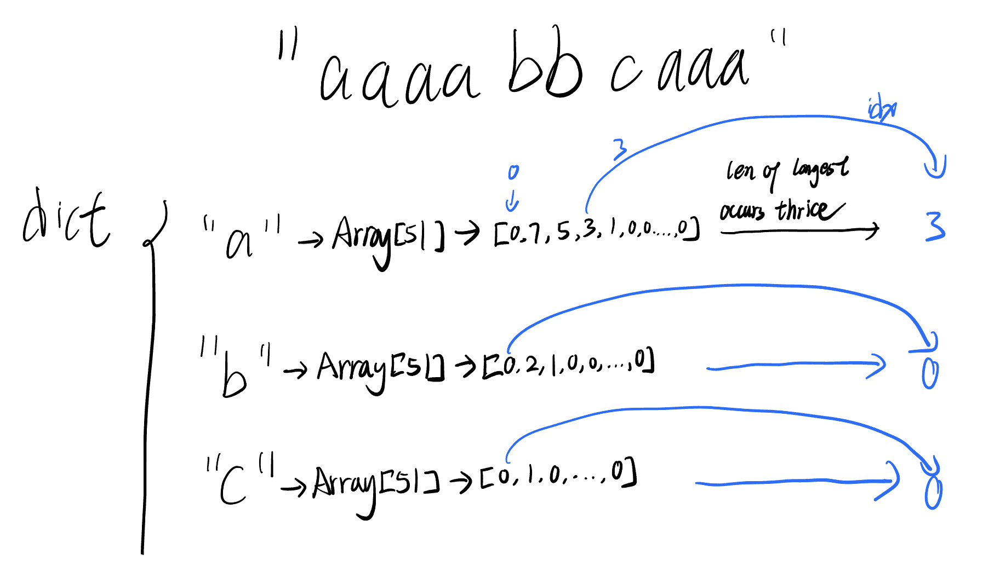
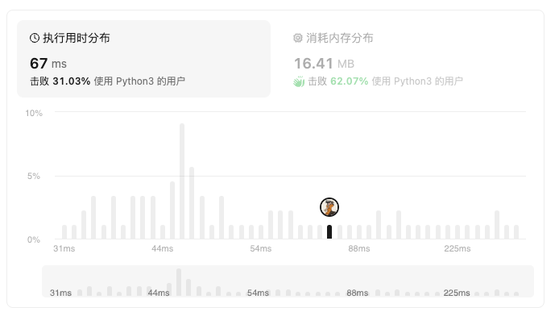
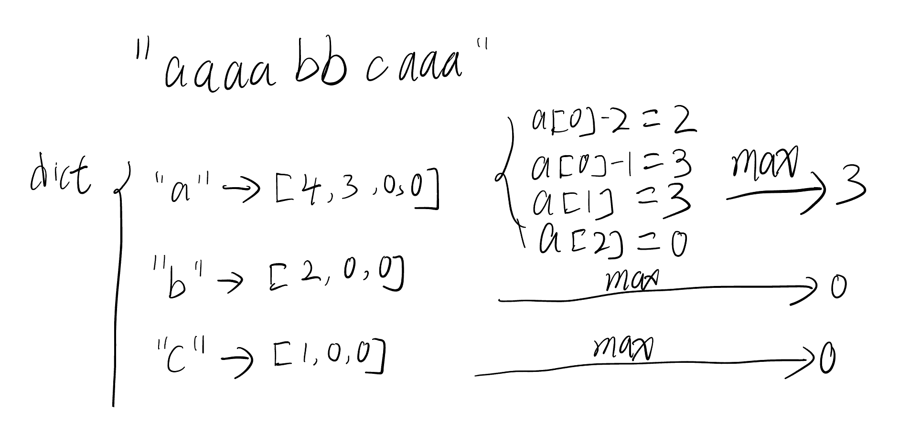
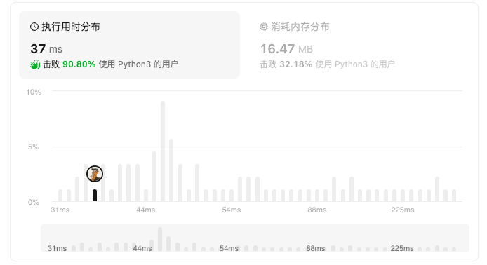

[2981. Find Longest Special Substring That Occurs Thrice I](https://leetcode.cn/problems/find-longest-special-substring-that-occurs-thrice-i/)

## Solution 1 - First Impression

- For each contiguous non-empty substring such that the elements are same character, for example, `aaaa`
  - we add the following to hashmap `lenArrayMap["a"]`, the content is a list `x`, the max length of `x` is 50 under the given limitation `3 <= s.length <= 50`
    - `x[4] += 1`
    - `x[3] += 2`
    - `x[2] += 3`
    - `x[1] += 4`
  - we also have another hashmap `charMaxLen["a"]` to note down the max length of  each character
- For each element in `charMaxLen`, go to find the corresponding `top-3` result in `lenMap`
  - If `lenMap["a"][charMaxLen] >= 3`, it is the length of the longest special substring of `s` which occurs at least thrice.



```python
class Solution:
    def maximumLength(self, s: str) -> int:
        lenArrayMap = dict()
        charMaxLen = dict()
        
        for i in range(26):
            lenArrayMap[chr(ord("a")+i)] = [0 for _ in range(51)]
        cnt = 0
        for i, c in enumerate(s):
            cnt += 1
            if i+1 == len(s) or c != s[i+1]:
                if c not in charMaxLen or charMaxLen[c] <= cnt:
                    charMaxLen[c] = cnt
                cLenArray = lenArrayMap[c]
                for k in range(cnt):
                    # Add up the count of k len substring in current contiguous substring
                    cLenArray[k+1] += cnt - k
                cnt = 0
        
        res = -1
        for c in charMaxLen:
            maxLen = charMaxLen[c]
            lenArray = lenArrayMap[c]
            # print(c, maxLen, lenArray)
            for i in range(maxLen, 0, -1):
                if lenArray[i] >= 3:
                    if i > res:
                        res = i
                    break
        return res
```

### Complexity

- Time, `O(n)`  Should be more than because it takes more time to complete than solution2 `O(nlogn)`
- Space, `O(n)`



## Solution 2 from 0x3f

https://leetcode.cn/problems/find-longest-special-substring-that-occurs-thrice-i/solutions/2585837/fei-bao-li-zuo-fa-fen-lei-tao-lun-python-p1g2/?envType=daily-question&envId=2024-05-29

- add the length of each contiguous non-empty substring in a traversal
  - we add two `0` to the element to mock there are two empty string `a.extend([0, 0])` 
- for each element in the dict
  - get the result by `max(a[0]-2, a[0]-1, a[1], a[2])`



```python
class Solution:
    def maximumLength(self, s: str) -> int:
        groups = defaultdict(list)
        cnt = 0
        for i, ch in enumerate(s):
            cnt += 1
            if i + 1 == len(s) or ch != s[i + 1]:
                groups[ch].append(cnt)  # 统计连续字符长度
                cnt = 0

        ans = 0
        for a in groups.values():
            a.sort(reverse=True)
            a.extend([0, 0])  # 假设还有两个空串
            ans = max(ans, a[0] - 2, min(a[0] - 1, a[1]), a[2])

        return ans if ans else -1
```

### Complexity

- Time, `O(nlogn)`
- Space, `O(n)`

