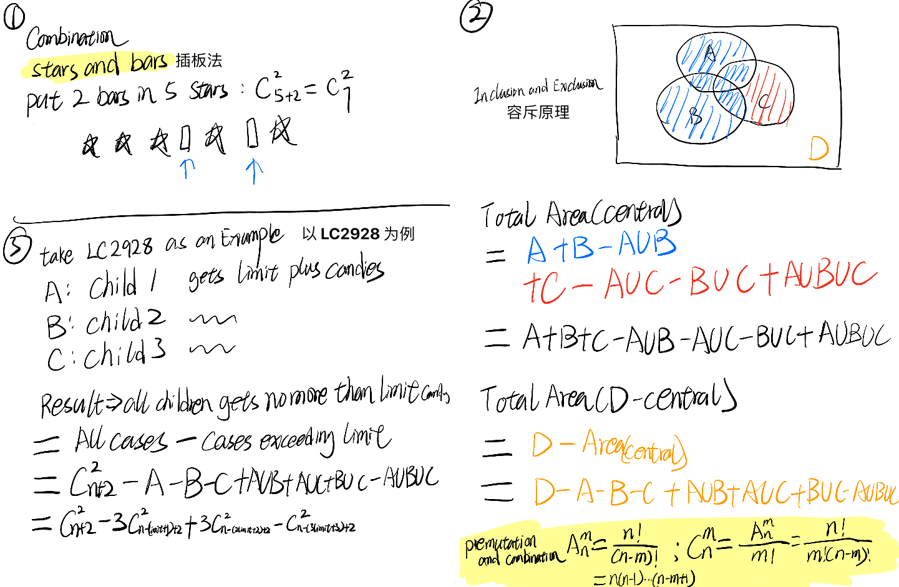

[2928. Distribute Candies Among Children I](https://leetcode.cn/problems/distribute-candies-among-children-i/)

```python
class Solution:
    def distributeCandies(self, n: int, limit: int) -> int:
        cnt = 0
        def traceback(remain, i):
            nonlocal cnt
            if i == 3 and remain != 0:
                return
            if i == 3:
                cnt += 1
                return 
            for k in range(limit + 1):
                if (remain - k) > (2 - i) * limit or (remain - k ) < 0:
                    continue
                traceback(remain - k, i + 1)
        traceback(n, 0)
        return cnt
```

nonlocal

```python
def subtrack():
 nonlocal cnt
```


Inclusion-Exclusion Principle

https://leetcode.cn/problems/distribute-candies-among-children-i/solutions/2522970/o1-rong-chi-yuan-li-pythonjavacgo-by-end-smj5/?envType=daily-question&envId=2024-06-01



```python
def c2(n: int) -> int:
    return n * (n - 1) // 2 if n > 1 else 0

class Solution:
    def distributeCandies(self, n: int, limit: int) -> int:
        return c2(n + 2) - 3 * c2(n - limit + 1) + 3 * c2(n - 2 * limit) - c2(n - 3 * limit - 1)
```

