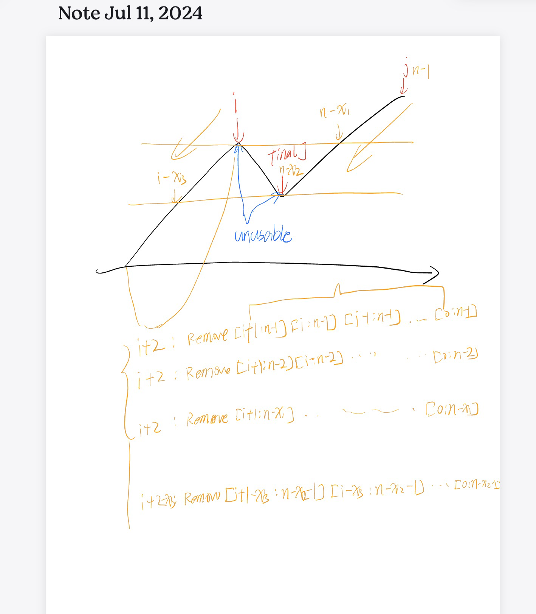

[2970. Count the Number of Incremovable Subarrays I](https://leetcode.cn/problems/count-the-number-of-incremovable-subarrays-i/)

rating 1900

```
class Solution:
    def incremovableSubarrayCount(self, a: List[int]) -> int:
        n = len(a)
        i = 0
        while i < n - 1 and a[i] < a[i + 1]:
            i += 1
        if i == n - 1:  # 每个非空子数组都可以移除
            return n * (n + 1) // 2

        ans = i + 2  # 不保留后缀的情况，一共 i+2 个
        # 枚举保留的后缀为 a[j:
        j = n - 1
        while j == n - 1 or a[j] < a[j + 1]:
            while i >= 0 and a[i] >= a[j]:
                i -= 1
            # 可以保留前缀 a[:i+1], a[:i], ..., a[:0] 一共 i+2 个
            ans += i + 2
            j -= 1
        return ans
        # 前后缀分解，1900
```

