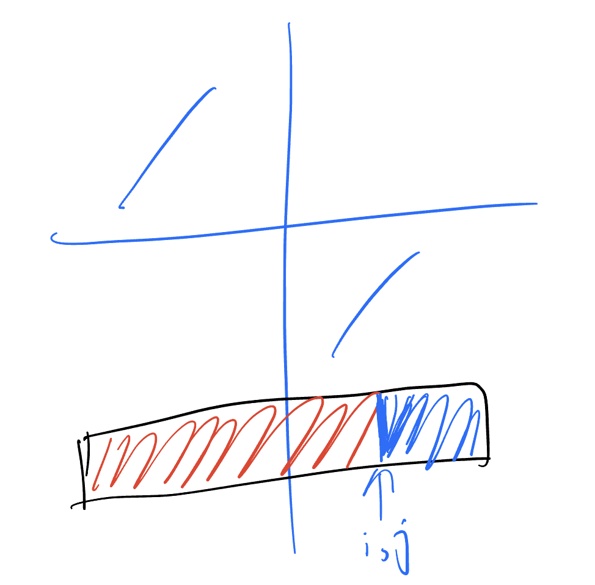
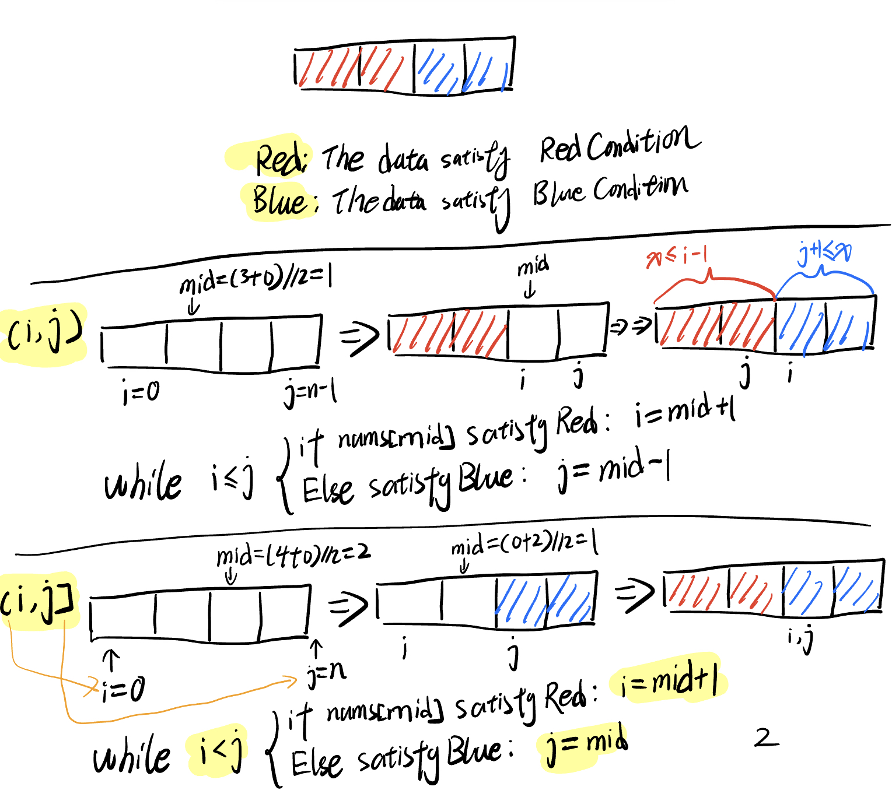
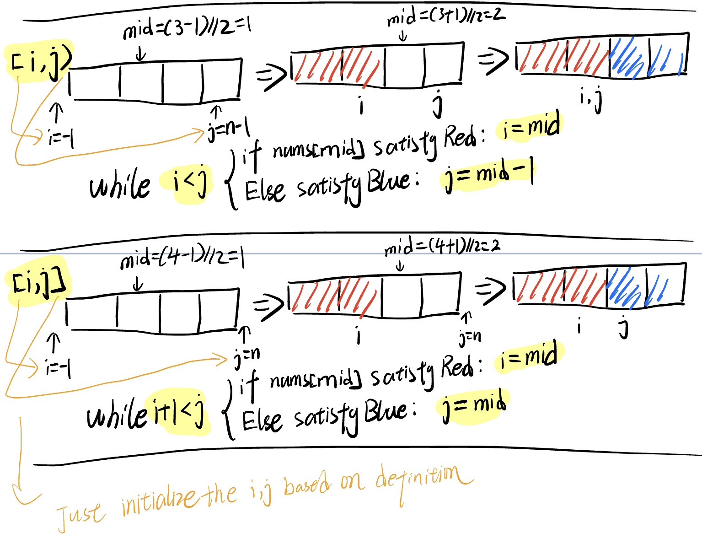

# 二分搜索 Binary Search 

# Idea

红蓝染色法：

1. right 左移使右侧变蓝 (判断条件为 true )
2. left 右移使左侧变红 (判断条件为 false )
3. 故确定二分处 ( mid ) 的染色条件是关键


## Template

## bisect_left

### (i, j)

```python
# (i, j) -> i <= j; i = mid + 1, j = mid - 1
def bisect_left(nums, target):
    i = 0
    j = len(nums) - 1
    while i <= j:
        mid = (i+j) // 2
        if nums[mid] < target:
            i = mid + 1
        else:
            j = mid - 1
    return i
```

### [i, j)

There is problem, I cannot figure it out for now.

```python
# [i, j) -> i < j; i = mid, j = mid - 1
def bisect_left(nums, target):
    i = 0
    j = len(nums)  # 使用半开区间 [i, j)
    while i < j:
        mid = (i + j) // 2
        if nums[mid] < target:  # 注意这里是 < 而不是 <=
            i = mid + 1
        else:
            j = mid
    return i

for i in range(1, 10):
    print(i, bisect_left_v1([1,2,3,4,5], i))
```

### [i, j]

```python
# [i, j] -> i + 1 < j; i = mid, j = mid
def bisect_left(nums, target):
    i = -1
    j = len(nums)
    while i + 1 < j:
        mid = (i+j) // 2
        if nums[mid] < target:
            i = mid
        else:
            j = mid
    return i + 1
```

## [162. Find Peak Element](https://leetcode.cn/problems/find-peak-element/)

```python
class Solution:
    def findPeakElement(self, nums: List[int]) -> int:
        # we use [left, right) left closed and right open interval
        # red blue painting approach to solve this problem
        left = 0
        right = len(nums) - 1
        while left < right:
            mid = (left + right) // 2
            if nums[mid] < nums[mid+1]:
                left = mid + 1
            else:
                right = mid
        return left
```

## [34. Find First and Last Position of Element in Sorted Array](https://leetcode.cn/problems/find-first-and-last-position-of-element-in-sorted-array/)

```python
class Solution:
    def searchRange(self, nums: List[int], target: int) -> List[int]:
        if len(nums) == 0:
            return [-1, -1]
        def lowBound(nums, target):
            # we use left open and right open interval here
            left = -1
            right = len(nums)
            while left + 1 < right:
                mid = (left + right) // 2
                if nums[mid] >= target:
                    right = mid
                else:
                    left = mid
            return left
        left = lowBound(nums, target) + 1 # plus 1 to make it ranges from [0, len(nums)]
        right = lowBound(nums, target+1)
        if left == len(nums) or nums[left] != target: # left is after the end, or left is not equal to the target
            return [-1, -1]
        else:
            return [left, right]
```

## [153. Find Minimum in Rotated Sorted Array](https://leetcode.cn/problems/find-minimum-in-rotated-sorted-array/)

```
class Solution:
    def findMin(self, nums: List[int]) -> int:
        def isBlue(mid):
            if nums[mid] > end:
                return False
            else:
                return True
        # left open right closed interval
        left = 0
        right = len(nums)
        end = nums[-1]
        while left < right:
            mid = (left + right) // 2
            if isBlue(mid):
                right = mid
            else:
                left = mid + 1
        return nums[right]
```

## [154. Find Minimum in Rotated Sorted Array II](https://leetcode.cn/problems/find-minimum-in-rotated-sorted-array-ii/)

```
class Solution:
    def findMin(self, nums: List[int]) -> int:
        end = nums[-1]
        i = 0
        while i < len(nums) and nums[i] == end: # 跳过开头的重复数字，来避免[3,1,3], right变成0
            i+=1
        if i == len(nums): # 如果全部一样则直接返回结果
            return end
        nums = nums[i:] #跳过重复数字

        def isBlue(mid):
            if nums[mid] <= end:
                return True
            else:
                return False
        # left closed right open interval
        left = 0
        right = len(nums)
        while left < right:
            mid = (left + right) // 2
            if isBlue(mid):
                right = mid
            else:
                left = mid + 1
        return nums[right]
```

## [33. Search in Rotated Sorted Array](https://leetcode.cn/problems/search-in-rotated-sorted-array/)



```
class Solution:
    def search(self, nums: List[int], target: int) -> int:
        end = nums[-1]
        def isBlue(mid):
            if nums[mid] > end:
                return target <= nums[mid] and target > end #target在mid的左边大于end的那段递增线段
            else:
                return target <= nums[mid] or target > end #target在最小和mid的中间，或者在左边大于end的递增线段
        left = 0
        right = len(nums) - 1
        while left < right:
            mid = (left+right) //2
            if isBlue(mid):
                right = mid
            else:
                left = mid + 1
        if nums[right] != target:
            return -1
        return right
```

## [2529. Maximum Count of Positive Integer and Negative Integer](https://leetcode.cn/problems/maximum-count-of-positive-integer-and-negative-integer/)

```
class Solution:
    def maximumCount(self, nums: List[int]) -> int:
        left = 0
        right = len(nums) - 1
        while left < right:
            mid = (left + right) //2
            if nums[mid] >= 0:
                right = mid -1
            else:
                left = mid
        neg = left+1
        pos = left
        while left < len(nums) and nums[left] <=0:
            left+=1
        pos = len(nums) - 1 - left
        return max(neg, pos)
```

## others

### (i, j) and [i, j]



### [i, j) and [i, j]



开区间指的是区间边界的两个值不包括在内，格式为：

```
(a, b)
a < x < b
```

闭区间指的是区间边界的两个值包括在内，格式为：

```
[a,b]
a <= x <=b
```
