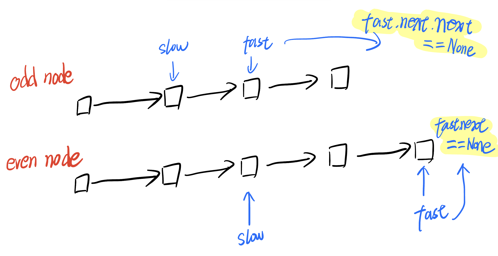
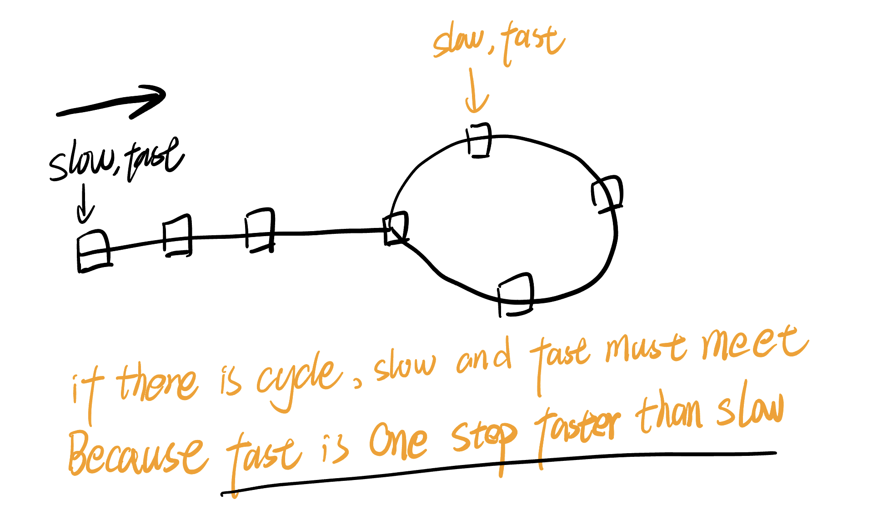
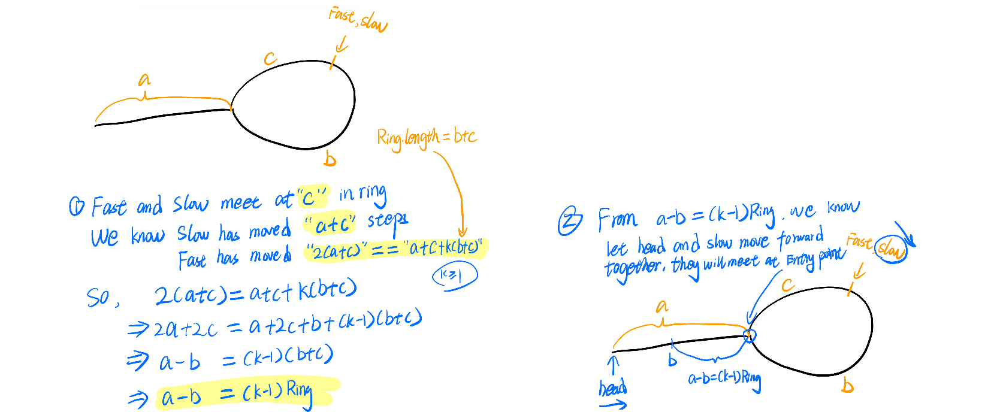

# 链表快慢指针系列 Linked List Fast Slow Series

## Idea

### Middle of linked list



### Check cycle in linked list

There is cycle?

- YES. `SLOW` and `FAST` must meet because `FAST` is one step faster than `SLOW`.
- NO. There is end. `FAST` can not move forward forever.



### Find entry point of cycle



## Template - Find Entry Point

```python
class Solution:
    def detectCycle(self, head: Optional[ListNode]) -> Optional[ListNode]:
        fast = head
        slow = head
        while fast and fast.next:
            fast = fast.next.next
            slow = slow.next
            if fast == slow:
                while head != slow:
                    slow = slow.next
                    head = head.next
                return head
        return None
```

## [876. Middle of the Linked List](https://leetcode.cn/problems/middle-of-the-linked-list/)

```python
# Definition for singly-linked list.
# class ListNode:
#     def __init__(self, val=0, next=None):
#         self.val = val
#         self.next = next
class Solution:
    def middleNode(self, head: Optional[ListNode]) -> Optional[ListNode]:
        slow = head
        fast = head
        while fast and fast.next:
            fast = fast.next.next
            slow = slow.next
        return slow
```

```go
/**
 * Definition for singly-linked list.
 * type ListNode struct {
 *     Val int
 *     Next *ListNode
 * }
 */
func middleNode(head *ListNode) *ListNode {
    slow := head
    fast := head
    for fast != nil && fast.Next != nil {
        fast = fast.Next.Next
        slow = slow.Next
    }
    return slow
}
```

## [141. Linked List Cycle](https://leetcode.cn/problems/linked-list-cycle/)

```
/**
 * Definition for singly-linked list.
 * type ListNode struct {
 *     Val int
 *     Next *ListNode
 * }
 */
func hasCycle(head *ListNode) bool {
    slow := head
    fast := head
    for fast != nil && fast.Next != nil {
        fast =  fast.Next.Next
        slow = slow.Next
        if slow == fast {
            return true
        }
    }
    return false
}
```

## [142. Linked List Cycle II](https://leetcode.cn/problems/linked-list-cycle-ii/) Find entry point of Cycle

Python

```python
class Solution:
    def detectCycle(self, head: Optional[ListNode]) -> Optional[ListNode]:
        fast = head
        slow = head
        while fast and fast.next:
            fast = fast.next.next
            slow = slow.next
            if fast == slow:
                while head != slow:
                    slow = slow.next
                    head = head.next
                return head
        return None
```

Go

```go
/**
 * Definition for singly-linked list.
 * type ListNode struct {
 *     Val int
 *     Next *ListNode
 * }
 */
func detectCycle(head *ListNode) *ListNode {
    slow := head
    fast := head
    for fast != nil && fast.Next != nil {
        fast =  fast.Next.Next
        slow = slow.Next
        if slow == fast {
            for head != nil && slow != nil {
                if slow == head {
                    return head
                }
                slow = slow.Next
                head = head.Next
            }
            return nil
        }
    }
    return nil
}
```

## Reference

1. [灵神视频](https://www.bilibili.com/video/BV1KG4y1G7cu/?vd_source=66a0b89065d7f04805223fd7f2d613a6)
