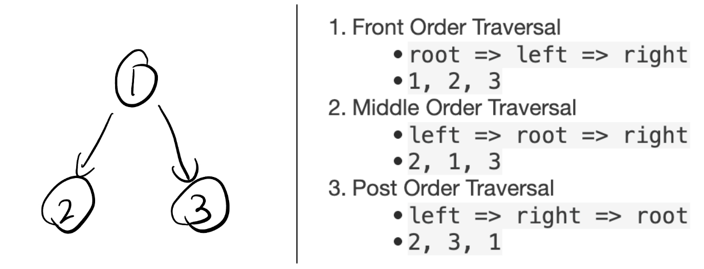
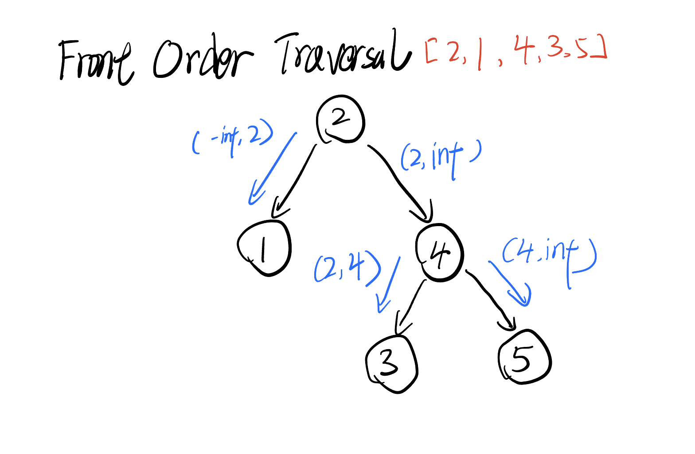
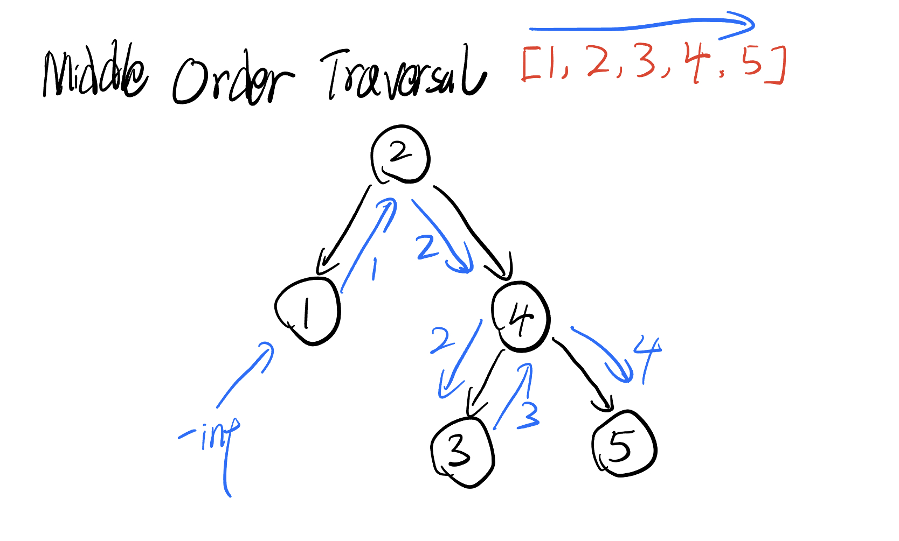
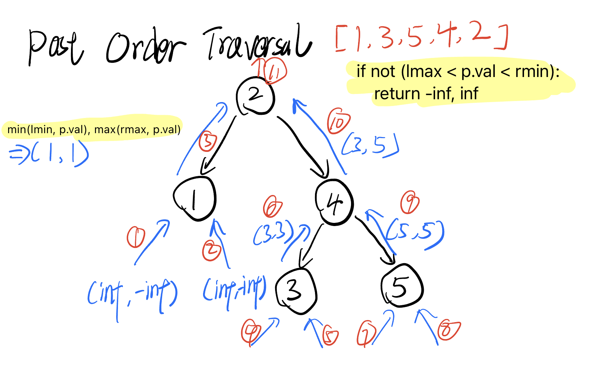

# 二叉树前中后向遍历 Binary Tree Front, Middle, and Post Order Traversal

## Idea

### Front, Middle, and Post Order Traversal



### Traversal Recursion Template

Middle-order traversal

```python
# Definition for a binary tree node.
class TreeNode:
    def __init__(self, val=0, left=None, right=None):
        self.val = val
        self.left = left
        self.right = right

res = []
def dfs(node):
    if node == None: 
        return None

    # Front-order traversal
    res.append(node.val)

    if node.left: 
        dfs(node.left)

    # Middle-order traversal
    # res.append(node.val)

    if node.right: 
        dfs(node.right)
 
    # Post-order traversal
    # res.append(node.val)

    return None

root = TreeNode(1)
root.left = TreeNode(2)
root.right = TreeNode(3)
dfs(root)
print(res)
# front: [1, 2, 3]
# middle: [2, 1, 3]
# post: [2, 3, 1]
```

### Traversal Iteration Template

在递归中，节点的访问关系是存在函数调用栈中的。

如果我们想用迭代的方法来实现树的前中后序访问，我们需要一个栈，以及记录节点被访问与否。

- Approach 1，在 root 节点上压入 null 节点来辨别 root 节点。
- Approach 2，用一个 visited map 来记录已经 加入结果集/被访问 的节点。

下面代码为中序遍历，在 root 节点上压入 null 节点来辨别 root 节点。

```python
def iterateTree(node):
    res = []
    stack = []
    if node != None:
        stack.append(node)
    while len(stack) > 0:
        # Check if the top of the stack is None
        cur = stack[-1]
        if cur != None:
            cur = stack.pop()

            # # Post-order traversal
            # stack.append(cur)
            # stack.append(None)

            if cur.right != None:
                stack.append(cur.right)
            
            # # Middle-order traversal
            # stack.append(cur)
            # stack.append(None) # The middle node is visited but not yet processed, use a Null Node to mark it

            if cur.left != None:
                stack.append(cur.left)

            # Front-order traversal
            stack.append(cur)
            stack.append(None)

        else:
            # If the top of the stack is None, it means we append the node to the result list
            stack.pop()
            cur = stack.pop()
            res.append(cur.val)
    return res

root = TreeNode(1)
root.left = TreeNode(2)
root.right = TreeNode(3)
print(iterateTree(root))
```

## [98. Validate Binary Search Tree](https://leetcode.cn/problems/validate-binary-search-tree/)

### My Recursion Solution

```python
# Definition for a binary tree node.
# class TreeNode:
#     def __init__(self, val=0, left=None, right=None):
#         self.val = val
#         self.left = left
#         self.right = right
class Solution:
    def isValidBST(self, root: Optional[TreeNode]) -> bool:
        def isBST(root, low, high):
            if root == None: return True
            if root.val >= high or root.val <= low: return False
            isLeftValid = isBST(root.left, low, root.val)
            isRightValid = isBST(root.right, root.val, high)
            return isLeftValid and isRightValid
        return isBST(root, float("-inf"), float("inf"))
```

### Front Order Traversal

We can pass the root's value to subnodes



```python
# Definition for a binary tree node.
# class TreeNode:
#     def __init__(self, val=0, left=None, right=None):
#         self.val = val
#         self.left = left
#         self.right = right
class Solution:
    def isValidBST(self, root: Optional[TreeNode], left=-inf, right=inf) -> bool:
        if root == None:
            return True
        return left < root.val < right and self.isValidBST(root.left, left, root.val) and self.isValidBST(root.right, root.val, right)
```

### Middle Order Traversal

It is like iterating through a monotonically increasing array 

- The current node's value must be smaller than previous node's value
- The initial previous node's value is `-inf` to ensure the first node's value is valid



```python
# Definition for a binary tree node.
# class TreeNode:
#     def __init__(self, val=0, left=None, right=None):
#         self.val = val
#         self.left = left
#         self.right = right
class Solution:
    minValue = -inf
    def isValidBST(self, root: Optional[TreeNode]) -> bool:
        if root == None:
            return True
        if self.isValidBST(root.left) == False:
            return False
        if self.minValue >= root.val: 
            return False
        self.minValue = root.val
        if self.isValidBST(root.right) == False:
            return False
        return True
```

### Post Order Traversal

Needs to return the valid values range for checking



```python
# Definition for a binary tree node.
# class TreeNode:
#     def __init__(self, val=0, left=None, right=None):
#         self.val = val
#         self.left = left
#         self.right = right
class Solution:
    def isValidBST(self, root: Optional[TreeNode]) -> bool:
        def check(p):
            if p == None:
                return inf, -inf # Ensure the validation of Node with Empty subNode
            lmin, lmax = check(p.left)
            rmin, rmax = check(p.right)
            if not (lmax < p.val < rmin):
                return -inf, inf
            return min(lmin, p.val), max(rmax, p.val)
        return check(root)[1] != inf

```

## Reference

1. [二叉树：前中后序迭代方式统一写法](https://zhuanlan.zhihu.com/p/260497281)
1. [二叉搜索树判断](https://www.bilibili.com/video/BV14G411P7C1/?spm_id_from=333.788&vd_source=66a0b89065d7f04805223fd7f2d613a6)
