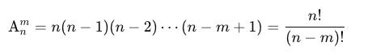

# 回溯之组合 Backtrace Combination

## Idea

### Premutation Count

The number of permutations of `m` elements taken from `n` different elements is called the permutation number of `m` elements from `n` elements. This is denoted by `A(n, m)` 

```
A(n, m) = n(n-1)(n-2)...(n-m+1) = n!/(n-m)!

# A(4, 2) = 4! / (4-2)! = 4 x 3 = 12
# 4! = 4 x 3 x 2 x 1
# (4-2)! = 2! = 2 x 1
```

The formula can be understood as follows: `n` people to form a line `m <= n`. The first position can be filled by any of the `n` people, the second position by any of the remaining `n−1` people, and so on. For the `m-th` (last) position, there are `n − 𝑚 + 1` choices, resulting in:



In the case of a full permutation, where all `n` people are arranged in a line.


### Combination Count

> 从 n 个不同元素中取出 m(m≤n) 个元素的所有组合的个数，用符号 C(n,m) 表示。
>
> 从 4 个元素中选 2 个元素的组合数：C(4, 2) = A(4, 2) / 2! = 4! / 2! x (4-2)! = (4 x 3 x 2 x 1) / (2 x 1) x (2 x1) = 3 x 2 x1 = 6
>
> How to understand? Because A(n, m) is the count of premutation, we have to deduplicate the data with same elements.


## Example

```
Input: n = 4, k = 2
Output: [[1,2],[1,3],[1,4],[2,3],[2,4],[3,4]]
```

## [77. Combinations](https://leetcode.cn/problems/combinations/)

```python
class Solution:
    def combine(self, n: int, k: int) -> List[List[int]]:
        ans = []
        path = []
        def dfs(i):
            d  = k - len(path)
            if len(path) == k:
                ans.append(path.copy())
                return
            for j in range(i, d-1, -1):
                path.append(j)
                dfs(j-1)
                path.pop()
        dfs(n)
        return ans
```

## [216. Combination Sum III](https://leetcode.cn/problems/combination-sum-iii/)

```python
class Solution:
    def combinationSum3(self, k: int, n: int) -> List[List[int]]:
        ans = []
        path = []
        def dfs(i, t):
            d = k - len(path)
            if t < 0 or t > (i + i - d + 1) * d // 2:
                return
            if len(path) == k:
                ans.append(path.copy())
                return
            for j in range(i, d-1, -1):
                path.append(j)
                dfs(j-1, t-j)
                path.pop()
        dfs(9, n)
        return ans
```

## [22. Generate Parentheses](https://leetcode.cn/problems/generate-parentheses/)

Record the number of left bracket added to path

```python
class Solution:
    def generateParenthesis(self, n: int) -> List[str]:
        ans = []
        path = [''] * (n*2)
        def dfs(i, left): # the number of left bracket
            if i == n*2:
                ans.append(''.join(path))
                return 
            if left < n:
                path[i] = '('
                dfs(i+1, left+1)
            if i-left < left:
                path[i] = ')'
                dfs(i+1, left)
        dfs(0, 0)
        return ans
```

## Reference

1. [组合型回溯，剪枝](https://www.bilibili.com/video/BV1xG4y1F7nC/?spm_id_from=333.788&vd_source=66a0b89065d7f04805223fd7f2d613a6)
1. [组合数学基础，排列组合](https://oi-wiki.org/math/combinatorics/combination/)
