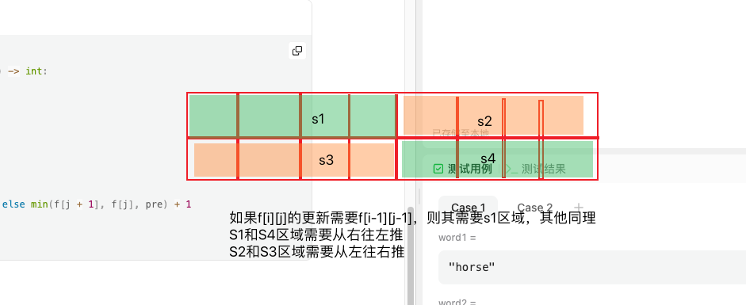

# 动态规划原理 DP Principle

[【动态规划入门：从记忆化搜索到递推】 https://www.bilibili.com/video/BV1Xj411K7oF/?share_source=copy_web&vd_source=5d4accef9045e3ed4e08bbb7a80f3c70](https://www.bilibili.com/video/BV1Xj411K7oF/)

核心：状态定义和状态转移

自顶向下：记忆化搜索，即递归

自底向上：递推，即递推

## 01 [198. House Robber](https://leetcode.cn/problems/house-robber/)

### 递归思路（自顶向下）

1. 大白话：
   1. 自顶向下，从n开始，可以选择打劫或不打劫，自然其打劫的金额是不同的。选择打劫，则需要跳过n-1的房子的钱
2. 公式
   1. dfs(i) = max(dfs(i-1), dfs(i-2)+nums[i])
3. 记忆化搜索
   1. 由于dfs(n)需要知道dfs(n-1)和dfs(n-2)，而dfs(n-1)需要知道dfs(n-2)和dfs(n-3)
   2. 可以发现他们都需要dfs(n-2)，我们可以用一个cache数组把他们记忆住
4. 时间复杂度：O(n)
5. 空间复杂度：O(n)
6. end

```
class Solution:
    def rob(self, nums: List[int]) -> int:
        n = len(nums)
        if n <= 0:
            return 0
        if n <= 2:
            return max(nums)
        @cache
        def dfs(i):
            if i < 0:
                return 0
            if i == 0:
                return nums[i]
            return max(dfs(i-1), dfs(i-2)+nums[i])
        return dfs(n-1)
```

### 递归（手动记忆化搜索）

```
class Solution:
    def rob(self, nums: List[int]) -> int:
        n = len(nums)
        if n <= 0:
            return 0
        if n <= 2:
            return max(nums)

        cache = [-1] * n
        def dfs(i):
            if i < 0:
                return 0
            if i == 0:
                return nums[i]
            if cache[i] != -1:
                return cache[i]
            cache[i] = max(dfs(i-1), dfs(i-2)+nums[i])
            return cache[i]
        return dfs(n-1)
```

### 递推思路（自底向上）

f[n]=max(f[n-1], f[n-2]+val[n])

```
class Solution:
    def rob(self, nums: List[int]) -> int:
        n = len(nums)
        if n <= 0:
            return 0
        if n <= 2:
            return max(nums)
        f = [0] * (n+1)
        f[0] = nums[0]
        f[1] = max(nums[1], nums[0])
        for i in range(2, n):
            f[i] = max(f[i-2]+nums[i], f[i-1])
        return f[n-1]
```

## 一维数组递推，是从左往右还是从右往左？

### 配图



### 原理

1. S1区域是上一轮的数据，从左往右推的时候会被覆盖掉，所以需要从右往左更新当前值
2. S2区域是上一轮的数据，同上，避免被覆盖，需要从左往右更新
3. S3区域是下一轮的数据，如果当前值需要这里的数据，则需要从左往右更新
4. S4区域是下一轮的数据，如果当前值需要这里的数据，则需要从右往左更新


