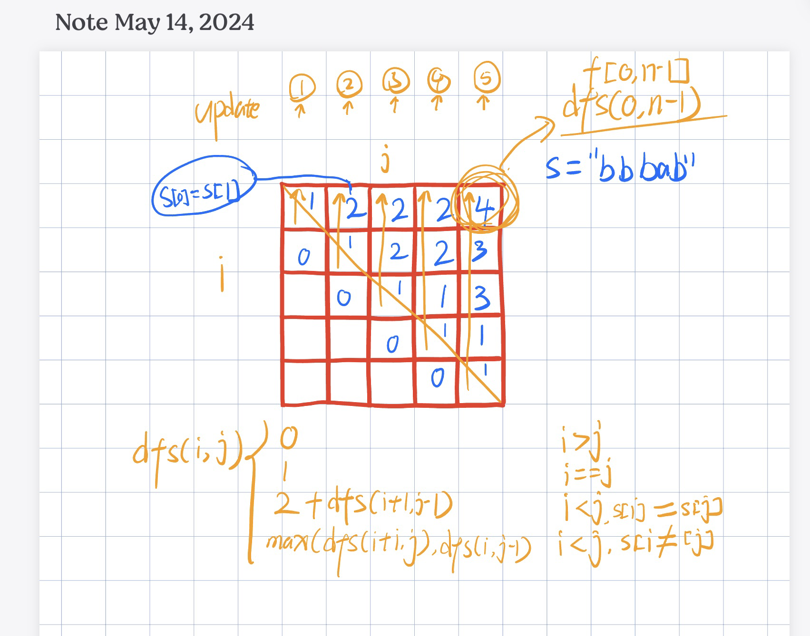

# 间隔动态规划 Interval DP

## [516. Longest Palindromic Subsequence](https://leetcode.cn/problems/longest-palindromic-subsequence/)

> Palindromic 回文

### 递归

区间 DP 是对某个区间 `[i, j]` 来搜索

`dfs(i, j)` =

- `if i > j` return 0
- `if i == j` return 1
- `if s[i] == s[j]` return `2 + dfs(i+1, j-1)`
- return `max(dfs(i+1, j), dfs(i, j-1))`

```python
class Solution:
    def longestPalindromeSubseq(self, s: str) -> int:
        n = len(s)
        @cache
        def dfs(i, j):
            if i > j:
                return 0
            if i == j: 
                return 1
            if s[i] == s[j]:
                return 2 + dfs(i+1, j-1)
            return max(dfs(i+1, j), dfs(i, j-1))
        return dfs(0, n-1)
```

时间复杂度 `O(n^2)`

- 动态规划的时间复杂度为：状态个数 X 单个状态的转移次数，此题状态个数为 `O(n^2)` 

空间复杂度 `O(n^2)`

- 因为是二维 `i, j` 记忆化搜索，所以是 `O(n^2)`

### 递推



```python
class Solution:
    def longestPalindromeSubseq(self, s: str) -> int:
        n = len(s)
        dp = [[0 for _ in range(n)] for _ in range(n)]
        for j in range(n):
            for i in range(j, -1, -1):
                if i == j:
                    dp[i][j] = 1
                else: 
                    if s[i] == s[j]:
                        dp[i][j] = 2 + dp[i+1][j-1]
                    else:
                        dp[i][j] = max(dp[i+1][j], dp[i][j-1])
        return dp[0][n-1]
```

### 空间优化，两个数组

考虑到当前 `f[i][j]` 需要 `f[i+1][j-1]`，以及 `f[i+1][j]` 和 `f[i][j-1]`。可以看出  `f[i+1][j-1]` 和  `f[i][j-1]` 都属于前一列`f` 值，而  `f[i+1][j]` 属于当前列 `f` 值。所以状态更新实际上只需要两个数组。

```python
class Solution:
    def longestPalindromeSubseq(self, s: str) -> int:
        n = len(s)
        dp = [[0 for _ in range(2)] for _ in range(n)]
        for j in range(n):
            for i in range(j, -1, -1):
                j2 = j % 2
                if i == j:
                    dp[i][j2] = 1
                else:
                    if s[i] == s[j]:
                        dp[i][j2] = 2 + dp[i + 1][(j2 + 1) % 2]
                    else:
                        dp[i][j2] = max(dp[i + 1][j2], dp[i][(j2 + 1) % 2])
        return dp[0][(n - 1) % 2]
```

### 空间优化，一个数组

因为当前 `f[i][j]` 计算需要的  `f[i+1][j-1]` 和  `f[i][j-1]` 都属于前一列`f` 值，而  `f[i+1][j]` 属于当前列 `f` 值。

如果用一个数组，由于更新  `f[i+1][j]`  会更新原值  `f[i+1][j-1]` ，我们可以用一个变量 `pre` 把 `f[i+1][j-1]` 存起来

```python
class Solution:
    def longestPalindromeSubseq(self, s: str) -> int:
        n = len(s)
        dp = [0 for _ in range(n)]
        for j in range(n):
            pre = 0
            for i in range(j, -1, -1):
                tmp = dp[i]
                if i == j:
                    dp[i] = 1
                else:
                    if s[i] == s[j]:
                        dp[i] = 2 + pre
                    else:
                        dp[i] = max(dp[i + 1], dp[i])
                pre = tmp
        return dp[0]
```

## Reference

1. [区间 DP：最长回文子序列](https://www.bilibili.com/video/BV1Gs4y1E7EU/?share_source=copy_web&vd_source=5d4accef9045e3ed4e08bbb7a80f3c70)
