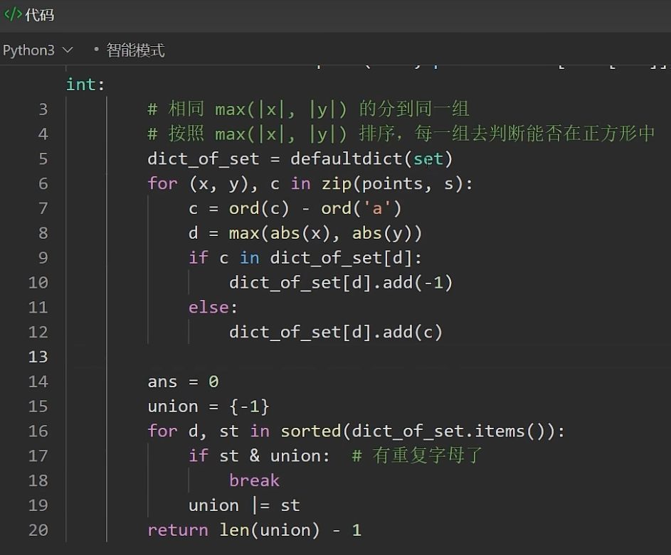

# 20240512 130 Biweekly

双周赛：https://leetcode.cn/contest/biweekly-contest-130/

灵神讲解：https://www.bilibili.com/video/BV1cz421m786/?spm_id_from=333.1007.top_right_bar_window_history.content.click&vd_source=66a0b89065d7f04805223fd7f2d613a6

## [100299. Check if Grid Satisfies Conditions](https://leetcode.cn/problems/check-if-grid-satisfies-conditions/)

```python
class Solution:
    def satisfiesConditions(self, grid: List[List[int]]) -> bool:
        n = len(grid)
        m = len(grid[0])
        
        for j in range(m):
            for i in range(n):
                if j != m-1 and grid[i][j] == grid[i][j + 1]:
                    return False
                if i != n-1 and grid[i][j] != grid[i + 1][j]:
                    return False
        return True
```

## [100302. Maximum Points Inside the Square](https://leetcode.cn/problems/maximum-points-inside-the-square/)

```python
class Solution:
    def maxPointsInsideSquare(self, points: List[List[int]], s: str) -> int:
        sl = []
        for c in s:
            sl.append(c)
        # print(sl)
        
        n = len(points)
        pl = [0] * n
        for i in range(n):
            x = points[i][0]
            y = points[i][1]
            pl[i] = max(abs(x), abs(y))
        # print(pl)
        
        ps = zip(pl, sl)
        sortedPS = sorted(ps, key=lambda p: p[0])
        
        res = 0
        # curlen = 0
        # curCnt = 0
        breakLen = float("inf")
        clist = []
        for s in sortedPS:
            if s[1] in clist:
                breakLen = s[0]
                break
            else:
                clist.append(s[1])
        for s in sortedPS:
            if s[0] < breakLen:
                res+=1
            else:
                break
        return res
```

灵神写法：[从集合论到位运算，常见位运算技巧分类总结](https://leetcode.cn/circle/discuss/CaOJ45/)

- 字典统计



- 位运算


## [100289. Minimum Substring Partition of Equal Character Frequency](https://leetcode.cn/problems/minimum-substring-partition-of-equal-character-frequency/)

一步一步来，记忆化搜索 timeout；线性递推、优化统计 cnt 方法；优化衡量 balance 方法


### 1、区间 DP，记忆化搜索，Timeout

- $dfs(0, j) = min(dfs(0, j), dfs(i, k) + dfs(k + 1, j)$
时间复杂度为 $(n^3) 

```python
class Solution:
    def minimumSubstringsInPartition(self, s: str) -> int:
        s = [ord(s[k]) - ord("a") for k in range(len(s))]
        cntDP = []

        @cache
        def isBalanced(i, j):
            if i == j:
                return True
            cnt = [0] * 26
            for k in range(i, j + 1, 1):
                cnt[s[k]] += 1
            maxCnt = cnt[s[i]]
            for i in range(26):
                if cnt[i] != 0 and cnt[i] != maxCnt:
                    return False
            return True

        @cache
        def minBalanceNum(i, j):
            if isBalanced(i, j):
                return 1
            minCnt = j - i
            for k in range(i, j + 1, 1):
                if k == i:
                    if isBalanced(k + 1, j):
                        minCnt = min(minCnt, 1 + minBalanceNum(k + 1, j))
                elif k == j:
                    minCnt = min(minCnt, minBalanceNum(i, k - 1) + 1)
                else:
                    if isBalanced(k, j):
                        minCnt = min(minCnt, minBalanceNum(i, k - 1) + 1)
                if minCnt == 2:
                    break
            return minCnt

        return minBalanceNum(0, len(s) - 1)

```


### 2、一维线性递推、优化统计 cnt 方法

- 把 isbalance 函数中的 `Cnt 数组计算` 移到上一层遍历中。
- 并且把第一层的记忆化搜索改成一维 dp 递推：$f(i) = minf(j) + 1$
时间复杂度从 `approach 1` 的 $O(n^3) 降到 $(26*n^2) 
```python
        @cache
        def isBalanced(i, j):
            if i == j:
                return True
            # ===== Cnt 数组计算 Start
            cnt = [0] * 26
            for k in range(i, j + 1, 1):
                cnt[s[k]] += 1
            # ===== Cnt 数组计算 End
            maxCnt = cnt[s[i]]
            for i in range(26):
                if cnt[i] != 0 and cnt[i] != maxCnt:
                    return False
            return True
```
完整实现

```python
class Solution:
    def minimumSubstringsInPartition(self, s: str) -> int:
        n = len(s)
        s = [ord(s[k]) - ord("a") for k in range(n)]

        def isCntBalanced(cnt):
            maxCnt = max(cnt)
            for i in range(26):
                if cnt[i] != 0 and cnt[i] != maxCnt:
                    return False
            return True

        dp = [i + 1 for i in range(n)]
        cnt = [0] * 26
        for j in range(n):
            cnt[s[j]] += 1
            if isCntBalanced(cnt):
                dp[j] = 1
                continue
            tmpCnt = cnt.copy()
            for i in range(j):
                tmpCnt[s[i]] -= 1
                if isCntBalanced(tmpCnt):
                    dp[j] = min(dp[j], dp[i] + 1)
                    if dp[j] == 2:
                        break
        return dp[n - 1]
```

### 3、优化衡量 balance 方法

思路：
1. 从后往前维护 cnt 数组，只用遍历一次
2.  计算 maxCnt 和 maxCntChars，用来快速比较 i 到 j 是否 balance
    - If 当前 i 的字母 s[i] 的 cnt 大于 maxCnt。更新 maxCnt，并且把 maxCntChars 设置为 1。因为满足 maxCnt 的字母当前只有 s[i]
    - else, 如果当前 i 的字母 s[i] 的 cnt 等于 maxCnt。maxCntChars += 1。因为当前字母一定不是已满足 maxCnt 的字母，是一个刚满足 maxCnt 的字母。

```python
class Solution:
    def minimumSubstringsInPartition(self, s: str) -> int:
        n = len(s)
        s = [ord(s[k]) - ord("a") for k in range(n)]

        dp = [i + 1 for i in range(n)]
        for j in range(n):
            maxCnt = 0
            maxCntChars = 0
            cnt = [0] * 26
            for i in range(j, -1, -1):
                cnt[s[i]] += 1
                if cnt[s[i]] > maxCnt:
                    maxCnt += 1
                    maxCntChars = 1
                elif cnt[s[i]] == maxCnt:
                    maxCntChars += 1
                if maxCntChars * maxCnt == j - i + 1:
                    if i == 0: 
                        dp[j] = 1
                    else: 
                        dp[j] = min(dp[j], dp[i-1] + 1)
        return dp[n - 1]
```

## [100295. Find Products of Elements of Big Array](https://leetcode.cn/problems/find-products-of-elements-of-big-array/)

