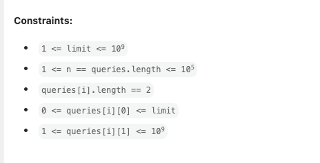

# 周赛 Weekly Contest 131

https://leetcode.cn/contest/biweekly-contest-131

## [100309. Find the XOR of Numbers Which Appear Twice](https://leetcode.cn/problems/find-the-xor-of-numbers-which-appear-twice/)

```python
class Solution:
    def duplicateNumbersXOR(self, nums: List[int]) -> int:
        d = dict()
        for n in nums:
            if n in d:
                d[n] += 1
            else:
                d[n] = 1
      
        res = 0
        for k in d:
            if d[k] == 2:
                if res == 0:
                    res = k
                else:
                    res = res ^ k
        return res
```

## [100303. Find Occurrences of an Element in an Array](https://leetcode.cn/problems/find-occurrences-of-an-element-in-an-array/)

```python
class Solution:
    def occurrencesOfElement(self, nums: List[int], queries: List[int], x: int) -> List[int]:
        d = dict()
        data = []
        for i in range(len(nums)):
            if nums[i] == x:
                data.append(i)
        # print(data)
        res = []
        for i in range(len(queries)):
            if queries[i] <= len(data):
                res.append(data[queries[i]-1])
            else:
                res.append(-1)
        # print(res)
        return res

```

## [100313. Find the Number of Distinct Colors Among the Balls](https://leetcode.cn/problems/find-the-number-of-distinct-colors-among-the-balls/)

需要知道 leetcode 的空间限制大概是怎么样



```python
class Solution:
    def queryResults(self, limit: int, queries: List[List[int]]) -> List[int]:
        colors = dict()
        paint = dict()
        cnt = 0
        res = []
        for q in queries:
            i = q[0]
            c = q[1]

            existC = -1
            if i not in paint:
                paint[i] = c
            else:
                existC = paint[i]
                paint[i] = c

            # update color
            if existC != -1 and existC != c:
                colors[existC] -= 1
                if colors[existC] == 0:
                    cnt -= 1
            
            if c not in colors:
                cnt += 1
                colors[c] = 1
            else:
                if colors[c] == 0:
                    cnt += 1
                if existC != c:
                    colors[c] += 1
            res.append(cnt)
        return res
```

## [100314. Block Placement Queries](https://leetcode.cn/problems/block-placement-queries/)

### binary tree

```python
class TreeNode:
    def __init__(self, rg=[0, float("inf")], left=None, right=None):
        self.rg = rg
        self.left = left
        self.right = right

class Solution:
    def getResults(self, queries: List[List[int]]) -> List[bool]:
        # root(-inf, inf)
        def place(node, i, j, x):
            # print(node.rg, i, j, x)
            if node == None:
                return False
            min_v, max_v = node.rg
            aSpace = max_v - min_v
            if x > aSpace:
                return False
            if node.left == None and node.right == None:
                return x <= (j - min_v)
            if node.left and (node.left.rg[1] - node.left.rg[0]) >= x:
                if place(node.left, i, j, x): 
                    return True
            if node.right and (node.right.rg[1] - node.right.rg[0]) >= x:
                if place(node.right, i, j, x): 
                    return True
            return False
        
        def build(node, k):
            if node == None:
                return
            min_v, max_v = node.rg
            if node.left == None and node.right == None and (min_v < k and k < max_v):
                node.left = TreeNode([min_v, k], None, None)
                node.right = TreeNode([k, max_v], None, None)
            else:
                if node.left and (node.left.rg[0] < k and k < node.left.rg[1]):
                    build(node.left, k)
                if node.right and (node.right.rg[0] < k and k < node.right.rg[1]):
                    build(node.right, k)
        root = TreeNode()
        res = []
        for i in queries:
            if i[0] == 1:
                build(root, i[1])
            else:
                res.append(place(root, 0, i[1], i[2]))
        return res
```

### arrays

```python
class TreeNode:
    def __init__(self, rg=[0, float("inf")], left=None, right=None):
        self.rg = rg
        self.left = left
        self.right = right

class Solution:
    def getResults(self, queries: List[List[int]]) -> List[bool]:
        leaf = dict()
        # root(-inf, inf)
        def place(node, i, j, x):
            # print(node.rg, i, j, x)
            for node in leaf:
                min_v, max_v = node.rg
                # print(min_v, max_v)
                aSpace = max_v - min_v
                if max_v <= j and x <= (max_v - min_v):
                    return True
                if min_v <= j <= max_v and x <= (j - min_v):
                    return True
            # if node == None:
            #     return False
            # min_v, max_v = node.rg
            # aSpace = max_v - min_v
            # if x > aSpace:
            #     return False
            # if node.left == None and node.right == None:
            #     return x <= (j - min_v)
            # if node.left.rg[1] - node.left.rg[0] >= x:
            #     if place(node.left, i, j, x): 
            #         return True
            # if node.right.rg[1] - node.right.rg[0] >= x:
            #     if place(node.right, i, j, x): 
            #         return True
            return False
        
        def build(node, k):
            if node == None:
                return
            min_v, max_v = node.rg
            if node.left == None and node.right == None and (min_v < k and k < max_v):
                leaf.pop(node)
                node.left = TreeNode([min_v, k], None, None)
                node.right = TreeNode([k, max_v], None, None)
                leaf[node.left] = True
                leaf[node.right] = True
            else:
                if node.left.rg[0] < k and k < node.left.rg[1]:
                    build(node.left, k)
                elif node.right.rg[0] < k and k < node.right.rg[1]:
                    build(node.right, k)
        root = TreeNode()
        leaf[root] = True
        res = []
        for i in queries:
            if i[0] == 1:
                build(root, i[1])
            else:
                res.append(place(root, 0, i[1], i[2]))
        return res
```

