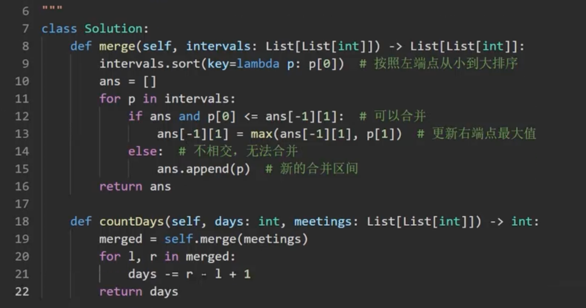
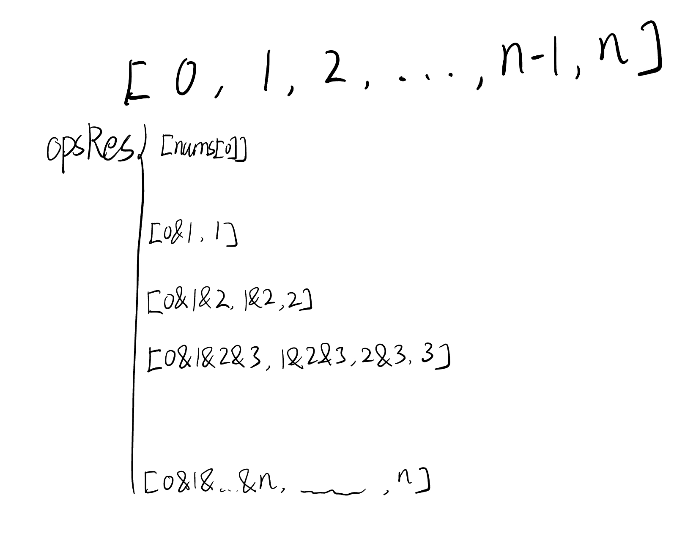
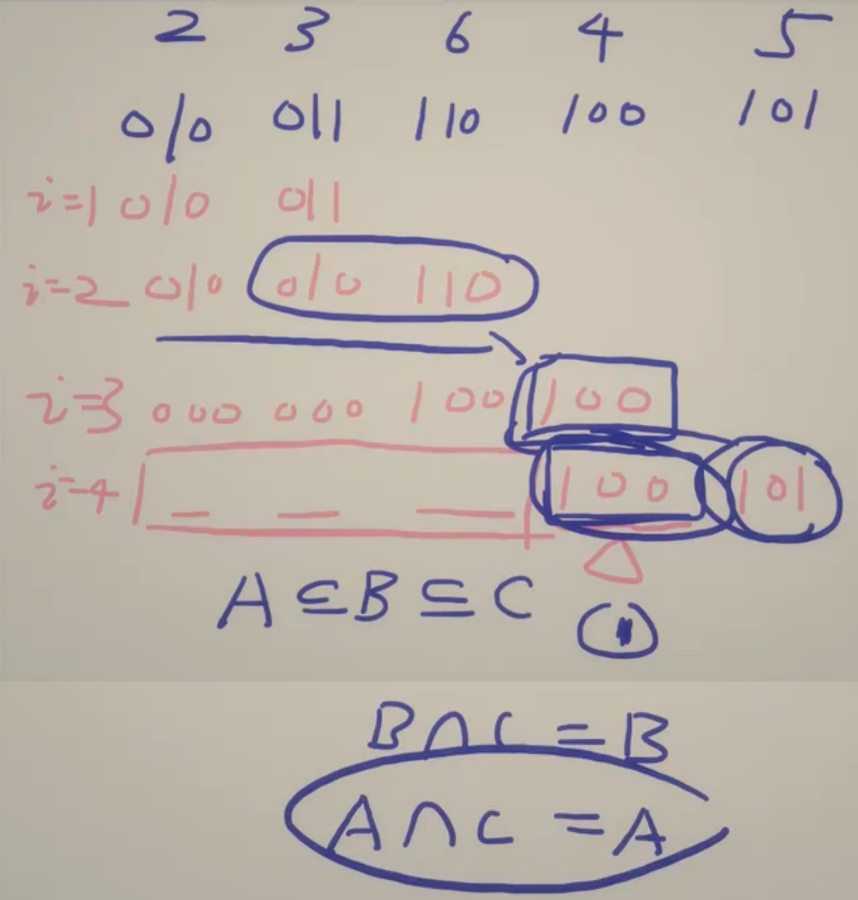
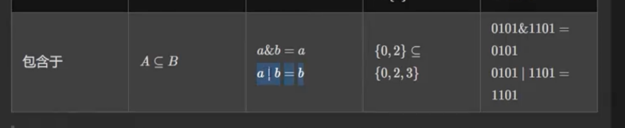
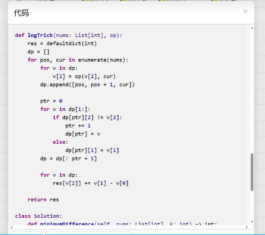
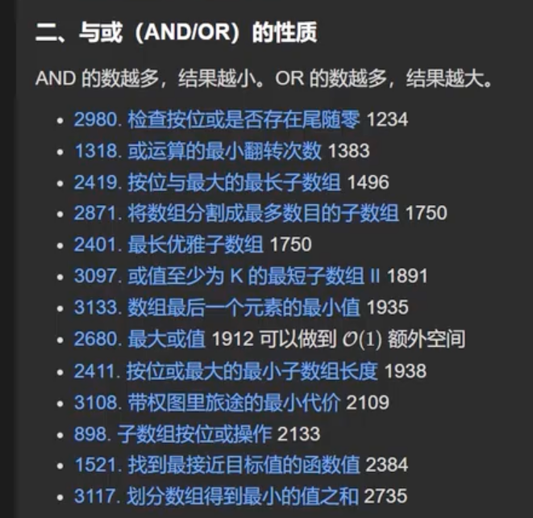

## [100307. Minimum Number of Chairs in a Waiting Room](https://leetcode.cn/contest/weekly-contest-400/problems/minimum-number-of-chairs-in-a-waiting-room/)

> You are given a string `s`. Simulate events at each second `i`:
>
> - If `s[i] == 'E'`, a person enters the waiting room and takes one of the chairs in it.
> - If `s[i] == 'L'`, a person leaves the waiting room, freeing up a chair.
>
> Return the **minimum** number of chairs needed so that a chair is available for every person who enters the waiting room given that it is initially **empty**.
>
>  
>
> **Example 1:**
>
> **Input:** s = "EEEEEEE"
>
> **Output:** 7
>
> **Explanation:**
>
> After each second, a person enters the waiting room and no person leaves it. Therefore, a minimum of 7 chairs is needed.

### Array Traversal

```python
class Solution:
    def minimumChairs(self, s: str) -> int:
        ans = 0
        e = 0
        for c in s:
            if c == "E":
                e += 1
            else:
                e -= 1
            if e > ans:
                ans = e 
        return ans
```

## [100311. Count Days Without Meetings](https://leetcode.cn/contest/weekly-contest-400/problems/count-days-without-meetings/)

> You are given a positive integer `days` representing the total number of days an employee is available for work (starting from day 1). You are also given a 2D array `meetings` of size `n` where, `meetings[i] = [start_i, end_i]` represents the starting and ending days of meeting `i` (inclusive).
>
> Return the count of days when the employee is available for work but no meetings are scheduled.
>
> **Note:** The meetings may overlap.
>
>  
>
> **Example 1:**
>
> **Input:** days = 10, meetings = [[5,7],[1,3],[9,10]]
>
> **Output:** 2
>
> **Explanation:**
>
> There is no meeting scheduled on the 4th and 8th days.

### Array Traversal

```python
class Solution:
    def countDays(self, days: int, meetings: List[List[int]]) -> int:
        meetings = sorted(meetings, key=lambda k : k[0])
        print(meetings)
        ans = 0
        s = 1

        maxE = 1
        for i in range(len(meetings)):
            cs = meetings[i][0]
            ce = meetings[i][1]

            if cs > maxE:
                if i == 0:
                    ans += cs - maxE
                else:
                    ans += cs - maxE - 1
            if maxE < ce:
                maxE = ce
        if days > maxE:
            ans += days - maxE
        return ans
```

### Merge Partition



## [100322. Lexicographically Minimum String After Removing Stars](https://leetcode.cn/contest/weekly-contest-400/problems/lexicographically-minimum-string-after-removing-stars/)

> You are given a string `s`. It may contain any number of `'*'` characters. Your task is to remove all `'*'` characters.
>
> While there is a `'*'`, do the following operation:
>
> - Delete the leftmost `'*'` and the **smallest** non-`'*'` character to its *left*. If there are several smallest characters, you can delete any of them.
>
> Return the 
>
> lexicographically smallest
>
>  resulting string after removing all `'*'` characters.
>
> 
>
> **Example 1:**
>
> **Input:** s = "aaba*"
>
> **Output:** "aab"
>
> **Explanation:**
>
> We should delete one of the `'a'` characters with `'*'`. If we choose `s[3]`, `s` becomes the lexicographically smallest.

### Queue and Dict application

```python
class Solution:
    def clearStars(self, s: str) -> str:
        cd = dict()
        idxRemoveD = dict()
        
        cQueue = collections.deque()
        for i in range(len(s)):
            c = s[i]
            idxRemoveD[i] = True
            if c != "*":
                if c not in cd:
                    cd[c] = [i]
                    cQueue.append(c)
                    cQueue = collections.deque(sorted(cQueue))
                else:
                    cd[c].append(i)
            else: # *
                smc = cQueue[0]
                removedIdx = cd[smc].pop()
                # print("remove", cQueue, removedIdx, smc, cd[smc])
                if len(cd[smc]) == 0:
                    cQueue.popleft()
                    cd.pop(smc)
                idxRemoveD[removedIdx] = False
                idxRemoveD[i] = False
            # print(cQueue, cd, idxRemoveD)

        res = ""
        for i in range(len(idxRemoveD)):
            if idxRemoveD[i]:
                res += s[i]
        # res = sorted(res)
        ans = "".join(res)
        return ans
```

## [100315. Find Subarray With Bitwise AND Closest to K](https://leetcode.cn/contest/weekly-contest-400/problems/find-subarray-with-bitwise-and-closest-to-k/)

>You are given an array `nums` and an integer `k`. You need to find a 
>
>subarray
>
> of `nums` such that the **absolute difference** between `k` and the bitwise `AND` of the subarray elements is as **small** as possible. In other words, select a subarray `nums[l..r]` such that `|k - (nums[l] AND nums[l + 1] ... AND nums[r])|` is minimum.
>
>
>
>Return the **minimum** possible value of the absolute difference.
>
>A **subarray** is a contiguous **non-empty** sequence of elements within an array.
>
>
>
>**Example 1:**
>
>**Input:** nums = [1,2,4,5], k = 3
>
>**Output:** 1
>
>**Explanation:**
>
>The subarray `nums[2..3]` has `AND` value 4, which gives the minimum absolute difference `|3 - 4| = 1`.

### Array Traversal + Set



```python
class Solution:
    def minimumDifference(self, nums: List[int], k: int) -> int:
        # n = len(nums)
        # dp = [[0x3FFFFFFF for j in range(len(nums)+1)] for i in range(len(nums)+1)]
        # # print(dp)

        # ans = abs(k - nums[0])
        # for j in range(1, n+1, 1):
        #     for i in range(j, 0, -1):
        #         if i == j:
        #             dp[i][j] = nums[j-1]
        #         else:
        #             # 0, 1
        #             # 0, mid, mid, 1
        #             mid = (i+j) // 2
        #             dp[i][j] = dp[i][mid] & dp[mid+1][j]
        #         ans = min(ans, abs(k - dp[i][j]))
        # # for i in range(n+1):
        # #     print(i, dp[i])

        n = len(nums)
        ans = dict()
        resOps = []
        for i in range(len(nums)):
            for j in range(len(resOps)):
                resOps[j] &= nums[i]
            resOps.append(nums[i])
            resOps = list(set(resOps))
            for j in range(len(resOps)):
                ans[resOps[j]] = True

        res = 1e18
        for key in ans:
            res = min(res, abs(k - key))
        return res
```

### 0x3f 讲解







`logTrick` 可以用于 AND, OR, GCD, LCM

- AND
- OR
- GCD
- LCM




### 位运算



