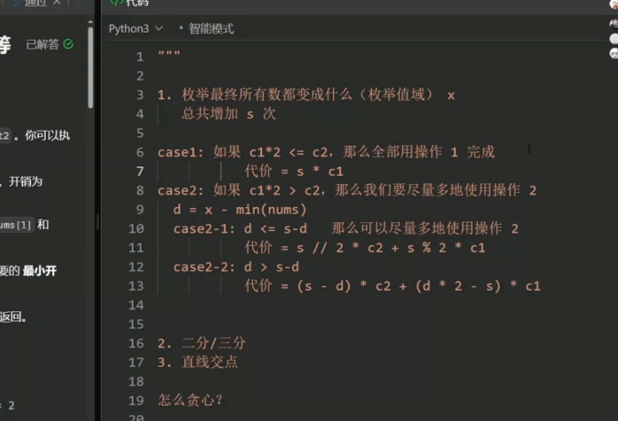
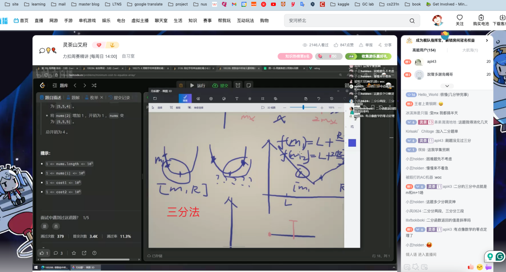

## 100284. Valid Word

[100284. Valid Word](https://leetcode.cn/problems/valid-word/)

- We need to know how to iterate each character in a string
- Also, need to know how to compare the character
  - The `ord()` function returns the number representing the unicode code of a specified character.
  - The `char` convert a 

```python
class Solution:
    def isValid(self, word: str) -> bool:
        if len(word) < 3: return False
        validCharDic = {}
        vowelCharDic = {
            'a': True,
            'e': True,
            'i': True,
            'o': True,
            'u': True,
            'A': True,
            'E': True,
            'I': True,
            'O': True,
            'U': True
        }
        cononant = {}

        for i in range(0, 26):
            validCharDic[chr(ord('a')+i)] = True
            validCharDic[chr(ord('A')+i)] = True
            if chr(ord('a')+i) not in vowelCharDic:
                cononant[chr(ord('a')+i)] = True
                cononant[chr(ord('A')+i)] = True
        for i in range(10):
            validCharDic[str(i)] = True

        isValid = True
        hasVowel = False
        hasConstant = False
        for i in range(len(word)):
            if word[i] not in validCharDic:
                isValid = False
            if word[i] in vowelCharDic:
                hasVowel = True
            if word[i] in cononant:
                hasConstant = True         
        return isValid and hasVowel and hasConstant
```

The English Character Arrays

```python
ii = "1234567890"
vowelW = "aeiouAEIOU"
lowercaseW = "abcdefghijklmnopqrstuvwxyz"
uppercaseW = "ABCDEFGHIJKLMNOPQRSTUVWXYZ"
```

## 100275. Minimum Number of Operations to Make Word K-Periodic

- `k` divides `word.length`.

```python
class Solution:
    def minimumOperationsToMakeKPeriodic(self, word: str, k: int) -> int:
        targetDic = {}
        i = 0
        while i < len(word):
            # print(i, word[i: i+k])
            if word[i: i+k] not in targetDic:
                targetDic[word[i: i+k]] = 1
            else:
                targetDic[word[i: i+k]] += 1
            i+=k

        # print(targetDic)
        target = ""
        maxCnt = 0
        for key in targetDic:
            if targetDic[key] > maxCnt:
                target = key
                maxCnt = targetDic[key]
        # print(target)
        cnt = 0
        i = 0
        while i < len(word):
            if word[i: i+k] != target:
                # print(i, k)
                cnt+=1
            i+=k
        return cnt
            
```

## 100283. Minimum Length of Anagram Concatenation

**anagram**

An anagram is a word or phrase formed by rearranging the letters of a word or phrase, typically using all the original letters exactly once.

concatenation

- 1, 2, 3, 4, 5
- 2, 4, 6, 8
- 3, 6, 9
- let n =9
  - 8(yes), 7, 6(not), 5, 4(not), 3(don't),  2(don't), 

Ideas

- from N to 1, find the k which can divide N
- for k, check if k * 2 is not available, if yes, k is not available too
- check if k satisfy the rule: the anagram of word(len k) can concatenate S.

```python
class Solution:
    def minAnagramLength(self, s: str) -> int:
        minLen = len(s)
        failedIndice = {}
        N = len(s)
        di = 2
        while N // di >= 1:
            if N % di != 0:
                di += 1
                continue
            n = N // di
            di += 1
            # print(n)

            if n * 2 in failedIndice:
                failedIndice[n] = True
                continue
            firstStr = "".join(sorted(s[0: 0+n]))
            j = 0+n
            # print("j", 0, j)
            while j < N - n + 1:
                secondStr = "".join(sorted(s[j: j+n]))
                if firstStr != secondStr:
                    # print(0, j, firstStr, secondStr)
                    failedIndice[n] = True
                    break
                j += n
            if n not in failedIndice:
                minLen = n
            # print(failedIndice, minLen)
        return minLen
        
```

## 100288. Minimum Cost to Equalize Array

Modulo

1. 枚举法
2. 二分法、三分法
3. 直线交点

Since the answer may be very large, return it **modulo** `109 + 7`.



