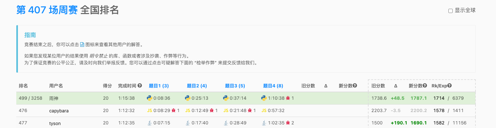

# 周赛汇总

## 417

https://leetcode.cn/contest/weekly-contest-417

rank 289

`4/4`

- [x] 1，dfs

- [x] 2，滑窗

- [x] 3，第二题的升级版，滑窗加优化

- [x] 4，第一题的升级版，dfs

## 414

https://leetcode.cn/contest/weekly-contest-414/

rank 2263

`1/4`

- [x] 1，模拟

- [ ] 2 WA

- [ ] 3 TLE

- [ ] 4

## 412

这周的 3, 4 题分别是第一第二题的数据范围升级， hard，7 分。

11.06 开始打， 大概自己 ac 了 1, 2, 4 题。但第四题是比赛后 ac 的，排名 1137 / 2681，掉了分。但这周打比赛的人怎么比上周少了一千。。

看起来要是准时开始打，这次还是能排名 500 到 600 左右能上分的。

不想满足于 500，但现在属于没有在学习，在靠周赛维持手感的状态，所以还能接受。

https://leetcode.cn/contest/weekly-contest-412/ranking/

`2/4`

- [x] 1，暴力

- [x] 2，暴力

- [ ] 3，用最小堆，按理来说是 klogn 的复杂度，但 502 / 692 TLE 了，故继续看第四题

- [x] 4，模拟，最后的 629/630 优化了好一会儿，是 12.30 左右 ac 的，比赛已经结束很久了

  优化经验：

  1. 调用封装的函数耗时大于直接本地判断计算
  2. 调用

current rate: 1790

## 411

这周的 3, 4 题都是 hard，7 分，说不上难，但总是最后几个 cases TLE 或者 MLE。。

这次只 ac 1 2 题居然排名 575 / 3029

https://leetcode.cn/contest/weekly-contest-411/ranking/

`2/4`

- [x] 1
- [x] 2
- [ ] 3 hasn't been run yet
- [ ] 4 MLE

current rate: 1757

## 410

https://leetcode.cn/contest/weekly-contest-410/ranking/

`2/4`

- [x] 1，Array
- [ ] 2，Tree iteration, got problem while understanding the problem description
- [x] 3，DP
- [ ] 4，DP,  TLE

## 409

感觉从这几周的周赛难度变大了，估计是为了防 chatgpt 吧

`1/4`

- [x] 1，Array
- [ ] 2，
- [ ] 3，
- [ ] 4

## 408

`2/4`

- [x] 1，Array
- [x] 2，Array，WA 一次
- [ ] 3，遍历+剪枝 TLE
- [ ] 4

国服排名 1100+

早上起来已经是 10.36 了，还是没能做到早睡早起。

T3 很多人都没有过，只要能过 T3 都是前 300 了，当然，这不是我不能过的借口。

T4 听说官方的 test cases 都没有覆盖所有的，所以有些人的简单思路能过

## 407

`4/4`

- [x] 1，Array
- [x] 2，Array，
- [x] 3，Array
- [x] 4，Array，错了一次

这周的题目都是思路题，推导一下都能做到 O(n) 的时间复杂度

## 406

国服 1287+ 掉分了

https://leetcode.cn/contest/weekly-contest-406

`3/4`

- [x] 1, Array，错了一次
- [x] 2, DP
- [x] 3, DP，错了一次
- [ ] 4

第三题先用 DP，无法覆盖所有的条件，于是改成暴力，成功了

## 405

国服 870

https://leetcode.cn/contest/weekly-contest-405

`3/4`

- [x] 1, Array
- [x] 2, Backtrace
- [x] 3, DP
- [ ] 4

前三题用时 27 分钟无 WA，第四题 TLE，没有想出来

## 404

`3/4`

- [x] 1
- [x] 2
- [ ] 3
- [x] 4 (Late Submission, AC after competition finished)

今天11点才开始周赛，半小时ak前两题，自己花了点时间做出来第四题（想不出一个条件看灵神视频讲解发现了）

第三题用 dp 总是超时、或者超出空间。

## 403

- [x] 1
- [x] 2g
- [x] 3
- [x] 4 (Late Submission, AC after competition finished)

`4/4`

今天11点才开始周赛，半小时ak前三题，然后花了一小时多才AC第四题， mark 第一次 ac 第四题

Abstract

1. Solution:  Array Traversal
   1. around 10 mins，属实不应该
   2. TODO:  python 数组删除元素不熟悉？应该不是，就是手搓太慢了而已
2. Array Traversal
   1. around 10 mins

3. Status DP
   1. around 10 mins
   2. TODO: 状态压缩是什么，为什么叫状态压缩

4. Array Traversal, Enumerate all possibilities
   1. around 1 hour 10 mins
   2. TODO: 
      1. Better solution
      2. 贴瓷砖 https://leetcode.cn/problems/tiling-a-rectangle-with-the-fewest-squares/description/
      3. 蒙德里安的梦想

## 402

- [x] 1
- [x] 2
- [x] 3
- [ ] 4

`3/4`

昨天早上做周赛的时候，第四题虽然看出来是树状数组，但是还是三题早退了，无他，不熟悉罢了。 这周目标加两个，把树状数组和线段树搞明白！

## 401

`2/3`

- [x] 1
- [x] 2
- [ ] 3
- [ ] 4

第三题和第四题是连着的，但是写的 DP 在第三题和第四题总是在最后几个 case 超时。。

## 400

`3/4`

- [x] 1
- [x] 2
- [x] 3
- [ ] 4

https://leetcode.cn/contest/weekly-contest-400

这周周赛第四题非常简单，用 dp 会在 804 / 813 会 TLE 超时。其实一次遍历加 set 就搞定了。 整了好久没有开窍

第四题曾经出现过，所以灵神只给了 2200 分

对应的模版叫 `logTrick`，可以用于 “子序列 AND, OR, GCD, LCM”

参考 127 双周赛灵神题解 【子数组OR 子序列DP【力扣双周赛 127】】 https://www.bilibili.com/video/BV19t421g7Pd/?share_source=copy_web&vd_source=5d4accef9045e3ed4e08bbb7a80f3c70

## 131 Biweekly

`3/4`

- [x] 1
- [x] 2
- [x] 3
- [ ] 4

https://leetcode.cn/contest/biweekly-contest-131

距离 AK 就差一点点，738 样例出奇的大。 目测是线段树或者数段数组吧，但不会写只能用二叉树来模拟，超时了

- `1 <= queries.length <= 15 * 104`

这些术语通常用于编程竞赛或在线判题系统中，用于描述提交代码的结果。以下是每个术语的解释：

1. **ak** (All Kill): 在该竞赛中通过所有题目。也称为“满贯”或“全过”。

2. **ac** (Accepted): 通过该题目。程序成功运行并且输出结果正确。

3. **wa** (Wrong Answer): 错误答案。程序成功运行，但输出结果不正确。

4. **tle** (Time Limit Exceeded): 超时。程序运行时间超过了题目规定的时间限制。

5. **mle** (Memory Limit Exceeded): 超过内存限制。程序使用的内存超过了题目规定的内存限制。

6. **ce** (Compilation Error): 编译错误。程序未能成功编译，通常是由于语法错误或其他编译时错误。

需要学习一下 leetcode 对于 tle 和 mle 的限制

以及需要估算 tle 和 mle 的能力

## 398

`3/4`

- [x] 1
- [x] 2
- [x] 3
- [ ] 4

做出来了三题

- 第二题、第三题错误了很多次，应该提高自己的构造样例、找到反例、找到特殊样例的能力
- 第四题是有思路的，很明显的状态 dp

## 396

国服 872

`3/4`

- [x] 1
- [x] 2
- [x] 3
- [ ] 4