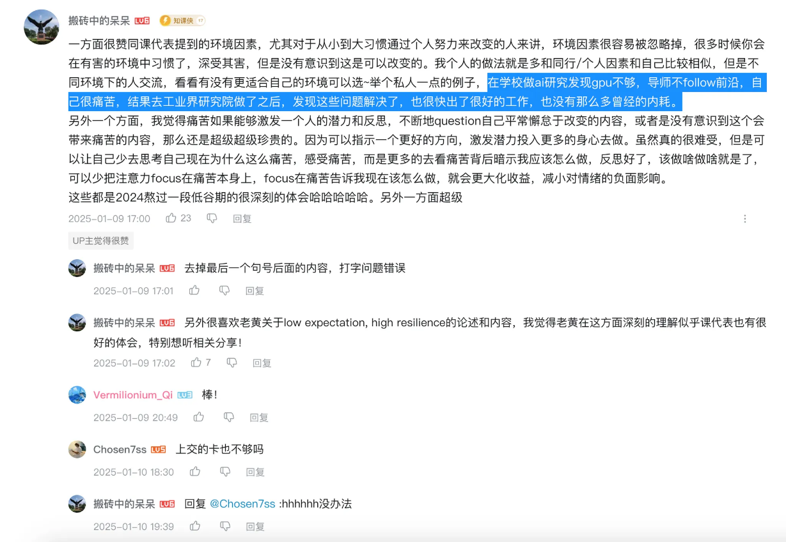
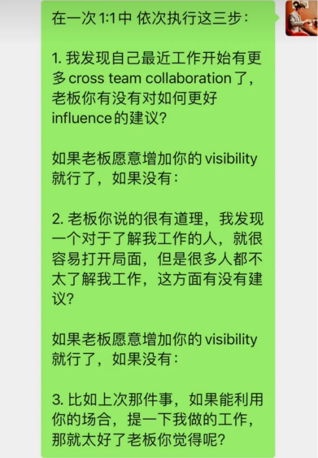

# 课代表立正视频笔记

## 成长思维 Growth Mindset

为什么有很多人又愿意take risk，工作又开心。

有点像一个人怎么看待自己可能的失败

Fixed mindset常见表现

-   觉得智力是固定的
-   **会觉得人的一辈子是固定的（开始认命？）**
-   **会觉得做事情不是为了获得成长，而是demostrate自己的能力**
-   **会觉得上课是表现自己的机会**
-   三岁看到老，江山易改本性难移
-   我不懂但是我可以学，但我的智力是固定的
-   我的语言天赋是固定的
-   我的性格是固定的
-   会觉得别人的评价是fixed的
-   怕犯错，比方说如果MR被reject会不开心

Growth mindset常见表现

-   智力不是固定的
-   人不是固定的
-   可以从成长过程中获得快乐
-   动心忍性，增益其所不能
-   我不懂可以找别人。
-   终于遇到我做不出来的问题了。
-   别人指正的时候，认为自己有可以改进的地方，而不会沉浸在难过的情绪中。
-   如果工作不被批评，说明学不到东西。
-   如果MR不被reject会不开心，觉得没有成长

Growth Mindset好处

-   可以让自己更舒服地获得更多机会
-   增加成功机会
-   被challenge的时候很开心

## 搞钱才能够理解世界

一个人只有开始了搞钱（除工作之外），开始有目的挣钱，开始build自己的business，他对于这个世界的认识才开始从0到1，才能够真正理解周围的人，周围的事情，别人的感悟。

不要自我设限，所有你认为的限制其实仅仅是你自己的mindset。（Self-imposed limiting belief）

这个观点我从某个程序员の神, beyondVoid, 的朋友（）的twitter上也看过，

## 不要抱怨

-   不公平才是本质，公平是虚幻的东西
-   你在世界上已经是非常幸运的少部分，不是命运对你如此不公，而是命运在对你已经不错的情况下，你特别计较那么一点点的不公平，于是导致你特别难受。
-   不要抱怨环境，不要被扼杀宝贵的意义感。
    -   主动心态：要适应环境、选择环境和改造环境。
    -   被动心态：漠视环境、抱怨环境
-   没有low的环境，不存在适应环境，请认真适应文化。
-   <man’s search for meaning> 有意义感的人才能够存活。当你把问题全都推给环境的时候，你就把自己的意义感和自己的价值全都剥夺了。

## 工作的意义是什么？

如果不明白这点，那么努力工作只会带来更多工作The reward of go to work is more work

要想清楚自己工作的意义，为之努力。

## 科学方法论

1.  **定义问题**
2.  **提出假设**
3.  **设计实验**
4.  预测结果
5.  观测结果
6.  验证、证伪

与trail-on-error试错相比，科学方法论才是正确的思路

参考《禅与摩托车维修艺术》

## 最重要的networking技巧

-   要学会识别大佬的favor，请人帮忙要诚恳，这是do me a favor

其他

-   要有很多亦师亦友的朋友一起聊天

-   network，randomly

-   对其他人有好奇心，从其他人身上学到东西，多和别人connect。

## 简历

-   嘉宾是来自腾讯多年工作的总监，阅过上万简历
-   要自己把简历的亮点拎清楚，不要写太多，写牛逼的东西，要有，让面试官震惊，想要跟你聊天
-   可以在第一页放一个总结，要能够达到石破天惊，让人想和你面试进一步的感觉。比如“我的github项目几万star”，“我组织过上万人的活动”，“我在几天内赚过几十万”
-   人的注意力有限，每个表述就一行就够了，不要多行，也不要一行半

## 空杯心态（小孩子只看对错，成年人看取舍）

- junior engineer thinks about right or wrong
    - 会让人觉得你是很难说服的
- senior engineer thinks about trade off
    -   思考事情的取舍

## 想做的，在做的，擅长做的，可能不是一件事

人如果把自己放在optimizer这个角色上，是很难找到自己的人生意义的，因为你的意义是被objective function define的。

不要对自己过度苛责，放松，找得到就找到，找不到就找不到。

加入新团人初期，是需要存钱的。为了做一些东西，争取permission等，credit是会消耗掉的。我们会花费credit，但也会积累credit。

## 怎么和老板1on1

1.  要和老板、同事建立工作以外的关系
2.  了解老板的concern和想法
3.  对于（2）能够做20%并且给feedback。（最好做到你做的事情是老板的核心kpi，能够让你的老板在他老板面前吹捧
4.  可能把工作这件事情想的太完美了，工作是没有完美答案的，你把这件事情做的更好了，有增量就好了
5.  20%讨论原则：很多时候在很好的完成自己的工作才能move forward，但只要把一件事情做到20%就能够和别人讨论了

-   第一次应用growth mindset思维：不应该说appriasal，应该说指点一下我的成长。我现在不会难过，我会觉得我成长了，我不害怕了，下次我会做的更好，这个问题出现的机会变低了。

参考

-   【如何跟老板1:1？】 https://www.bilibili.com/video/BV1ga4y1S7Xz/?share_source=copy_web&vd_source=5d4accef9045e3ed4e08bbb7a80f3c70
-   【如何通过沟通，让老板主动帮你？】 https://www.bilibili.com/video/BV1Uu4y1f7RC/?share_source=copy_web&vd_source=5d4accef9045e3ed4e08bbb7a80f3c70
-   【被set up for failure，怎么熬过来的？】 https://www.bilibili.com/video/BV19Jr6Y2Ey2/?share_source=copy_web&vd_source=5d4accef9045e3ed4e08bbb7a80f3c70

## 被setup for failure，怎么熬过来的

在学校做ai研究发现gpu不够，导师不follow前沿，自己很痛苦，结果去工业界研究院做了之后，发现这些问题解决了，也很快出了很好的工作，也没有那么多曾经的内耗。

## 向老板要credit

1.  委婉请教有没有什么建议，暗示老板
2.  表示对于了解我工作的人，很容易就能够打开局面
3.  上次那件事，如果能够利用你的场合，提一下我做的工作那就太好了，增加我的visibility

## 华人（中国人）在硅谷的天花板

采访嘉宾是OpenAI推理模型团队的Tech Manager

影响因素

-   第二语言终究不敌先天母语，如果语言都不能够达到一致，会有一种非我族类的感觉。
    -   即使是课代表这样子经历过学术训练的人，阅读速度、口语表达能力还是不如母语强
    -   就像LLM一般，对于人而言，语言是知识的压缩，而表达也是另一种压缩
    -   有时候想问题是母语，但需要用第二语言表达，会有信息的损失
    -   最近看到一个帖子说“新加坡人会把3念成tree，而正规发音是three，念tree的明显会自主形成一个新加坡小团体”。这种现象很常见
    -   也明白了印度人为什么更混得开，因为他们英语算是母语
-   目前湾区很多华人还是移民工作的第一代，文化还是不够适应

OpenAI招人看什么？

-   最近三年做过的最有挑战性的项目（其实和马斯克的观点不谋而合，能够解决一个有挑战的问题就能够解决另一个）
    -   且能够开始讲几句概要，然后分别介绍困难点
-   OpenAI的人相比于FANNG来说还是非常年轻的
    -   因为年轻人的学习、接受新鲜事物的速度快
    -   深度学习、LLM还是非常新的东西，而且门槛非常低（线性代数、微积分、python编程）就能够掌握，只要是想学的人，初中都能够开始。所以很多人大学期间其实在AI领域就已经有了很多年的经验。
    -   算法团队有本科生，甚至dropout的学生
-   
