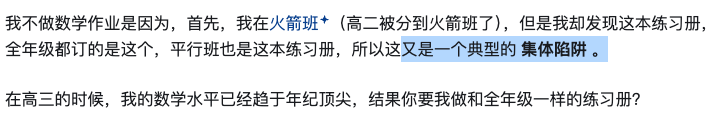
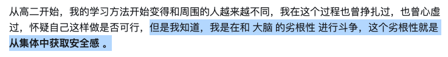
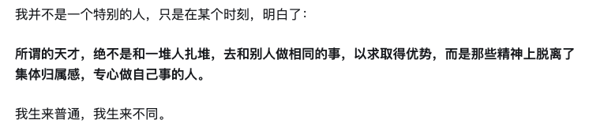

# 牛岱

## 不要从集体中寻找安全感

-   熬夜这种行为本身具有传染性
-   又是一个典型的集体陷阱

-   但我知道我是在和大脑的劣根性进行斗争，这个劣根性就是从集体中获取安全感

-   按部就班给你带来了什么？最终会带给你的，往往是无尽的空虚

-   我并不是一个特别的人，只是在某个时刻，明白了
    -   所谓的天才，绝不是和一堆人杂扎堆，去和别人做相同的事，以求得优势，而是那些精神上脱离了集体归属感，专心做自己事情的人
    -   我生来普通，我生来不同

### to me

## 不要说你会什么，要说你做了什么

-   学习新东西不要期望找个完美的教程、课程从头看到尾就好了
    -   新的东西从来都需要自己去找答案的，没有现成的答案
-   

## 学会观察自己，从而能够更客观的了解自己。

-   大多数人对自己的喜好，起心动念，都不会去过问，认为这是自己自发的，主观的意识活动
    -   比方说我之前发现自己遇到挫折后，经常萌生一种“我好可怜“的情绪，然后这种情绪就会蔓延，逐步扑灭我解决困难的勇气。
    -   **我发现这很可能和小时候，当我表现的比较可怜，可以获得更多父母的关注和帮助有关。**
-   人本质上就会去追求安全感，而看那些和自己观点，利益保持一致的内容，就会增强自己的安全感
-   现在我会觉得，**我的大脑是个大笨蛋，有很多坏习惯，我是我大脑的父母，要看好它，教好它。**

绝对赚多少钱不重要，在经济循环里占据什么位置最重要。有的人天塌下来，躺着都可以月入三万，无负债，有的人月入八万但是每天辛勤劳作担惊受怕生怕被裁，每月还需还贷，看似挣得更多，可是本质仍然是牛马。从社会顶层设计角度看，你赚多少根本不重要，有的是办法让你赚的全部吐出来。当你老去回顾自己的人生的时候，希望你为自己幸福自由的一生而感到自豪，而不是“我这辈子打工二十年总共赚了一千万，我真牛逼”。

新时代很多大厂程序员的悲哀：虽然高薪，却要失去个人时间，无法享受生活，而高薪又没有高到可以打几年工然后躺平的程度，反倒是容易进入中产陷阱里，房贷车贷 Buff 叠满进入负债模式，被迫一直打工下去。真实的生活体验可能还不如回老家当个高中老师舒服。

## 观点

如果你问我希望接下来 AI 带给我最大的便利是什么，不是替代我工作，而是能够替代我做几乎所有家务（AI 保姆），我愿意为这个机器人支付 10 - 20 万人名币。（它带来的便利性加成要超过汽车，支付一个汽车的成本完全值得）。毕竟人生苦短，独居成年人不可避免花太多时间在做饭洗衣服打扫卫生上了。

## 参考

1.   The author's github https://github.com/niudai
2.   The author's X https://x.com/NiuSheldon
3.   有哪些道理你后悔没有早点知道？ - 牛岱的回答 - 知乎
     https://www.zhihu.com/question/23819007/answer/808838524
4.   你成长的私人暗器是什么？ - 牛岱的回答 - 知乎
     https://www.zhihu.com/question/537552336/answer/2717725971