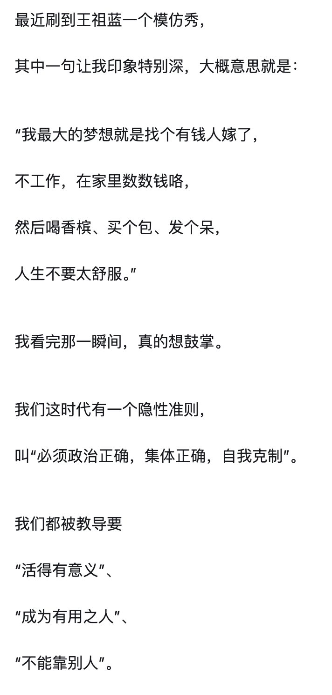
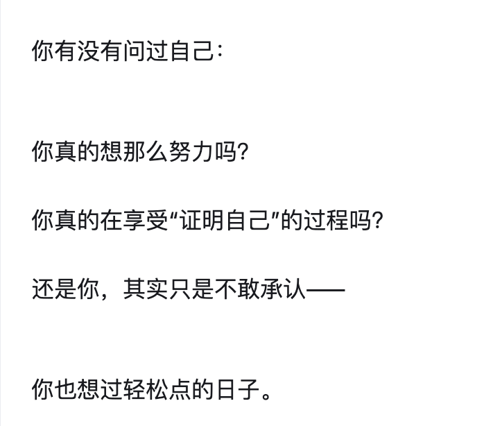

# 激情 Passion

## 漫士呓语：讲数学两年百万粉，我终于实现了这场复仇

https://mp.weixin.qq.com/s/Fh7b7PnplIyXfPmCExzblA

其实核心很简单：找到自己热爱并且擅长的事情，然后不断追寻它，倾尽全力去把它做好。这玩意儿英文叫passion

Micheal教授说的很生动，如果有那么一件事，你起床想做，闲下来想做，而且做起来就很兴奋很有成就感，那这件事就是你的passion。

回答passion是Minecraft的人，那我问你，你玩MC能几分钟速通？

如果你的回答支支吾吾，那对不起，MC并不是你的passion，只是你消遣和逃避正常学习、工作的一个借口，玩也只是傻玩，既没有玩出名堂也不懂节目效果。

东亚文化深受儒家浸润，又兼以法家的严苛，所以会把一条“正道”抬得无限高，而且设定了无数个节点，每个节点时间都很紧急。18岁好好高考，22岁考研考公，35岁之前尽快爬到管理层，结婚买房，生娃养老。一辈子被计算的清清楚楚，在永无止境的追求上岸，因为每个阶段都在被迫溺水。归根结底，底层人民长期只有一条狭窄的道路可以改善生活、提升阶层，而这条路极为拥挤、崎岖坎坷

只有从时时刻刻被审判的固定型思维，转化成松弛积极的成长型思维，才能克服那种所谓的“学生气”。

请大家知道，你其实一直有的选。那条偏离正道的小径，如果你足够有热情、有能力，在漫长的人生中，我真心建议你试一次、好好的冲一把。千万不要一味追求稳妥和正确的人生路径，生活却疲惫无比、缺乏意义感，然后在某一天，面对镜子里皱纹和白发时，你突然黯然心惊，恍然意识到自己从未为自己活过，在尚且青葱的年华，因为怯懦和听话，过早地亲手斩断太多的可能。

给自己树立特别远大的志向，**追求一个听起来很崇高的目标，是一个看起来很炫酷但其实有毒的事。因为你会在自负和自卑之间被扯成碎片**。自负，是因为你觉得自己的目标比别人远大，在别人只想着成为千万富翁的时候，你已经立志要解决黎曼猜想了，这波还不是薄纱？

追寻自己的passion并不意味着一定能“世俗”成功。

如果你只是纯粹个体性的热爱，所做的事情却没有为他人和社会带来太多切实价值，那么凭什么这个世界要给你金钱、认可、和关注呢？

当你碰到任何有意思的知识和问题时，不要满足于记住定义和方法本身，而是追问：为什么呢？为什么有这种东西？它和什么别的知识有微妙的联系？是否存在一个更本质和底层的逻辑机理？我们能利用这种机理的启示做些什么？在这个过程中，你就有机会形成整个世界所有的教科书、所有人都未曾提过的见解、视角和洞察。

## MIT“局王”的学术游戏：用20小时工作量搞定80小时科研。“读博士难道是为了拿那张纸吗？”

https://mp.weixin.qq.com/s/9ShvwClzAYXtAeww4gURKA

我觉得过程比结果重要。为什么读 PhD？难道是为了拿那张纸吗？ 我觉得 PhD 是个体验。我来 MIT 对自己只有一个要求：无论何时毕业，我想要开心。我不会后悔来这里读 PhD，这是我唯一的要求。我希望我毕业的时候，我能觉得很开心，和那张纸一点关系都没有。我觉得开心是最重要的。我想让我毕业的时候可以说，如果再来一次，我还会这么做。

我其实完全没有看项目。因为我觉得作为一个 PhD 学生，除非你研究一个问题要研究一辈子，否则我们不会永远研究同一个问题。

在学校里可以见到有意思的人，学弟学妹毕业了，又有新人来，又去认识新人。你就可以盘局。 就像搞庞氏骗局，总得有新人进来。 对我来说，不停地遇到新人和新的机会是很吸引人的。

你有一份稳定的工作，就有足够的时间去做别的事情。万一别的事情失败了，我至少还是一个 PhD 学生。

内卷

- 为什么大家如此热衷于内卷呢？
  大家想要把很多选项压缩成一个量化指标 。
  你把这个模型简化后，你的决策也变得简单。
- 话说回来，大家为什么会去内卷，是因为 在一个简化的模型下，你可以再做简化， 直到你达到一个看似简单到不能再简单的可执行条件，方便你去exploit这个系统来最大化你的产出。
- 一个程序员真的需要把 LeetCode hard 全做出来才能得到一份最基本的工作吗？答案是不需要。 这些都是人为制造的门槛，因为这些行业没有技术壁垒。没有技术壁垒的地方，人就会制造壁垒。 你要想，为什么会有人为制造壁垒？就是为了防止内卷。如果你发现人为壁垒还在提高，那说明这个行业越来越卷。
- 这就是内卷的逻辑。每个人都想保护自己的资产，保护自己的护城河。 对我来说，这是一场没有意义的行为，我不想卷进去。小时候看了一本书《围城》，里面一句经典的话，前半句是城外的人都想进去，这我同意。但后半句我却觉得是城里的人不一定想出来，可能也不想让城外的人进来。如果你聪明一点，不去接受一些规则，你完全可以找到一个高薪工作。
- 你说大家为什么会去内卷？大家可能有时候也是自己想去内卷，是你愿意接受这个游戏。
  你可能也想获得别人对你的赞同，想获得异性对你的赞美，想回家时大家说出去好听。这句话我觉得是个中国人都能理解。"说出去好听"，你是在这里读 PhD，你是在这里学个 CS，还是说你是在这里当一个，随便举个例子，其实警察赚钱很多，美国的警察赚很多钱。
  在这种个人意愿与社会期望产生冲突情况下，你要坚持自己必须要做什么？你得不play the rule，你得是一个自我很强的人。我不在乎别人怎么说，我只想让我自己开心。我的快乐凭什么要建立在让你快乐之上？
- 你要去拿 10 个学位，必然做不了别的事情，因为时间是有限的。人生是有限的，资源是有限的，一切是有限的， 物理世界不存在无限的东西，然而人的欲望是可以无限的 ，这就是为什么我们对物理世界的模型总希望一种无限的东西存在。

做决定为什么一定要是对的？

- 你做决定，谁跟你讲你做决定一定要完全正确才是对的？有没有可能这个决定错了是为了让你去学习？有没有可能如果你真的什么东西都得到了，你会变得虚无，你会变得不知道要干嘛。

有什么脱离内卷苦海的建议吗?

- 你有时候会发现，有的人为不知道做什么而苦恼，有的人为一直在做同一件事情而苦恼。大家是不一样的。

- 因为你现在问我要干什么，我只有一个大方向，我知道我喜欢干什么，可能慢慢朝着这个努力。但我并不会因为不知道干什么而感到迷惘或害怕。为什么呢?因为我曾经跟一个很好的朋友聊过类似的话题。他希望有一个确定的生活，像上一辆列车，知道终点站，只要按部就班地做就好。有的人就是希望有这样稳定的生活的，这完全没问题。对他来说，如果你给他太多选择，他反而觉得最好别人告诉他怎么做。这种人适合有个局爷来教他怎么干活。
  我呢，其实我喜欢意料之外的事情。我想到普希金写的诗(注:应为弗罗斯特)，他说森林里的两条路，我选了一条。我选了人迹稀少的那条。

怎么成为太阳呢?

- 人如果向内挖，去探索这些问题，比如我到底是为什么活着，我为什么要思考,我到底要什么，这可能是一个终身的问题。
- 像这种哲学问题，不会有一个统一的最佳解决方案。

- 如何成为一个太阳，想明白这个问题，想明白自己要什么，想成为一个太阳的人，他自己会努力把自己成为太阳。不想成为太阳的人，他可能想成为一个月亮，他已经想清楚这个问题，他就会把自己变成一个月亮。

我必须要玩你这个游戏，成为一个乖学生，你才能拿这个东西来惩罚我。 但我已经不跟你玩这个游戏了。那你怎么威胁我

是选择完全顺服对游戏上瘾，还是干脆拔网线关机退游？ 
有些东西我不喜欢做，但我也要做。所以重点是找到一个平衡，而不是只有极端选择。完全不与社会合作，你无法生存；完全与社会合作，你又失去了身份。每个人都在调整，这是一个动态的过程。在不同的生命阶段，它会调整到不同的地方。我可能现在更想要自由，但我不是完全自由的人，这是不可能的。

现在大家都加入机器学习也是一样的。都想成为那个把别人都淘汰的人。因此，我会投资人工智能，但我不会想要necessarily的成为一个程序员。我会参与人工智能相关的初创，做一个组织者，去充分享受便宜程序员和大模型给我带来的红利。

稀缺性决定价值，与技术无关

- 考虑到供需关系。在 10 万个人都是马车夫的时候，可能有 20 万人想变成马车夫，所以他们的工资低。 但是如果现在只有 100 个马车夫的岗位，比如说国家规定元首必须乘坐马车，而这个世界上只有两个人想当马车夫，你的稀缺性决定了你的价值，这个时候马车夫就很值钱了 。

## WhynotTV：机器人博士前两年总结——任尔东西南北风	

https://www.bilibili.com/video/BV1neM1zKEmE

“如果一个项目，一开始的技术路线很清晰，并且我知道一定能work，只是需要具体优化工程实现细节以及训练参数，那么我觉得这样的项目就应该交给工业界的工程师去做。学术界的职责应该是承担风险，并且做出创新。”

## 聊聊我坎坷的 academia 之路（1）

22 【聊聊我坎坷的academia之路（1） - Yuanfang Guan | 小红书 - 你的生活指南】 😆 PBVoNdJMBeABagI 😆 https://www.xiaohongshu.com/discovery/item/684d2f16000000001101fff6?source=webshare&xhsshare=pc_web&xsec_token=ABR9QkETjki_Ns18EirL3KT47FcEQY9pzglNPLqRGbpe8=&xsec_source=pc_share

## 有没有某个瞬间，你觉得做科研特扯淡……?

有没有某个瞬间，你觉得做科研特扯淡……? - 薛天帆的回答 - 知乎
https://www.zhihu.com/question/459918748/answer/45270033349

1. 我自己的研究的课题是图像和视频处理，博士期间虽然发了一些还不错的文章，有的还有些关注度，**但是每次都会问自己，自己设计的算法真的能够用到实际工作中吗**？
2. 但在谷歌带了很多年后，开始慢慢觉得之前的想法有点偏激了。研究工作的实用性的确很重要，但如果过分强调短期能够解决实际问题，那就会变得很短视，刻意回避那些更加困难，需要更长时间，几年十几年甚至几十年的研究。
3. 科研的意义，尤其是在学校科研的意义，不仅仅在提出一个解决方案，更重要的是告诉大家，某个领域是值得去研究的。作为一个先行者，建立大家对于一些未知研究领域的信心。
4. 研究工作太实际就没有办法打破前面提到的"问题太难->没人做->问题还是太难"这样一个恶性循环，使得有一些问题明明很重要，但却鲜有人研究。而高校一些天马行空的工作一旦取得好结果，就能打破这个循环，引领一个新的领域，这也是很多人说的，“北极星式的的研究"(northern star research)。

## Airwallex十年｜构建全球银行和金融的未来

49 【Airwallex十年｜构建全球银行和金融的未来 - Lucy刘 | 小红书 - 你的生活指南】 😆 MywUzExjJTl2ONv 😆 https://www.xiaohongshu.com/discovery/item/684cd771000000002300e6f3?source=webshare&xhsshare=pc_web&xsec_token=ABOXK1vCtNJdtz6W8jdPLjlP_2UdicVw1ApgwuLPh5N2U=&xsec_source=pc_share

🛠 我们选择的，是最难但最正确的那条路 从第一天起，我们花了大量时间精力，在每个市场逐一申请牌照、建立银行合作、接受审查、搭建系统。 对我们来说，合规不是束缚，而是护城河。  

👣 我的角色，也在不断转变 最初几年，我几乎参与了除写代码以外的所有工作： 公司第一台电脑是我自己装的，法人文件是我亲自去注册的，开户资料、工资表……我一项项处理。 现在我更多地专注在推动Airwallex Impact，用资源和技术创造长期的正面影响。

## 那个研究记忆算法，被邀请加入扇贝的人

## 左滑解锁最新程序员职业发展最优解

34 【左滑解锁最新程序员职业发展最优解 - TechTalker | 小红书 - 你的生活指南】 😆 WKBjYxXXiAcvUjB 😆 https://www.xiaohongshu.com/discovery/item/684e2612000000000c039d35?source=webshare&xhsshare=pc_web&xsec_token=ABHlrYxlVo3qhijxWV0QvECy1Ig3IoQ10vf6GnHIzm4Kg=&xsec_source=pc_share

## 你喜欢拥有一个怎样的人生呢？

沙漏

你喜欢拥有一个怎样的人生呢？ - 沙漏的回答 - 知乎
https://www.zhihu.com/question/1917027439806231877/answer/1917710811582959823

- 学业漂亮、事业有光、择地合理、婚姻体面、母职也没有掉线。到头来发现自己在写一份让社会满意的答卷

真的想那么努力吗？

- 我经历过两年的摆烂，我应该不喜欢摆烂的自己。
- 我喜欢轻松点的日子吗？假如现在有花不完的钱，所有（衣食住行，性，人际关系）需求都被满足后，我是不是会每天在家打游戏？在家里看动漫、看小说，看新奇的故事？

