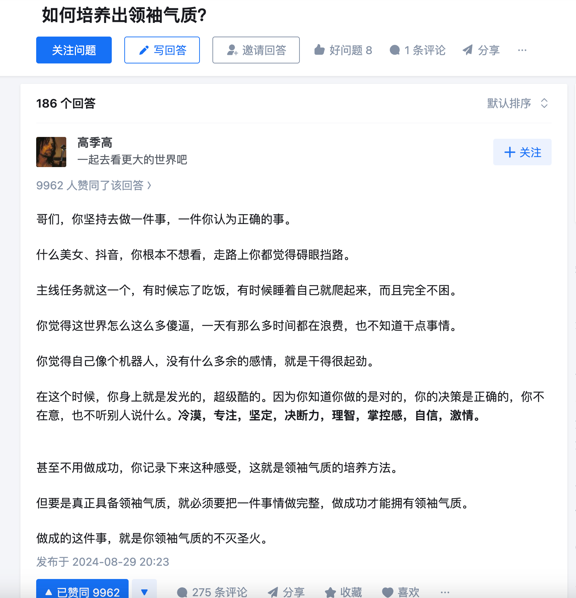

# 领袖气质

哥们，你坚持去做一件事，一件你认为正确的事。

什么美女、抖音，你根本不想看，走路上你都觉得碍眼挡路。

主线任务就这一个，有时候忘了吃饭，有时候睡着自己就爬起来，而且完全不困。

你觉得这世界怎么这么多傻逼，一天有那么多时间都在浪费，也不知道干点事情。

你觉得自己像个机器人，没有什么多余的感情，就是干得很起劲。

在这个时候，你身上就是发光的，超级酷的。因为你知道你做的是对的，你的决策是正确的，你不在意，也不听别人说什么。**冷漠，专注，坚定，决断力，理智，掌控感，自信，激情。**

甚至不用做成功，你记录下来这种感受，这就是领袖气质的培养方法。

但要是真正具备领袖气质，就必须要把一件事情做完整，做成功才能拥有领袖气质。

做成的这件事，就是你领袖气质的不灭圣火。

## 宽容

领袖气质最重要的是一个人的肚量和包容性。

领袖一定不是某方面能力最强的那个，那种人只能当将军。

领袖的将拥有不同长处的人聚拢在一起，并且能容忍他们有各自的个性和特点，包括长处和短处，甚至容忍他们挑战权威。

所谓用人所长就是这个道理，这世界上没有十全十美的人，没有完全对你脾气的人，也没有完全相处愉快和谐的队伍，考验的都是领头那个人的包容和肚量。

## 参考

1. 如何培养出领袖气质？ - 高季高的回答 - 知乎
   https://www.zhihu.com/question/636034037/answer/3610069592
2. https://www.zhihu.com/question/636034037/answer/3372416200